## Transformer Overview  
- **Definition**: Neural-network architecture optimized for parallel sequence processing using self-attention.  
- **Teaching Approach**: Learn internals gradually through code and practice.  
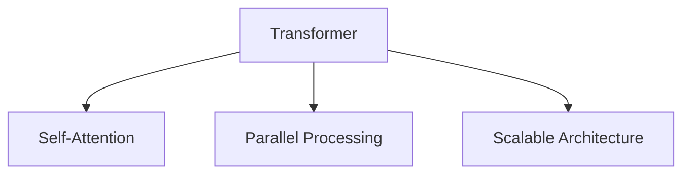

## 2017 Origin: “Attention Is All You Need”  
- Proposed by Google researchers as an efficient alternative to prior sequence models.  
- Introduced attention as the core mechanism.  
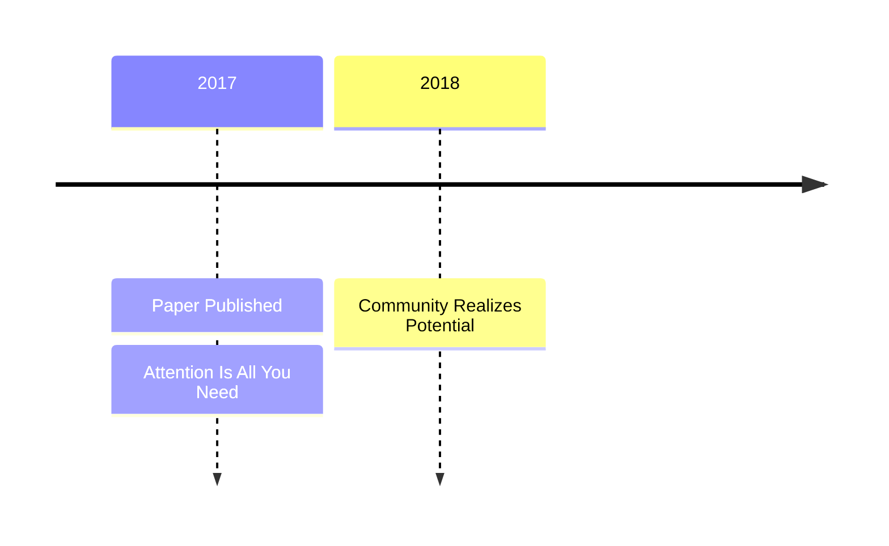

## Neural Network Background  
- Traditional models adjust statistical parameters from data.  
- Neural networks mimic brain-like interconnected neurons.  
- Deep learning stacks many layers for richer pattern recognition.  
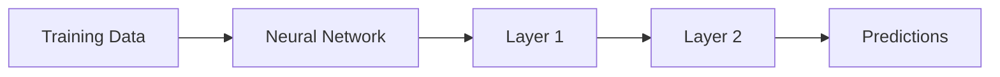

## Key Innovation: Self-Attention  
- Architecture excels at weighted focus over input sequences.  
- Enables larger models trained faster through parallelism.  
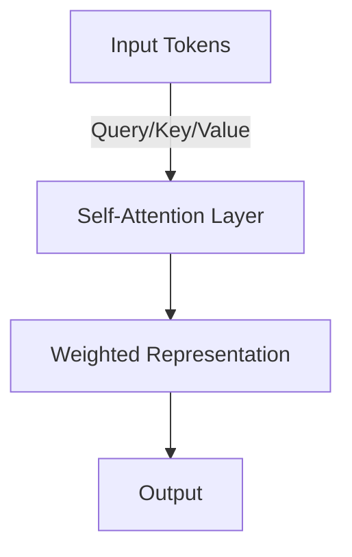

## Rise of GPT Series  
- GPT-1 (2018) → GPT-2 (2019) → GPT-3 (2020) → ChatGPT (2022) → GPT-4 (2023) → GPT-4.x/5+.  
- Expanded capabilities, chat alignment, multimodal support.  
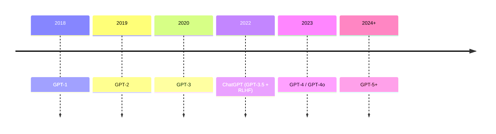

## Efficiency Breakthrough  
- Transformer is a scalable optimization rather than a philosophical shift.  
- Reduced cost/time to train large models dramatically.  
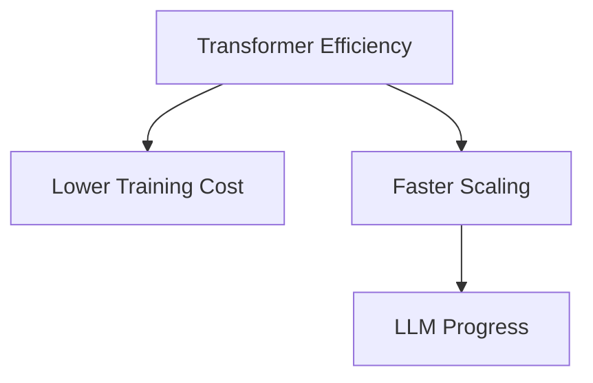

## Alternatives and Research  
- State-space models and hybrids explored.  
- Transformers still dominate due to proven performance.  
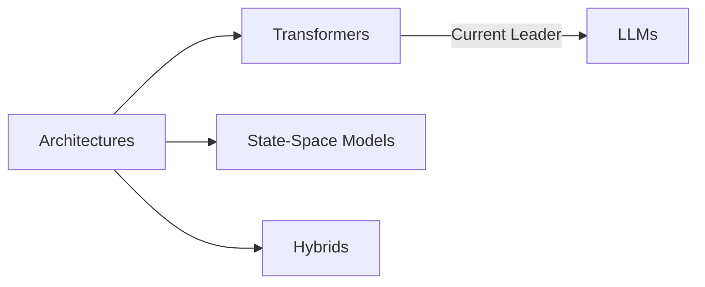

## LSTMs vs Transformers  
- LSTMs handled sequences well but lacked parallelism.  
- Transformers simplified computation, enabling parallel training.  
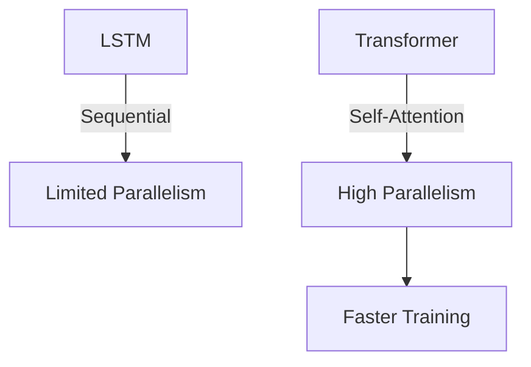

## Reception and Backlash  
- Initial awe followed by critiques (e.g., stochastic parrots).  
- Concern: statistical models misinterpreted as truth.  
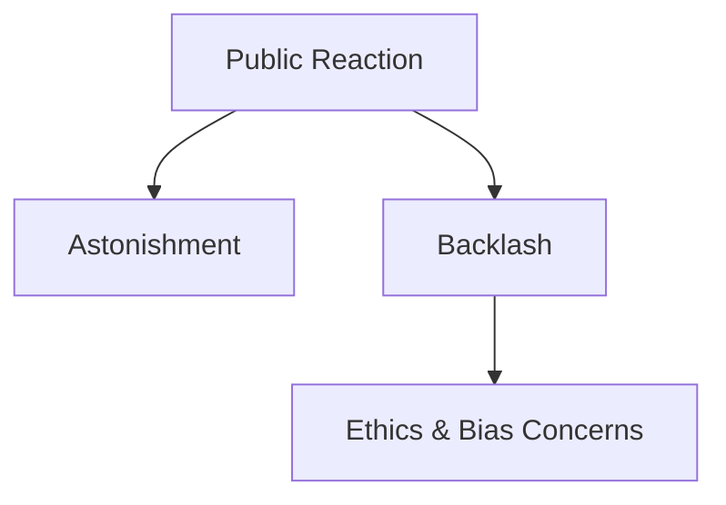

## Surprising Capabilities  
- Predictive focus unexpectedly yields accurate answers.  
- True solutions emerge from probabilistic token prediction.  
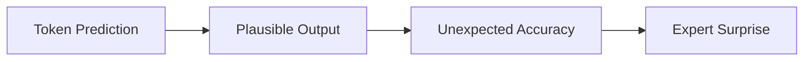

## Emergent Intelligence  
- Large-scale models exhibit intelligence-like behavior.  
- Emergence remains partially unexplained.  
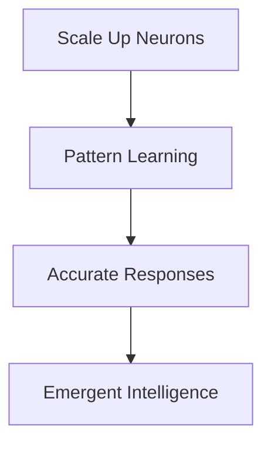

## Prompt → Context Engineering  
- Prompt engineering evolved into broader context provisioning.  
- Tools and domain data enhance alignment.  
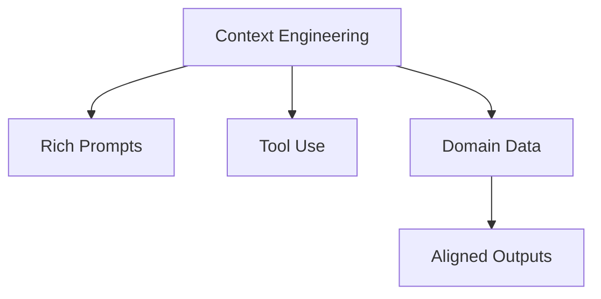

## Agentic AI  
- Agents: LLMs orchestrating workflows, potentially self-calling with tools.  
- Autonomy arises from looped decision making.  
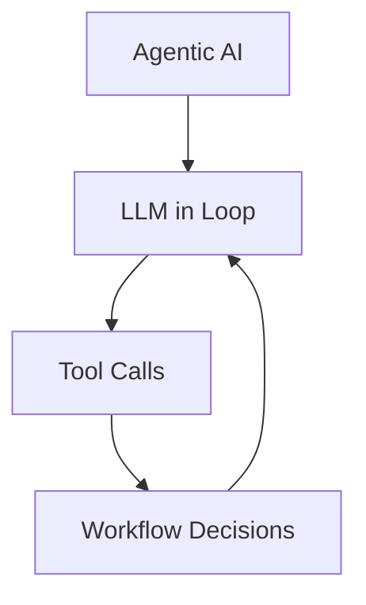

## Course Outlook & Examples  
- Upcoming weeks cover agentic systems with hands-on builds.  
- Examples: Claude Code, custom GPT agents.  
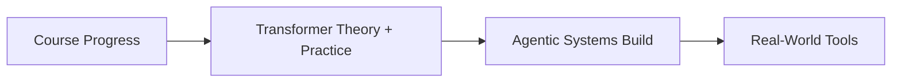

## Key Takeaways  
- Attention-powered parallelism unlocked transformer dominance.  
- Emergent intelligence shows surprising accuracy beyond mere statistics.  
- Context engineering replaces prompt tricks with holistic information design.  
- Agentic AI loops LLM reasoning with tools to deliver autonomy.