# Understanding Parameters in Machine Learning Models

## How Parameters Give ChatGPT Its Intelligence

**Based on:** "But what are PARAMETERS and how do they give ChatGPT its intelligence?" by Edward Donner  
**Date:** Feb 20, 2025  
**Duration:** 21:22

---

## Table of Contents
- [Introduction](#introduction)
- [Traditional Programming vs Machine Learning](#traditional-programming-vs-machine-learning)
- [Training and Inference](#training-and-inference)
- [The Mixer Analogy](#the-mixer-analogy)
- [Neural Networks: Layers of Mixers](#neural-networks-layers-of-mixers)
- [Large Language Models (LLMs)](#large-language-models-llms)
- [How ChatGPT Works](#how-chatgpt-works)
- [Emergent Intelligence](#emergent-intelligence)
- [Summary](#summary)

---

## Introduction

Understanding how ChatGPT works requires understanding **parameters** (also called **weights**). These are the fundamental building blocks that give AI models their capabilities. This document explains parameters from the ground up, using analogies and visual diagrams.

---

## Traditional Programming vs Machine Learning

### Traditional Programming Approach

In traditional programming, developers write explicit instructions that take inputs and produce outputs.

**Example:** Estimating apartment rent based on features like square feet and floor number.

### Machine Learning Approach

Instead of writing explicit rules, the model **learns** patterns from data.

**Hypothesis for rent estimation:**

$$\text{Rent} = a \times \text{square feet} + b \times \text{floor number}$$

Where:
- \(a\) and \(b\) are **parameters** (learned from data)
- The model adjusts these parameters to minimize prediction errors

```mermaid
graph TB
    A[Training Data:<br/>Square Feet, Floor, Actual Rent] --> B[Learning Algorithm]
    B --> C[Parameters:<br/>a, b]
    C --> D[Model:<br/>Rent = a×sqft + b×floor]
    
    E[New Input:<br/>Square Feet, Floor] --> D
    D --> F[Predicted Rent]
    
    style A fill:#e1f5ff
    style B fill:#fff4e1
    style C fill:#ffe1e1
    style D fill:#f3e5f5
    style E fill:#e1f5ff
    style F fill:#e8f5e9
```

### Key Comparison

| Aspect | Traditional Programming | Machine Learning |
|--------|------------------------|------------------|
| **Rules** | Hand-coded by developer | Learned from data |
| **Parameters** | None or fixed constants | Learned and adjusted |
| **Flexibility** | Must rewrite code for changes | Retrain with new data |
| **Complexity** | Limited by developer's ability | Can capture complex patterns |

---

## Training and Inference

Machine learning has two distinct phases:

### Training Phase
- **Adjust parameters** based on data examples
- **Goal:** Minimize prediction error
- Parameters are like **adjustable sliders** that tune predictions
- Iterative process: predict → measure error → adjust → repeat

### Inference Phase
- **Use learned fixed parameters** to make predictions on new data
- Parameters remain constant
- Fast execution since no learning occurs

---

## The Mixer Analogy

### Sound Mixer Metaphor

Parameters can be understood like sliders on a sound mixer in a music studio:

```mermaid
graph TB
    subgraph "Audio Mixer Studio"
        I1[🎸 Guitar Input] --> S1[Slider a1]
        I2[🎤 Vocals Input] --> S2[Slider a2]
        I3[🥁 Drums Input] --> S3[Slider a3]
        I4[🎹 Keys Input] --> S4[Slider a4]
        
        S1 --> M[Mixer<br/>Combines Weighted Inputs]
        S2 --> M
        S3 --> M
        S4 --> M
        
        M --> O[🔊 Output<br/>Final Sound]
    end
    
    style I1 fill:#e1f5ff
    style I2 fill:#e1f5ff
    style I3 fill:#e1f5ff
    style I4 fill:#e1f5ff
    style S1 fill:#ffe1e1
    style S2 fill:#ffe1e1
    style S3 fill:#ffe1e1
    style S4 fill:#ffe1e1
    style M fill:#fff4e1
    style O fill:#e8f5e9
```

**Analogy Breakdown:**
- **Inputs** = Features (square feet, floor number, etc.)
- **Sliders** = Parameters (weights)
- **Mixer** = Mathematical combination of weighted inputs
- **Output** = Prediction

**Training = Rehearsing:** Adjusting sliders during rehearsal to get the best sound

**Inference = Performance:** Using the fixed slider settings to produce the final music

---

## Neural Networks: Layers of Mixers

Modern AI uses **many layers** of mixers (neurons), each with its own parameters.

### Key Concepts

1. **Multiple Layers:** Each layer processes the output of the previous layer
2. **Activation Functions:** Unique distortions applied after mixing for complexity
3. **Massive Parameters:** Each connection has a weight parameter
4. **Gradual Adjustment:** During training, all parameters adjust simultaneously

### Mathematical Flow

For each neuron:

$$\text{output} = \text{activation}\left(\sum_{i=1}^{n} w_i \times \text{input}_i + b\right)$$

Where:
- \(w_i\) = weight parameters
- \(b\) = bias parameter
- activation = non-linear function (ReLU, sigmoid, etc.)

---

## Large Language Models (LLMs)

### Scale Comparison

### Transformer Architecture

ChatGPT uses the **Transformer** architecture, which enables:
- Efficient information flow
- Complex pattern recognition
- Attention mechanisms
- Parallel processing

```mermaid
graph TB
    subgraph "Transformer Block"
        A[Input Tokens] --> B[Embedding Layer<br/>Parameters: vocab_size × embedding_dim]
        B --> C[Multi-Head<br/>Self-Attention<br/>Parameters: ~millions]
        C --> D[Add & Normalize]
        D --> E[Feed-Forward Network<br/>Parameters: ~millions]
        E --> F[Add & Normalize]
        F --> G[Output to Next Layer]
    end
    
    style A fill:#e1f5ff
    style B fill:#fff4e1
    style C fill:#ffe1e1
    style D fill:#fff4e1
    style E fill:#ffe1e1
    style F fill:#fff4e1
    style G fill:#e8f5e9
```

---

## How ChatGPT Works

### Generative Pre-trained Transformer (GPT)

### Token-by-Token Generation

ChatGPT doesn't generate entire sentences at once. It predicts **one token at a time**.

**Example:**

### What are Tokens?

- **Token:** Small group of characters (not always full words)
- Examples:
  - "Hello" = 1 token
  - "ChatGPT" = 2 tokens ("Chat", "GPT")
  - "unhappiness" = 2 tokens ("un", "happiness")

---

## Emergent Intelligence

### The Nature of ChatGPT's Intelligence

### Key Insights

1. **Not True Understanding:** ChatGPT doesn't "understand" in the human sense
2. **Pattern Completion:** It completes patterns based on statistical regularities
3. **Emergent Behavior:** Complex capabilities emerge from simple prediction task
4. **Context Window:** The "memory" is just previous text passed with each input

### The Illusion of Memory

---

## Summary

### Core Principles

### Key Takeaways

1. **Parameters are the core** of how AI models function
2. **Parameters control** the blending and transforming of inputs into outputs
3. **Training adjusts** parameters to minimize prediction errors
4. **Inference uses fixed** parameters to make new predictions
5. **ChatGPT's vast parameters** (trillions) encode statistical language patterns
6. **Intelligence emerges** from excellent next-token prediction ability
7. **Not true understanding:** sophisticated statistical pattern completion
8. **Memory is an illusion:** full conversation context passed each time

### Visual Summary

```mermaid
graph TB
    A[Traditional Programming<br/>Hand-coded rules] --> B{Machine Learning<br/>Revolution}
    B --> C[Simple Models<br/>Few parameters<br/>Linear relationships]
    C --> D[Neural Networks<br/>Many parameters<br/>Non-linear patterns]
    D --> E[Deep Learning<br/>Millions of parameters<br/>Complex hierarchies]
    E --> F[Large Language Models<br/>Trillions of parameters<br/>Emergent intelligence]
    
    F --> G[ChatGPT<br/>Generative Pre-trained Transformer]
    
    G --> H[Capabilities:<br/>✓ Natural conversation<br/>✓ Code generation<br/>✓ Question answering<br/>✓ Creative writing<br/>✓ Task completion]
    
    style A fill:#e1f5ff
    style C fill:#fff4e1
    style D fill:#ffe1e1
    style E fill:#ffcdd2
    style F fill:#f48fb1
    style G fill:#c5e1a5
    style H fill:#e8f5e9
```

---

## References

- **Source Video:** "But what are PARAMETERS and how do they give ChatGPT its intelligence?"
- **Presenter:** Edward Donner
- **Date:** February 20, 2025
- **URL:** [YouTube Link](https://www.youtube.com/watch?v=nYy-umCNKPQ)

---

## Further Reading

- Neural Networks and Deep Learning
- Transformer Architecture Papers (Attention Is All You Need)
- GPT Model Documentation
- Machine Learning Fundamentals
- Natural Language Processing

---

*This document is designed to help non-technical audiences understand the fundamental concept of parameters in AI and how they power systems like ChatGPT.*

