# Understanding Context Windows and API Costs in Large Language Models

## A Comprehensive Guide to LLM Constraints and Economics

---

## Table of Contents
- [What is a Context Window?](#what-is-a-context-window)
- [How the Input Sequence Works](#how-the-input-sequence-works)
- [Token Generation Process](#token-generation-process)
- [Why Context Windows Matter](#why-context-windows-matter)
- [Context Window Size Examples](#context-window-size-examples)
- [API Costs Explained](#api-costs-explained)
- [Cost Optimization Strategies](#cost-optimization-strategies)
- [Model Comparisons](#model-comparisons)
- [Practical Implications](#practical-implications)
- [Summary](#summary)

---

## What is a Context Window?

There is a constraint when working with LLMs, known as the **context window**. The context window is the maximum number of tokens that any particular model can look back on when it is generating the next token. It is the maximum length of the input that it can handle. If you pass in more input than that, it will fail and indicate that the input is bigger than its context window.


### Key Concepts

- **Constraint:** If you pass more tokens than the context window allows, the model will fail
- **Hard Limit:** This is a fixed architectural limitation of each model
- **Measured in Tokens:** Context windows are measured in token count, not characters or words

---

## How the Input Sequence Works

### The Entire Conversation Must Fit

The thing that needs to fit within the context window is not just the most recent message you gave to the model. It is the **entire conversation so far**. For example: "Hi, my name is Ed," then "Nice to meet you, Ed," and then "What's my name?" — all of that must fit in the context window.

It is a little more than that, because you pass in all of that, and then the model generates the most likely next token. For instance, it might produce the token "your," forming "Your name is Ed your." The whole input sequence is fed back into the model with that new token appended, and the model generates the next token "name." The input with "your name" goes back in, and it generates "is," and then "Ed." The model generates tokens one at a time, and the whole input is passed back in each step.


### What Must Fit in the Context Window

What needs to fit in the context window is the original input, the model replies, the next inputs, the final message you are giving it, and then all of the generated tokens that it produces up until — but not including — the very last token that it generates. All of that has to fit in the context window.


---

## Token Generation Process

### Step-by-Step: How Context Grows

The model generates **one token at a time**, and the entire sequence is fed back with each new token.

**Example:** "What's my name?" → "Your name is Ed"


### Visual Flow of Context Growth


---

## Why Context Windows Matter

The context window governs how much background the model can remember about references, content, and context. For example, if you include many ticket prices to different cities in the prompt, the context window determines how many of those references the model can remember.

The context window is particularly important for techniques such as **multi-shot prompting**, where you give a series of example questions and answers in the input for the model to draw from while producing the output. It is also important for techniques like **RAG (Retrieval-Augmented Generation)** and many inference-time methods that make heavy use of the context window. That is why it is important to keep the context window in mind.


### Critical Use Cases


### Large Context Needs and Examples

People who have used models like Claude are very aware of what happens as you start to fill up the context window. If you wanted the complete works of Shakespeare in the prompt, you would need a context window on the order of a million tokens to handle that. At the moment, only a few models such as some Gemini variants can handle windows that large.


---

## Context Window Size Examples

### Context Window Comparisons Across Models

Context window sizes differ significantly between models. Examples include:

- **GPT-5:** ~400,000 tokens
- **Claude:** ~200,000 tokens
- **GPT-OS (open-source):** ~130,000 tokens
- **Gemini 2.5 Flash:** ~1,000,000 tokens

A 1,000,000-token context window (as in some Gemini variants) means you could almost fit the complete works of Shakespeare in one prompt and then ask the model to quote or analyze from that text.

### Model Comparison by Context Window


### Context Window Scale Visualization


---

## API Costs Explained

Chat products like ChatGPT typically offer a free tier and paid tiers. Those subscriptions allow you to use the chat product without paying per use, although there is rate limiting. If you use the API, however, you pay per use of the API regardless of whether you have a subscription. The API cost covers inference compute: there are trillions of calculations happening to generate outputs and some portion goes toward repaying the training costs invested in the model.

### Free Tier vs API Usage

```mermaid
graph TB
    A[LLM Access Options] --> B[Chat Product<br/>e.g., ChatGPT]
    A --> C[Direct API Access]
    
    B --> D[Free Tier<br/>Rate Limited]
    B --> E[Paid Subscription<br/>No per-use cost]
    
    C --> F[Pay Per Use<br/>Regardless of<br/>subscription]
    
    F --> G[Cost Factors:<br/>• Input tokens<br/>• Output tokens<br/>• Model size]
    
    style A fill:#e1f5ff
    style B fill:#fff4e1
    style C fill:#ffe1e1
    style D fill:#e8f5e9
    style E fill:#e8f5e9
    style F fill:#ffcdd2
    style G fill:#fff4e1
```



### What Determines Cost and the Two Catches to Watch For

Typically, the cost depends on how many input tokens you pass in and how many output tokens you generate. There are two catches:

**Catch #1:** The input token count must include the full sequence so far, including any injected memory or RAG context. That causes costs to accumulate, but the transformer needs that context in order to predict the most likely tokens, so the compute is necessary.

**Catch #2:** Output token charges include any reasoning tokens the model generates. For reasoning models that produce internal reasoning traces, those tokens are output tokens you pay for even if you do not get to see them (for example, some GPT models perform hidden reasoning behind the scenes). This can make costs somewhat unpredictable because you pay for processing you cannot always inspect.

```mermaid
graph TB
    subgraph "API Cost Components"
        A[Total API Cost] --> B[Input Token Cost]
        A --> C[Output Token Cost]
        
        B --> D[Full sequence length:<br/>• All conversation history<br/>• RAG context<br/>• System prompts<br/>• Current input]
        
        C --> E[Generated tokens:<br/>• Visible output<br/>• Hidden reasoning tokens<br/>• Internal processing]
    end
    
    F[Inference Compute] -.-> A
    G[Training Cost<br/>Amortization] -.-> A
    
    style A fill:#ffe1e1
    style B fill:#fff4e1
    style C fill:#fff4e1
    style D fill:#e1f5ff
    style E fill:#e1f5ff
    style F fill:#ffcdd2
    style G fill:#ffcdd2
```



### Two Key Cost Catches

```mermaid
graph TB
    A[⚠️ Cost Catch #1:<br/>Input Token Count] --> B[Must include FULL sequence]
    B --> C[• Original conversation<br/>• All previous turns<br/>• RAG context<br/>• System instructions]
    C --> D[💰 Costs accumulate<br/>with each turn]
    
    E[⚠️ Cost Catch #2:<br/>Output Token Count] --> F[Includes reasoning tokens]
    F --> G[• Visible output<br/>• Hidden reasoning<br/>• Internal processing]
    G --> H[💰 You pay for tokens<br/>you can't see]
    
    style A fill:#ffcdd2
    style E fill:#ffcdd2
    style B fill:#fff4e1
    style F fill:#fff4e1
    style D fill:#ffe1e1
    style H fill:#ffe1e1
```



---

## API Costs: Detailed Breakdown

### Leaderboards and Model Comparisons

One useful resource is leaderboards that rank and compare different LLMs. A practical example is the **Vellum leaderboard**, which includes many leaderboards and a handy table showing context windows and API costs for major models. You should check it out to compare models quickly.

### Example: GPT-5 Pricing and Context Window

On the Vellum leaderboard you will see entries such as GPT-5 with a context window of 400,000 tokens. The input cost is listed as $1.25 and the output cost as $10. Note that the output cost of $10 is per million output tokens, so generating a very large amount of text (for example the complete works of Shakespeare) at that rate is still priced per million tokens.

**Costs are per million tokens:**

| Model Variant | Context Window | Input Cost (per 1M tokens) | Output Cost (per 1M tokens) |
|---------------|----------------|---------------------------|----------------------------|
| **GPT-5** | 400,000 tokens | $1.25 | $10.00 |
| **GPT-5 Nano** | 130,000 tokens | $0.05 | $0.40 |


### Operational Scale and Small-Scale Costs

If you are operating at scale with many concurrent conversations, you need to understand your unit costs per user and factor that into your product economics. For individual experimentation, however, the per-call API costs are typically very small. If you are just sending short prompts such as "Hi, my name is Ed," the cost is negligible relative to the per-month subscription annoyance.

If you are not building a large, scalable system or an agent loop that consumes many tokens, the costs for everyday API calls are relatively small.

### GPT-5 Nano and Lower-Cost Options

If you scale down to smaller model variants, the costs fall dramatically. For example, GPT-5 Nano lists an input cost of $0.05 per million tokens and an output cost of $0.40 per million output tokens. Using a tiny variant to generate the complete works of Shakespeare would cost less than a dollar, illustrating how cheaper options can be used for many tasks.

### Cost Scaling with Model Size


---

## Cost Optimization Strategies

### 1. Caching

There is also the idea of caching: if you send in the same input twice within a short time window, you may pay less because some information is cached. This is automatic in some systems; in others (for example Claude) the behavior varies. If you frequently send identical inputs, caching strategies can reduce input costs. There are additional tricks to be aware of, which can be discussed separately.

```mermaid
sequenceDiagram
    participant User
    participant Cache
    participant API
    
    User->>API: Request 1: Long prompt
    Note over API: Process full input<br/>Cost: Full price
    API->>Cache: Store input hash
    API->>User: Response
    
    User->>API: Request 2: Same long prompt
    API->>Cache: Check for match
    Cache->>API: ✓ Cache hit!
    Note over API: Skip processing<br/>Cost: Reduced or free
    API->>User: Response
```



### 2. Strategic Model Selection

```mermaid
graph TB
    A{What's your use case?} --> B[Simple tasks<br/>Classification, extraction]
    A --> C[Medium complexity<br/>Summaries, Q&A]
    A --> D[Complex reasoning<br/>Analysis, generation]
    
    B --> E[Use: Nano/Mini models<br/>💰 Low cost]
    C --> F[Use: Standard models<br/>💰 Medium cost]
    D --> G[Use: Pro models<br/>💰 High cost]
    
    style A fill:#e1f5ff
    style B fill:#e8f5e9
    style C fill:#fff4e1
    style D fill:#ffe1e1
    style E fill:#c5e1a5
    style F fill:#fff4e1
    style G fill:#ffcdd2
```



### 3. Context Management

```mermaid
graph TB
    subgraph "Optimize Context Usage"
        A[Long Conversation] --> B{Need full<br/>history?}
        B -->|No| C[Summarize old turns<br/>Keep recent context]
        B -->|Yes| D[Keep all context<br/>Pay full cost]
        
        C --> E[💰 Lower token count<br/>= Lower cost]
        D --> F[💰 Higher token count<br/>= Higher cost]
        
        G[RAG Results] --> H{Need all<br/>documents?}
        H -->|No| I[Rank and filter<br/>Top K results]
        H -->|Yes| J[Include all<br/>Pay for all]
        
        I --> K[💰 Optimized cost]
        J --> L[💰 Maximum cost]
    end
    
    style C fill:#e8f5e9
    style E fill:#c5e1a5
    style I fill:#e8f5e9
    style K fill:#c5e1a5
    style D fill:#ffe1e1
    style F fill:#ffcdd2
    style J fill:#ffe1e1
    style L fill:#ffcdd2
```



---

## Practical Cost Examples

### Small-Scale Usage (Individual/Experimentation)


### Large-Scale Usage (Production)


### Cost Comparison: Different Scales

```mermaid
graph LR
    A[Individual Use<br/>10 calls/day] --> B[$0.01 - $0.10/day]
    
    C[Small App<br/>100 users] --> D[$10 - $50/day]
    
    E[Production App<br/>1,000+ users] --> F[$100 - $1,000+/day]
    
    G[Enterprise<br/>10,000+ users] --> H[$1,000 - $10,000+/day]
    
    style A fill:#e8f5e9
    style B fill:#c5e1a5
    style C fill:#fff4e1
    style D fill:#fff4e1
    style E fill:#ffe1e1
    style F fill:#ffcdd2
    style G fill:#f48fb1
    style H fill:#d32f2f
```

---

## Model Comparisons: Context Windows & Costs

### Visual Comparison Matrix

```mermaid
graph TB
    subgraph "High Context Window"
        G[Gemini 2.5 Flash<br/>1M tokens<br/>💰 Low-Medium Cost]
        P[GPT-5<br/>400K tokens<br/>💰 High Cost]
    end
    
    subgraph "Medium Context Window"
        C[Claude<br/>200K tokens<br/>💰 Medium Cost]
    end
    
    subgraph "Small Context Window"
        O[GPT-OS<br/>130K tokens<br/>💰 Low Cost]
        N[GPT-5 Nano<br/>130K tokens<br/>💰 Very Low Cost]
    end
    
    style G fill:#c5e1a5
    style P fill:#ffcdd2
    style C fill:#fff4e1
    style O fill:#e8f5e9
    style N fill:#a5d6a7
```

### Detailed Comparison Table

| Model | Context Window | Input Cost | Output Cost | Best For |
|-------|----------------|------------|-------------|----------|
| **Gemini 2.5 Flash** | 1,000,000 | Low | Low | 🏆 Massive documents, full codebases |
| **GPT-5** | 400,000 | $1.25/M | $10.00/M | Complex reasoning, long context |
| **Claude** | 200,000 | Medium | Medium | Balanced performance |
| **GPT-OS** | 130,000 | Low | Low | Open-source, cost-effective |
| **GPT-5 Nano** | 130,000 | $0.05/M | $0.40/M | Simple tasks, high volume |

---

## Practical Implications

### When Context Windows Matter Most

```mermaid
graph TB
    A{What are you building?} --> B[Chatbot]
    A --> C[Document Analyzer]
    A --> D[Code Assistant]
    A --> E[RAG System]
    
    B --> F[Needs: Medium context<br/>Long conversations]
    C --> G[Needs: Large context<br/>Full documents]
    D --> H[Needs: Large context<br/>Entire files/repos]
    E --> I[Needs: Large context<br/>Multiple retrieved docs]
    
    F --> J[Recommended:<br/>130K - 200K tokens]
    G --> K[Recommended:<br/>400K - 1M tokens]
    H --> L[Recommended:<br/>400K+ tokens]
    I --> M[Recommended:<br/>200K - 400K tokens]
    
    style A fill:#e1f5ff
    style B fill:#fff4e1
    style C fill:#fff4e1
    style D fill:#fff4e1
    style E fill:#fff4e1
    style J fill:#e8f5e9
    style K fill:#e8f5e9
    style L fill:#e8f5e9
    style M fill:#e8f5e9
```

### Decision Framework

```mermaid
graph TB
    A[Start: Choose a Model] --> B{Budget<br/>Constraint?}
    
    B -->|Tight| C{Context<br/>Needs?}
    B -->|Flexible| D{Context<br/>Needs?}
    
    C -->|Small| E[GPT-5 Nano<br/>or GPT-OS]
    C -->|Large| F[Gemini 2.5 Flash]
    
    D -->|Small| G[Claude or GPT-5]
    D -->|Large| H[GPT-5 or<br/>Gemini 2.5]
    
    style A fill:#e1f5ff
    style B fill:#fff4e1
    style C fill:#fff4e1
    style D fill:#fff4e1
    style E fill:#e8f5e9
    style F fill:#e8f5e9
    style G fill:#e8f5e9
    style H fill:#e8f5e9
```

---

## Key Takeaways

### Understanding the Full Picture

```mermaid
mindmap
  root((LLM Context<br/>& Costs))
    Context Window
      Definition
        Max tokens processed
        Hard architectural limit
      Contents
        Full conversation
        All generated tokens
        RAG context
        System prompts
      Importance
        Memory span
        Use case enablement
        Technique support
    API Costs
      Structure
        Input tokens
        Output tokens
        Per million pricing
      Catches
        Full sequence cost
        Hidden reasoning tokens
      Optimization
        Caching
        Model selection
        Context management
    Model Selection
      Factors
        Context window size
        Cost per token
        Capability level
        Use case fit
      Options
        Nano/Mini: cheap
        Standard: balanced
        Pro: powerful
        Gemini: massive context
```

---

## Summary

### Summary and Next Steps

You are already partway through the course. At this point you can write code to call OpenAI or Llama, make a summary, and compare leading frontier models. You now have an introduction to transformers, tokens, context windows, and API costs, which provides a solid foundation for upcoming topics such as the illusion of memory.

By the end of the week you will be confident with the OpenAI Chat Completions API, one-shot prompting, streaming Markdown/JSON results, and building a practical business solution in minutes. The next sessions will be hands-on and practical: sleeves rolled up and building.

### The Essential Points

1. **Context Window = Model's Memory**
   - Maximum tokens the model can process at once
   - Includes entire conversation history + all generated tokens
   - Different models have vastly different limits (130K - 1M tokens)

2. **Token Generation is Iterative**
   - One token at a time
   - Full sequence fed back with each new token
   - Context grows with each generation step

3. **Context Windows Enable Advanced Techniques**
   - Multi-shot prompting
   - RAG (Retrieval-Augmented Generation)
   - Long document analysis
   - Extended conversations

4. **API Costs Have Two Components**
   - Input tokens (full sequence, including history and context)
   - Output tokens (including hidden reasoning tokens)
   - Priced per million tokens

5. **Two Critical Cost Catches**
   - ⚠️ Input includes entire conversation history
   - ⚠️ Output includes hidden reasoning you can't see

6. **Cost Optimization Strategies**
   - Use caching for repeated inputs
   - Choose appropriate model size for task
   - Manage context strategically (summarize, filter)

7. **Model Selection Matters**
   - Small-scale: costs are negligible ($0.0001 per call)
   - Large-scale: must calculate unit economics
   - Match model to use case (don't use GPT-5 for simple tasks)

8. **Practical Scale Examples**
   - Individual experimentation: pennies per day
   - Production system (1K users): ~$30-100/day
   - Enterprise scale: $1,000+ per day

### Visual Summary

```mermaid
graph TB
    A[LLM Fundamentals] --> B[Context Window:<br/>Model's working memory]
    A --> C[API Costs:<br/>Input + Output tokens]
    
    B --> D[Enables:<br/>Long conversations<br/>Document analysis<br/>RAG systems]
    
    C --> E[Optimize via:<br/>Caching<br/>Model selection<br/>Context management]
    
    D --> F[Choose model based on:<br/>Context needs<br/>Budget<br/>Use case]
    
    E --> F
    
    F --> G[Build Practical Solutions]
    
    style A fill:#e1f5ff
    style B fill:#fff4e1
    style C fill:#ffe1e1
    style D fill:#e8f5e9
    style E fill:#e8f5e9
    style F fill:#c5e1a5
    style G fill:#81c784
```

---

## Useful Resources

### Leaderboards and Comparison Tools

- **Vellum Leaderboard:** Compare context windows and API costs across models
- **Artificial Analysis:** Benchmark performance and pricing
- **OpenAI Pricing Page:** Official GPT pricing
- **Anthropic Pricing:** Claude pricing and details
- **Google AI Pricing:** Gemini pricing information

### Next Steps in Your Learning

By this point in the course, you should be able to:

✅ Write code to call OpenAI or Llama APIs  
✅ Create summaries and compare models  
✅ Understand transformers, tokens, and context windows  
✅ Calculate and optimize API costs  

**Coming Next:**
- The illusion of memory in LLMs
- OpenAI Chat Completions API deep dive
- One-shot and few-shot prompting
- Streaming Markdown and JSON results
- Building practical business solutions

---

## Practical Exercise Ideas

### 1. Context Window Experiment
- Send increasingly long prompts to different models
- Observe when you hit context limits
- Compare how models handle near-limit contexts

### 2. Cost Calculator
- Build a simple calculator for API costs
- Input: token counts, model selection
- Output: estimated costs at different scales

### 3. Conversation Manager
- Create a system that tracks conversation token count
- Implement summarization when approaching context limit
- Compare costs with/without optimization

### 4. Model Comparison
- Same prompt to multiple models
- Compare: quality, cost, context handling
- Document which model works best for which tasks

---

*This document provides a comprehensive understanding of context windows and API costs in Large Language Models. Use it as a reference when building LLM-powered applications and optimizing for cost and performance.*

