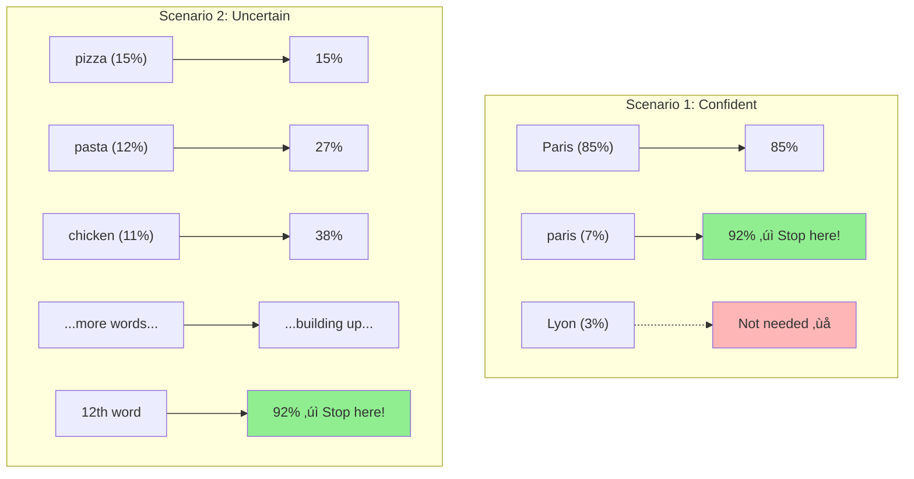
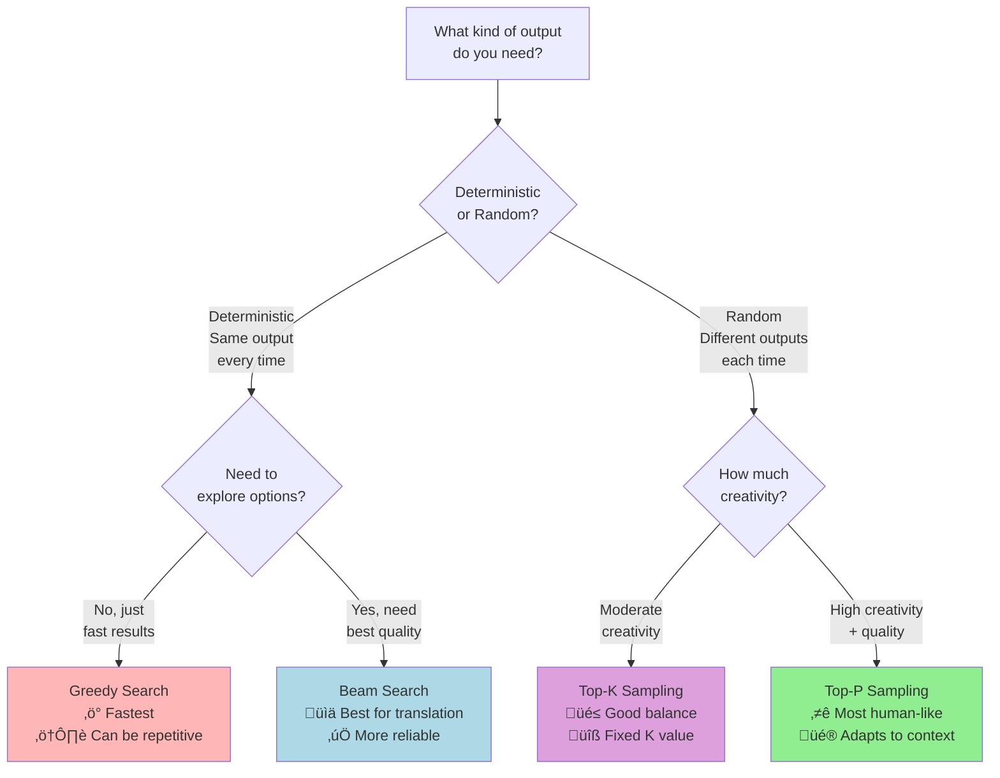

# Decoding and Sampling Algorithms for Text Generation

## Introduction: How Do LLMs Choose Words?

When a language model like ChatGPT or GPT-2 generates text, it doesn't just "know" what to write next. Instead, for every single word position, the model produces a list of ALL possible words it could use, along with a score (called a "probability") for each word.

Think of it like this: Imagine you're writing a sentence that starts with "I love eating..." The model might give you scores like:
- "pizza" → 30%
- "pasta" → 25%
- "apples" → 20%
- "books" → 5%
- "cars" → 3%
- ... and thousands of other words with smaller scores

**The big question is: How does the model pick which word to actually use?**

This document explains the different strategies (called "decoding methods") that models use to make this choice. Each method has trade-offs between being predictable vs. creative, fast vs. high-quality, and repetitive vs. diverse.

---

## How Auto-Regressive Generation Works

Before we dive into the methods, let's understand how text generation works step-by-step.

**Auto-regressive generation** is a fancy term that simply means: **the model generates one word at a time, using all the previous words as context**.

At each step:
1. The model looks at what's been written so far
2. It calculates probabilities for every possible next word
3. It uses a **decoding method** to pick one word
4. That word gets added to the context
5. Repeat until the model decides to stop (usually by generating a special "end" token)

Now let's explore the different ways to pick that next word!

---

## 1. Greedy Search: Always Pick the Most Likely Word

### The Simple Explanation

**Greedy Search** is the simplest approach: at every step, just pick the word with the highest probability. No thinking ahead, no randomness—just always choose #1.

### How It Works

Imagine you're at each step and you have these options:

**Step 1:** Starting with "The"
- "nice" → 50% ✅ **Pick this!**
- "dog" → 30%
- "big" → 20%

**Step 2:** Now you have "The nice"
- "woman" → 40% ✅ **Pick this!**
- "person" → 35%
- "man" → 25%

**Step 3:** Now you have "The nice woman"
- "is" → 60% ✅ **Pick this!**
- "walks" → 30%
- "said" → 10%

### The Problem

While greedy search is fast and predictable, it has two major issues:

1. **It misses better paths**: Sometimes a slightly less likely word early on leads to a much better sentence later
2. **It creates repetition**: Models often get stuck in loops, repeating the same phrases over and over

### Real Example

> "I enjoy walking with my cute dog, but I'm not sure if I'll ever be able to walk with my dog. I'm not sure if I'll ever be able to walk with my dog. I'm not sure..."

Notice how it keeps repeating the same phrase? That's a classic problem with greedy search.

---

## 2. Beam Search: Keep Multiple Options Open

### The Simple Explanation

**Beam Search** is smarter than greedy search. Instead of only tracking the #1 choice, it keeps track of the top **N** candidates (called "beams") at each step. This way, it can explore multiple paths and pick the best one overall.

Think of it like exploring a maze: instead of always taking the first tunnel you see, you split into multiple groups to explore different paths simultaneously, then choose the path that gets you furthest.

### How It Works

Let's say we use **2 beams** (keeping track of 2 candidates):

**Step 1:** Starting with "The"
- **Beam 1:** "The nice" (50%)
- **Beam 2:** "The dog" (30%)

**Step 2:** For each beam, explore the next word:
- From "The nice": "The nice woman" (50% × 40% = 20%)
- From "The nice": "The nice person" (50% × 35% = 17.5%)
- From "The dog": "The dog has" (30% × 90% = 27%) ✨ **This is best!**
- From "The dog": "The dog is" (30% × 60% = 18%)

Now we keep:
- **Beam 1:** "The dog has" (27%)
- **Beam 2:** "The nice woman" (20%)

### The Benefit

By exploring multiple paths, beam search can find sequences that are better overall, even if they started with a less likely word.

### The Limitation

Beam search still tends to produce somewhat generic, "safe" text. It's great for tasks where you want the most likely, predictable output (like translation), but not ideal when you want creative or diverse text.

---

## 3. Sampling: Introducing Randomness

### The Simple Explanation

Instead of always picking the most likely word (greedy) or the most likely paths (beam search), **sampling** introduces **randomness**. The model picks words randomly, but **more likely words have a higher chance of being chosen**.

Think of it like a lottery where "pizza" gets 30 tickets, "pasta" gets 25 tickets, "apples" gets 20 tickets, etc. You randomly draw one ticket—so pizza is most likely to win, but pasta or apples could win too!

### How It Works

Given these probabilities:
- "walking" → 40%
- "running" → 30%
- "hiking" → 20%
- "dancing" → 10%

Instead of always picking "walking," we might pick:
- "walking" 40% of the time
- "running" 30% of the time
- "hiking" 20% of the time
- "dancing" 10% of the time

### Temperature: Controlling Creativity

**Temperature** is a setting that controls how "adventurous" the sampling is:

- **Low temperature (e.g., 0.5)**: Makes the model MORE predictable
  - "pizza" → 50%, "pasta" → 30%, "apples" → 15%, "books" → 5%
  - The gap between top choices becomes bigger
  
- **High temperature (e.g., 1.5)**: Makes the model MORE creative/random
  - "pizza" → 25%, "pasta" → 24%, "apples" → 23%, "books" → 20%
  - Probabilities become more evenly distributed

### The Problem with Pure Sampling

If we sample from ALL possible words (including very unlikely ones), the model might choose words that make no sense at all. Imagine if the lottery included a million tickets for nonsense words—you'd sometimes get gibberish!

That's where the next two methods come in...

---

## 4. Top-K Sampling: Limiting the Lottery

### The Simple Explanation

**Top-K Sampling** solves the gibberish problem by saying: "Only consider the top **K** most likely words, ignore everything else."

For example, with K=5, you only put the top 5 words into the lottery, even though there might be thousands of possible words.

### How It Works

Let's say K=5 and you have these probabilities:

**All words:**
- "walking" → 30%
- "running" → 25%
- "hiking" → 20%
- "cooking" → 10%
- "reading" → 8%
- "sleeping" → 3%
- "jumping" → 2%
- "flying" → 1%
- ... thousands more tiny probabilities

**Top-K (K=5) only considers:**
- "walking" → 30%
- "running" → 25%
- "hiking" → 20%
- "cooking" → 10%
- "reading" → 8%

Everything else is eliminated! Then we sample randomly from these 5 words (adjusting probabilities so they add up to 100%).

### The Benefit

By eliminating low-probability words, Top-K prevents the model from choosing nonsensical words while still allowing for creativity and diversity.

### The Limitation

The problem with Top-K is that K is **fixed**. Sometimes you want to be MORE selective (when the model is very confident), and sometimes LESS selective (when the model is uncertain).

Example:
- If the next word is very obvious ("The capital of France is..."), you might only need K=2 
- If the next word is more open-ended ("I love to eat..."), you might want K=50

Top-K doesn't adapt to this—it always uses the same K value.

---

## 5. Top-P (Nucleus) Sampling: Adaptive Selection

### The Simple Explanation

**Top-P Sampling** (also called **Nucleus Sampling**) is smarter than Top-K. Instead of picking a fixed number of words, it picks **the smallest group of words whose probabilities add up to P%**.

For example, with P=90%, the model asks: "What's the smallest set of words that covers 90% of the probability?" Then it samples only from that set.

### How It Works

**Scenario 1:** Very confident prediction ("The capital of France is...")
- "Paris" → 85%
- "paris" → 7%
- "Lyon" → 3%
- "France" → 2%
- "French" → 1%

With P=90%, we only need the first 2 words to reach 92% (85% + 7%). So we sample from just those 2!

**Scenario 2:** Uncertain prediction ("I love to eat...")
- "pizza" → 15%
- "pasta" → 12%
- "chicken" → 11%
- "sushi" → 10%
- "tacos" → 9%
- "burgers" → 8%
- ... (many more)

With P=90%, we need maybe 12 words to reach 90%. So we sample from 12 words!

### The Benefit

Top-P **adapts** to the situation:
- When the model is confident, it's more selective (picks from fewer words)
- When the model is uncertain, it's more open (picks from more words)

This creates more natural, human-like text compared to fixed Top-K.

### Real-World Results

With Top-P=0.92, models generate much more diverse and interesting text:

> "I enjoy walking with my cute dog for the rest of the day, but this had me staying in an unusual room and not going on nights out with friends..."

Notice how it's creative and varied, without being nonsensical or repetitive!

---

## Comparison: Which Method Should You Use?

Here's a simple guide:

### Quick Reference Table

| Method | Randomness | Speed | Quality | Best For |
|--------|-----------|-------|---------|----------|
| **Greedy Search** | None | ⚡⚡⚡ Fastest | ⭐⭐ Can be repetitive | Quick tests, when speed matters |
| **Beam Search** | None | ⚡⚡ Fast | ⭐⭐⭐⭐ Reliable | Translation, summarization, factual tasks |
| **Sampling + Temperature** | High | ⚡⚡ Fast | ⭐⭐⭐ Varies | When you want pure creativity |
| **Top-K Sampling** | Medium | ⚡⚡ Fast | ⭐⭐⭐⭐ Good | Creative writing, chat bots |
| **Top-P Sampling** | Medium | ⚡⚡ Fast | ⭐⭐⭐⭐⭐ Best | Most general-purpose tasks, stories, dialogue |

---

## Practical Tips

### Combining Methods

You can combine these methods! For example:
- **Top-K + Top-P**: First filter to top 50 words (K=50), then do Top-P sampling within those
- **Beam Search + Sampling**: Use beam search but with some randomness
- **Temperature + Top-P**: Adjust temperature to control creativity, then use Top-P for adaptive selection

### Common Settings

Here are some typical settings for different use cases:

**Creative Writing:**
- Method: Top-P Sampling
- Temperature: 0.8-1.0
- Top-P: 0.9-0.95

**Chatbot Responses:**
- Method: Top-P Sampling
- Temperature: 0.7
- Top-P: 0.9

**Code Generation:**
- Method: Beam Search or Greedy
- Temperature: 0.2 (if using sampling)
- Beams: 3-5 (if using beam search)

**Translation:**
- Method: Beam Search
- Temperature: N/A
- Beams: 4-8

---

## Visualizing the Complete Process

Here's how it all comes together:

---

## Common Misconceptions

### "More randomness = better creativity" ❌

**Not quite!** Too much randomness creates gibberish. The best creativity comes from:
- Medium temperature (0.7-1.0)
- Smart filtering (Top-P or Top-K)
- Letting the model use its training

### "Greedy search is always bad" ❌

**Not true!** Greedy search is perfectly fine for:
- Quick prototypes
- When you need speed
- Deterministic outputs (same input always gives same output)

### "You always need the most advanced method" ❌

**Nope!** Sometimes simpler is better:
- Greedy for speed
- Beam for reliability
- Sampling for creativity

Choose based on your specific needs!

---

## Key Takeaways

1. **Decoding methods determine how a language model picks the next word** from thousands of possibilities

2. **Greedy Search** is simple and fast but can be repetitive

3. **Beam Search** explores multiple paths to find better overall sequences

4. **Sampling** adds randomness for more creative and diverse outputs

5. **Temperature** controls how adventurous the sampling is

6. **Top-K Sampling** limits choices to the top K words to avoid gibberish

7. **Top-P (Nucleus) Sampling** is usually the best choice—it adapts to context and produces natural-sounding text

8. **Different tasks need different methods**—experiment to find what works best for your use case!

---

## Further Reading

- [Hugging Face: How to Generate Text](https://huggingface.co/blog/how-to-generate) - The source material for this document
- [Hugging Face Generation Parameters](https://huggingface.co/docs/transformers/main_classes/text_generation) - Technical documentation
- Temperature and sampling in practice with different models
- The evolution of decoding methods in NLP research

---

**Remember:** There's no "perfect" decoding method—only the method that's perfect for YOUR specific task! Experiment, compare outputs, and see what works best for your needs. 🚀

