# Understanding Transformer Architecture

## Introduction: What is a Transformer?

Imagine you're at a party trying to understand a conversation. You don't just listen to one word at a time in isolation - you pay attention to how all the words relate to each other. When someone says "I put my phone on the table, and then **it** rang," you instantly know "it" refers to the phone, not the table. Your brain naturally understands these connections.

**Transformers are AI models that work similarly!** They look at all the words in a sentence at once and figure out how they relate to each other. This is what makes them so powerful for tasks like translation, writing, and understanding language.

Before transformers (introduced in 2017 in a paper called "Attention Is All You Need"), AI models processed text one word at a time, like reading through a tunnel with a flashlight - you could only see one word clearly at a time. Transformers changed everything by letting the model see the entire sentence at once and understand how every word connects to every other word.

Think of it like this:
- **Old way (RNNs):** Reading a book one word at a time through a tiny window, trying to remember everything that came before
- **Transformer way:** Seeing the entire page at once and instantly understanding how all the pieces fit together

This document will explain how transformers work, step by step, in plain English. No math required!

---

## Table of Contents

- [Understanding Transformer Architecture](#understanding-transformer-architecture)
  - [Introduction: What is a Transformer?](#introduction-what-is-a-transformer)
  - [Table of Contents](#table-of-contents)
  - [The Big Picture: What Does a Transformer Do?](#the-big-picture-what-does-a-transformer-do)
  - [The Two Main Parts: Encoder and Decoder](#the-two-main-parts-encoder-and-decoder)
  - [Step 1: Turning Words Into Numbers (Embeddings)](#step-1-turning-words-into-numbers-embeddings)
    - [Positional Encoding: Remembering Word Order](#positional-encoding-remembering-word-order)
  - [The Encoder: Understanding the Input](#the-encoder-understanding-the-input)
    - [Self-Attention: The Magic Sauce](#self-attention-the-magic-sauce)
      - [A Simple Analogy](#a-simple-analogy)
      - [How Self-Attention Works (Simple Version)](#how-self-attention-works-simple-version)
      - [Advanced Explanation: Self-Attention in Detail](#advanced-explanation-self-attention-in-detail)
    - [Multi-Head Attention: Multiple Perspectives](#multi-head-attention-multiple-perspectives)
    - [Feed-Forward Network: Processing Each Position](#feed-forward-network-processing-each-position)
    - [Residual Connections and Layer Normalization](#residual-connections-and-layer-normalization)
  - [The Decoder: Generating the Output](#the-decoder-generating-the-output)
    - [Masked Self-Attention: No Peeking Ahead](#masked-self-attention-no-peeking-ahead)
    - [Encoder-Decoder Attention: Using the Input](#encoder-decoder-attention-using-the-input)
  - [The Final Step: Turning Numbers Back Into Words](#the-final-step-turning-numbers-back-into-words)
  - [How Training Works](#how-training-works)
  - [Why Transformers Are So Powerful](#why-transformers-are-so-powerful)
  - [Modern Transformer Variants](#modern-transformer-variants)
  - [Key Takeaways](#key-takeaways)
  - [Further Reading](#further-reading)

---

## The Big Picture: What Does a Transformer Do?

Let's start with a real example. Imagine you want to translate this French sentence to English:

**French:** "Je suis étudiant"  
**English:** "I am a student"

A transformer takes the French sentence as input and produces the English sentence as output. But how?

```mermaid
graph LR
    A["Input: 'Je suis étudiant'"] --> B["Transformer
    (Black Box)"]
    B --> C["Output: 'I am a student'"]
    
    style A fill:#e1f5ff
    style B fill:#FFD700
    style C fill:#90EE90
```




*Figure 1: The transformer as a black box - takes French input and produces English output. Source: [The Illustrated Transformer](https://jalammar.github.io/illustrated-transformer/)*

**What's happening inside that black box?** The transformer:
1. **Understands** what the French sentence means
2. **Figures out** the relationships between words
3. **Generates** the English translation word by word

Think of it as a highly skilled translator who reads the entire French sentence first, understands its meaning completely, and then writes out the English translation.

---

## The Two Main Parts: Encoder and Decoder

When we open up the transformer "black box," we find two main sections:

1. **The Encoder** (the "understanding" part) - reads and understands the input
2. **The Decoder** (the "generating" part) - creates the output based on that understanding

```mermaid
graph TD
    Input["Input Sentence:
    'Je suis étudiant'"] --> Encoder["ENCODER
    (Understanding)
    
    Reads input
    Builds understanding
    Captures relationships"]
    
    Encoder --> Connection["Information Flow"]
    
    Connection --> Decoder["DECODER
    (Generating)
    
    Uses understanding
    Generates output
    One word at a time"]
    
    Decoder --> Output["Output Sentence:
    'I am a student'"]
    
    style Input fill:#e1f5ff
    style Encoder fill:#ADD8E6
    style Decoder fill:#DDA0DD
    style Output fill:#90EE90
    style Connection fill:#FFD700
```




*Figure 2: Opening the transformer reveals the encoder and decoder components. Source: [The Illustrated Transformer](https://jalammar.github.io/illustrated-transformer/)*

**The Encoder's job:** Read "Je suis étudiant" and build a rich understanding of what it means, including:
- What each word means
- How the words relate to each other
- The overall meaning of the sentence

**The Decoder's job:** Use that understanding to generate "I am a student" one word at a time:
- First: "I"
- Then: "am"
- Then: "a"
- Finally: "student"

### Stacking Layers

Both the encoder and decoder are actually **stacks of identical layers**. The original transformer paper used 6 encoder layers and 6 decoder layers stacked on top of each other.


*Figure 3: The transformer consists of a stack of 6 encoders and 6 decoders. Source: [The Illustrated Transformer](https://jalammar.github.io/illustrated-transformer/)*

**Why stack multiple layers?** Each layer refines the understanding:
- **Layer 1** might recognize basic patterns (like identifying nouns and verbs)
- **Layer 2** might understand simple relationships (like subject-verb agreement)
- **Layer 3** might grasp more complex meanings
- **Layers 4-6** build even deeper understanding

It's like editing a document multiple times - each pass improves the quality!

---

## Step 1: Turning Words Into Numbers (Embeddings)

Computers can't work with words directly - they need numbers. So the first step is converting each word into a list of numbers called an **embedding**.

**Simple analogy:** Imagine describing people with numbers:
- Height: 5.8
- Age: 30
- Friendliness: 8/10
- Sense of humor: 7/10

Each person becomes a list of numbers. Similarly, each word becomes a list of numbers (typically 512 numbers in the original transformer).

```mermaid
graph LR
    W1["Word: 'Je'"] --> E1["Embedding:
    [0.2, 0.8, ..., 0.3]
    (512 numbers)"]
    
    W2["Word: 'suis'"] --> E2["Embedding:
    [0.5, 0.1, ..., 0.7]
    (512 numbers)"]
    
    W3["Word: 'étudiant'"] --> E3["Embedding:
    [0.9, 0.3, ..., 0.2]
    (512 numbers)"]
    
    style W1 fill:#e1f5ff
    style W2 fill:#e1f5ff
    style W3 fill:#e1f5ff
    style E1 fill:#90EE90
    style E2 fill:#90EE90
    style E3 fill:#90EE90
```




*Figure 4: Each word is converted into a vector of 512 numbers (embedding). Source: [The Illustrated Transformer](https://jalammar.github.io/illustrated-transformer/)*

These embeddings aren't random - they're learned during training! Words with similar meanings get similar numbers. For example:
- "cat" and "dog" would have similar embeddings (both are animals)
- "happy" and "joyful" would have similar embeddings (both are positive emotions)
- "cat" and "happy" would have very different embeddings

**Advanced Explanation:** Embeddings are learned weight matrices that map each word (represented as a one-hot vector) to a dense vector in a continuous space. The model learns these embeddings through backpropagation during training. Similar words cluster together in this embedding space based on their usage patterns in the training data. The embedding dimension (512 in the original paper) is a hyperparameter that balances expressiveness with computational cost.

### Positional Encoding: Remembering Word Order

There's a problem: these embeddings don't tell us the **order** of words. But word order matters!
- "The dog bit the man" ≠ "The man bit the dog"

To solve this, transformers add **positional encodings** - extra numbers that tell the model where each word is in the sentence.

```mermaid
graph LR
    E1["Word Embedding
    (meaning)"] --> Add["➕"]
    P1["Positional Encoding
    (position)"] --> Add
    Add --> Final["Final Representation
    (meaning + position)"]
    
    style E1 fill:#ADD8E6
    style P1 fill:#FFD700
    style Final fill:#90EE90
```



**Think of it like this:** 
- **Word embedding** = "What does this word mean?"
- **Positional encoding** = "Where is this word in the sentence?"
- **Combined** = "What does this word mean AND where is it?"

Now each word has both its meaning and its position baked into its numbers!

**Advanced Explanation:** Positional encodings use sine and cosine functions of different frequencies: PE(pos, 2i) = sin(pos/10000^(2i/d)) and PE(pos, 2i+1) = cos(pos/10000^(2i/d)), where pos is the position and i is the dimension. This allows the model to learn to attend to relative positions. Unlike learned positional embeddings, these sinusoidal encodings can generalize to sequence lengths not seen during training.


*Figure 5: Word embeddings combined with positional encodings give each word both meaning and position information. Source: [The Illustrated Transformer](https://jalammar.github.io/illustrated-transformer/)*

---

## The Encoder: Understanding the Input

Now let's dive into what happens inside each encoder layer. Each encoder layer has two main components:

1. **Self-Attention Layer** - figures out how words relate to each other
2. **Feed-Forward Network** - processes each word's information


*Figure 6: Inside a single encoder layer - self-attention followed by feed-forward network, with residual connections. Source: [The Illustrated Transformer](https://jalammar.github.io/illustrated-transformer/)*

Let's break down each piece!

### Self-Attention: The Magic Sauce

**Self-attention is the heart of the transformer.** It's what allows the model to understand how words relate to each other.

#### A Simple Analogy

Imagine you're reading: "The animal didn't cross the street because **it** was too tired."

When you read "it," your brain automatically thinks back to "animal" (not "street"). You're paying **attention** to the relevant word. That's exactly what self-attention does!


*Figure 7: As the model processes "it," self-attention focuses heavily on "animal" to understand what "it" refers to. Source: [The Illustrated Transformer](https://jalammar.github.io/illustrated-transformer/)*

#### How Self-Attention Works (Simple Version)

For each word, self-attention:

1. **Looks at all other words** in the sentence
2. **Calculates attention scores** - how relevant is each other word?
3. **Combines information** from relevant words

Let's use a simpler example: "The cat sat on the mat"

When processing the word "**sat**":
- It pays high attention to "**cat**" (who is sitting?)
- It pays high attention to "**mat**" (where are they sitting?)
- It pays lower attention to "the" (less important words)


After self-attention, the word "sat" has been enriched with information from "cat" and "mat," so the model understands: "a cat is sitting on a mat."


*Figure 8: How embeddings flow through an encoder layer - each position (x1, x2, x3) is processed in parallel. Source: [The Illustrated Transformer](https://jalammar.github.io/illustrated-transformer/)*

#### Advanced Explanation: Self-Attention in Detail

Self-attention uses three learned transformations for each word embedding:
- **Query (Q):** "What am I looking for?"
- **Key (K):** "What do I contain?"
- **Value (V):** "What information can I provide?"

**The process:**

1. For each word, create Q, K, and V vectors by multiplying the word embedding by learned weight matrices (W^Q, W^K, W^V)

2. Calculate attention scores: For word i looking at word j:
   - Score(i,j) = Q_i · K_j (dot product)
   - This measures how much word i should attend to word j

3. Normalize scores using softmax to get attention weights (probabilities that sum to 1)

4. Create the output: weighted sum of Value vectors using attention weights

Mathematically: Attention(Q, K, V) = softmax(QK^T / √d_k)V

where d_k is the dimension of the Key vectors (used for scaling to prevent vanishing gradients).

The intuition:
- **Query** is like asking a question: "Who should I pay attention to?"
- **Key** is like answering: "I contain this type of information"
- **Value** is the actual information to use
- The dot product Q·K measures compatibility/relevance

This happens **in parallel for all words simultaneously**, which is why transformers are fast!


*Figure 9: Creating Query, Key, and Value vectors by multiplying the input embedding by learned weight matrices. Source: [The Illustrated Transformer](https://jalammar.github.io/illustrated-transformer/)*


*Figure 10: The complete self-attention calculation for one word - showing Query·Key scoring, normalization, and weighted Value combination. Source: [The Illustrated Transformer](https://jalammar.github.io/illustrated-transformer/)*


*Figure 11: The self-attention formula in matrix form - processing all positions simultaneously. Source: [The Illustrated Transformer](https://jalammar.github.io/illustrated-transformer/)*

### Multi-Head Attention: Multiple Perspectives

Instead of doing self-attention once, transformers do it **multiple times in parallel** (typically 8 times). Each is called an **attention head**.

**Why?** Different heads can focus on different types of relationships!

```mermaid
graph TD
    Word["Word: 'playing'"] --> Head1["Head 1:
    Who is playing?
    → Focus on 'children'"]
    
    Word --> Head2["Head 2:
    What are they playing?
    → Focus on 'game'"]
    
    Word --> Head3["Head 3:
    Where are they playing?
    → Focus on 'park'"]
    
    Word --> More["...more heads..."]
    
    Head1 --> Combine["Combine all
    perspectives"]
    Head2 --> Combine
    Head3 --> Combine
    More --> Combine
    
    Combine --> Rich["Rich understanding
    of 'playing'"]
    
    style Word fill:#e1f5ff
    style Head1 fill:#ADD8E6
    style Head2 fill:#DDA0DD
    style Head3 fill:#90EE90
    style Rich fill:#FFD700
```



**Real example:** In the sentence "The children were playing a game in the park"
- **Head 1** might focus on subject-verb relationships ("children" → "playing")
- **Head 2** might focus on verb-object relationships ("playing" → "game")  
- **Head 3** might focus on location relationships ("playing" → "park")

By combining all heads, the model gets a complete, multi-faceted understanding!


*Figure 12: Multi-head attention creates separate Q, K, V transformations for each attention head, allowing different perspectives. Source: [The Illustrated Transformer](https://jalammar.github.io/illustrated-transformer/)*


*Figure 13: Each attention head produces its own output (Z), which are then concatenated and transformed. Source: [The Illustrated Transformer](https://jalammar.github.io/illustrated-transformer/)*


*Figure 14: Visualizing different attention heads focusing on different words - some heads track syntactic relationships, others semantic ones. Source: [The Illustrated Transformer](https://jalammar.github.io/illustrated-transformer/)*

**Advanced Explanation:** Multi-head attention runs h parallel attention mechanisms with different learned weight matrices (W^Q_i, W^K_i, W^V_i for each head i). Each head has dimension d_k = d_model/h. After computing attention for each head, the outputs are concatenated and multiplied by a final weight matrix W^O to get the final output. This allows the model to jointly attend to information from different representation subspaces at different positions. Different heads empirically learn different linguistic relationships (e.g., syntactic vs. semantic).

### Feed-Forward Network: Processing Each Position

After self-attention mixes information between words, each word goes through a **feed-forward network** - a simple neural network that processes each word **independently**.


**Think of it as:** After gathering information from other words (self-attention), each word needs time to "think" and process what it learned. The feed-forward network does this processing.

**Key point:** The **same** feed-forward network is applied to each position, but each word is processed **independently** and **in parallel**.

**Advanced Explanation:** The feed-forward network consists of two linear transformations with a ReLU activation in between: FFN(x) = max(0, xW_1 + b_1)W_2 + b_2. The inner layer typically has dimension 4 times the model dimension (2048 for d_model=512). While the same FFN is applied to each position, they operate independently, making them trivially parallelizable. This provides a non-linear transformation that allows the model to compute complex functions of its inputs.

### Residual Connections and Layer Normalization

Two important tricks help train deep transformers:

**1. Residual Connections (Skip Connections):** Add the input directly to the output


**Why?** This helps information flow through deep networks and makes training easier. It's like having an "express lane" for information.

**2. Layer Normalization:** Normalize the values to keep them in a reasonable range

**Why?** This stabilizes training and prevents values from getting too large or too small.

**Advanced Explanation:** Residual connections combat vanishing gradients in deep networks by providing direct paths for gradient flow during backpropagation. Layer normalization (LayerNorm) normalizes across the feature dimension for each example independently: LayerNorm(x) = γ(x - μ)/σ + β, where μ and σ are the mean and standard deviation computed per-example, and γ and β are learned parameters. This differs from batch normalization and is more stable for sequences of varying lengths.


*Figure 15: Encoder and decoder layers with residual connections and layer normalization - showing how information flows through the complete architecture. Source: [The Illustrated Transformer](https://jalammar.github.io/illustrated-transformer/)*

---

## The Decoder: Generating the Output

The decoder is similar to the encoder but has three layers instead of two:

1. **Masked Self-Attention** - looks at words generated so far (with restrictions)
2. **Encoder-Decoder Attention** - pays attention to the input sentence
3. **Feed-Forward Network** - processes the information

```mermaid
graph TD
    Input["Output so far:
    'I am'"] --> Masked["Masked Self-Attention
    
    Can only look at
    'I' and 'am'
    (not future words)"]
    
    Masked --> Add1["Add & Normalize"]
    Input -.->|Skip| Add1
    
    Add1 --> EncDec["Encoder-Decoder Attention
    
    Looks at input sentence
    'Je suis étudiant'"]
    
    EncoderInfo["Information from
    Encoder"] -.-> EncDec
    
    EncDec --> Add2["Add & Normalize"]
    Add1 -.->|Skip| Add2
    
    Add2 --> FFN["Feed-Forward Network"]
    
    FFN --> Add3["Add & Normalize"]
    Add2 -.->|Skip| Add3
    
    Add3 --> Output["Predict next word:
    'a'"]
    
    style Input fill:#e1f5ff
    style Masked fill:#FFD700
    style EncDec fill:#DDA0DD
    style FFN fill:#ADD8E6
    style Output fill:#90EE90
    style EncoderInfo fill:#FFB6C1
```




*Figure 16: The decoder generates output one word at a time, using the encoder's output and previously generated words. Source: [The Illustrated Transformer](https://jalammar.github.io/illustrated-transformer/)*

### Masked Self-Attention: No Peeking Ahead

When generating word 3, the decoder can only look at words 1 and 2 - it can't peek at future words! This is called **masking**.

**Why?** During training, we show the decoder the complete output sentence, but we need to prevent it from "cheating" by looking ahead.

```mermaid
graph LR
    subgraph Generating["Generating: 'I am a student'"]
        W1["I"] --> W2["am"]
        W2 --> W3["a"]
        W3 --> W4["student"]
    end
    
    W1 -.->|Can see| W1
    
    W2 -.->|Can see| W1
    W2 -.->|Can see| W2
    
    W3 -.->|Can see| W1
    W3 -.->|Can see| W2
    W3 -.->|Can see| W3
    
    W4 -.->|Can see| W1
    W4 -.->|Can see| W2
    W4 -.->|Can see| W3
    W4 -.->|Can see| W4
    
    W1 -.->|BLOCKED ❌| W2
    W1 -.->|BLOCKED ❌| W3
    W1 -.->|BLOCKED ❌| W4
    
    W2 -.->|BLOCKED ❌| W3
    W2 -.->|BLOCKED ❌| W4
    
    W3 -.->|BLOCKED ❌| W4
    
    style W1 fill:#90EE90
    style W2 fill:#90EE90
    style W3 fill:#90EE90
    style W4 fill:#90EE90
```



**Think of it like writing a story:** You can only use the words you've already written to decide what comes next. You can't look at future words (because they don't exist yet!).

**Advanced Explanation:** Masking is implemented by setting attention scores for future positions to -∞ before the softmax operation. This ensures those positions get zero attention weight. The mask is a lower triangular matrix of 1s (allowing positions i to attend to j where j ≤ i). This is essential during training where we have the complete target sequence but need to maintain the auto-regressive property for coherent generation.

### Encoder-Decoder Attention: Using the Input

This is where the decoder **uses information from the encoder** (the input sentence).


**Example:** When generating "am," the decoder:
1. Looks at the French word "suis"
2. Realizes "suis" means "am"
3. Generates "am"

**Advanced Explanation:** Encoder-decoder attention (also called cross-attention) works like self-attention but with a crucial difference: Queries come from the decoder layer below, while Keys and Values come from the encoder output. This allows each decoder position to attend over all positions in the input sequence. The encoder output (Keys and Values) remains constant across all decoder layers and time steps, providing a consistent representation of the source sentence.


*Figure 17: Complete summary of the self-attention mechanism showing all steps from input embeddings to output. Source: [The Illustrated Transformer](https://jalammar.github.io/illustrated-transformer/)*

---

## The Final Step: Turning Numbers Back Into Words

After all the encoder and decoder layers, we have a vector of numbers. We need to turn this into a word!


**The process:**

1. **Linear layer:** Expand the vector to have one number per possible word (e.g., 10,000 words)
2. **Softmax:** Convert numbers to probabilities (percentages that add up to 100%)
3. **Pick the word:** Usually pick the word with highest probability

Then repeat for the next word, and the next, until the sentence is complete!


*Figure 18: The final linear layer expands to vocabulary size, then softmax produces probabilities for each word. Source: [The Illustrated Transformer](https://jalammar.github.io/illustrated-transformer/)*

**Advanced Explanation:** The final linear layer is a learned weight matrix that projects from d_model dimensions to vocabulary size (often 30,000-50,000 tokens). The softmax converts these logits into a probability distribution over the vocabulary: P(word_i) = exp(logit_i) / Σ_j exp(logit_j). During training, we use cross-entropy loss to compare this distribution with the target word. During inference, we can use greedy decoding (argmax), beam search, or sampling methods to select the next token.

---

## How Training Works

Training a transformer involves showing it many examples and adjusting its weights to make better predictions.

```mermaid
graph TD
    Input["Training Input:
    'Je suis étudiant'"] --> Trans["Transformer"]
    
    Target["Target Output:
    'I am a student'"] --> Compare
    
    Trans --> Prediction["Predicted Output:
    'I is one student'
    (wrong!)"]
    
    Prediction --> Compare["Compare:
    Calculate Error"]
    
    Compare --> Error["Error/Loss:
    How wrong was it?"]
    
    Error --> Back["Backpropagation:
    Adjust weights to
    reduce error"]
    
    Back --> Trans
    
    style Input fill:#e1f5ff
    style Trans fill:#FFD700
    style Target fill:#90EE90
    style Prediction fill:#FFB6B6
    style Error fill:#FFB6C1
    style Back fill:#DDA0DD
```



**The training loop:**

1. **Show input:** "Je suis étudiant"
2. **Show target:** "I am a student"
3. **Get prediction:** Model generates its best guess
4. **Calculate error:** How different is the prediction from the target?
5. **Update weights:** Adjust the model to reduce the error
6. **Repeat** millions of times with different examples

Over time, the model learns to make better and better translations!

**Important:** During training, we show the decoder the correct output words (with masking) to help it learn faster. During actual use (inference), we generate one word at a time and feed it back as input for the next word.

**Advanced Explanation:** Training uses teacher forcing: the decoder receives the correct previous tokens as input, not its own predictions. Loss is computed using cross-entropy between predicted and target distributions at each position, then summed or averaged. Gradients are calculated via backpropagation through all layers. The original transformer used the Adam optimizer with a custom learning rate schedule: lr = d_model^(-0.5) × min(step^(-0.5), step × warmup_steps^(-1.5)). Label smoothing (ε=0.1) was applied to prevent overconfidence. Training on large corpora (like WMT) with data augmentation and regularization (dropout=0.1) is essential for good generalization.

---

## Why Transformers Are So Powerful

Transformers revolutionized AI for several reasons:

### 1. **Parallel Processing**

**Old models (RNNs):** Process words one at a time sequentially

*Must wait for each word - SLOW!*

**Transformers:** Process all words simultaneously

*All at once - FAST!*

### 2. **Long-Range Dependencies**

Transformers can easily connect words that are far apart:

"The **animal**, which had been wandering in the forest for days, finally found its **home**."

Self-attention directly connects "animal" to "home" regardless of distance!

### 3. **Flexible Attention**

Each word can attend to **any other word** with learned weights, allowing the model to discover whatever patterns are most useful.

### 4. **Scalability**

Transformers scale incredibly well:
- GPT-3: 175 billion parameters
- GPT-4: Even larger!
- Can process thousands of tokens

The architecture works well from small models to massive ones.

---

## Modern Transformer Variants

The original transformer (2017) inspired many variations:

### Encoder-Only Models (BERT-style)
**Use case:** Understanding text (classification, question answering)


**Examples:** BERT, RoBERTa, ELECTRA

### Decoder-Only Models (GPT-style)
**Use case:** Generating text


**Examples:** GPT-2, GPT-3, GPT-4, LLaMA, Claude

**Key insight:** Decoder-only models can be trained simply by predicting the next word, making them easy to scale to huge datasets (all of the internet!).

### Encoder-Decoder Models (Original style)
**Use case:** Translation, summarization (input → output tasks)

```mermaid
graph LR
    Input["Source text"] --> Encoder["Encoder"] --> Decoder["Decoder"] --> Output["Target text"]
    
    style Input fill:#e1f5ff
    style Encoder fill:#ADD8E6
    style Decoder fill:#DDA0DD
    style Output fill:#90EE90
```

**Examples:** T5, BART, Original Transformer

---

## Key Takeaways

1. **Transformers understand relationships** between all words in a sentence simultaneously using self-attention

2. **Self-attention is the core mechanism** that allows each word to gather information from relevant words

3. **Multi-head attention** provides multiple perspectives on these relationships

4. **Encoders understand** the input, **decoders generate** the output

5. **Parallel processing** makes transformers much faster than older sequential models

6. **Positional encodings** help the model understand word order

7. **Stacking multiple layers** builds increasingly sophisticated understanding

8. **Modern variants** (GPT, BERT) use parts of the transformer architecture for specialized tasks

9. **Transformers scale incredibly well**, leading to models with hundreds of billions of parameters

10. **The key innovation:** Moving from processing text sequentially to processing it all at once with attention mechanisms

---

## Further Reading

### Beginner-Friendly Resources
- [The Illustrated Transformer](https://jalammar.github.io/illustrated-transformer/) - Jay Alammar's excellent visual guide (source for this document)
- [The Illustrated GPT-2](https://jalammar.github.io/illustrated-gpt2/) - Understanding decoder-only transformers
- [Attention Is All You Need](https://arxiv.org/abs/1706.03762) - The original transformer paper (more technical)

### Video Explanations
- [Attention is All You Need](https://www.youtube.com/watch?v=iDulhoQ2pro) - Yannic Kilcher's paper walkthrough
- [Transformer Neural Networks](https://www.youtube.com/watch?v=TQQlZhbC5ps) - CodeEmporium's explanation

### Interactive Resources
- [Tensor2Tensor Notebook](https://colab.research.google.com/github/tensorflow/tensor2tensor/blob/master/tensor2tensor/notebooks/hello_t2t.ipynb) - Experiment with transformers
- [The Annotated Transformer](http://nlp.seas.harvard.edu/2018/04/03/attention.html) - Harvard NLP's code walkthrough

### Advanced Papers
- [BERT: Pre-training of Deep Bidirectional Transformers](https://arxiv.org/abs/1810.04805)
- [Language Models are Few-Shot Learners (GPT-3)](https://arxiv.org/abs/2005.14165)
- [Training Compute-Optimal Large Language Models (Chinchilla)](https://arxiv.org/abs/2203.15556)

---

**Remember:** Understanding transformers is a journey, not a destination. Start with the high-level concepts, and gradually dig deeper into the mechanisms that interest you most. Even researchers are still discovering new ways to improve and apply transformers! 🚀

---

## List of Figures

This document includes 18 figures from [The Illustrated Transformer](https://jalammar.github.io/illustrated-transformer/) by Jay Alammar, used to enhance understanding:

1. **Figure 1**: Transformer as a black box
2. **Figure 2**: Encoder and decoder components
3. **Figure 3**: Stacked encoder and decoder layers
4. **Figure 4**: Word embeddings visualization
5. **Figure 5**: Positional encoding combined with embeddings
6. **Figure 6**: Single encoder layer structure
7. **Figure 7**: Self-attention focusing on "animal" when processing "it"
8. **Figure 8**: Encoder with vectors flowing through layers
9. **Figure 9**: Creating Query, Key, and Value vectors
10. **Figure 10**: Self-attention calculation step-by-step
11. **Figure 11**: Self-attention matrix formula
12. **Figure 12**: Multi-head attention Q, K, V transformations
13. **Figure 13**: Multi-head attention outputs
14. **Figure 14**: Attention visualization across different heads
15. **Figure 15**: Complete encoder-decoder with residuals and layer norm
16. **Figure 16**: Decoder generating output sequentially
17. **Figure 17**: Complete self-attention mechanism summary
18. **Figure 18**: Final linear and softmax layer

All figures are sourced from [The Illustrated Transformer](https://jalammar.github.io/illustrated-transformer/) by Jay Alammar, licensed under Creative Commons Attribution-NonCommercial-ShareAlike 4.0.

---

*This document was created to make transformer architecture accessible to everyone, regardless of technical background. For questions or clarifications, refer to the resources above or explore the many excellent transformer tutorials available online.*

