# Decoder-Only Transformers: The Architecture Behind Modern LLMs

## Introduction: What Are Decoder-Only Transformers?

Remember when we learned about the original transformer architecture with its encoder and decoder? Well, researchers discovered something surprising: **you can throw away the encoder entirely and just use the decoder part to build incredibly powerful language models!**

This simplified architecture is called a **decoder-only transformer**, and it's the secret behind almost every modern large language model (LLM) you've heard of:
- **GPT** (Generative Pre-trained Transformer) - GPT-2, GPT-3, GPT-4
- **LLaMA** (Meta's open models)
- **Claude** (Anthropic)
- **Gemini** (Google)
- **Mistral** and many others

**Why is this architecture so popular?** Because it turns out that for generating text, understanding text, answering questions, and pretty much everything LLMs do, you only need the decoder! It's simpler, easier to train on massive datasets, and scales beautifully to billions or even trillions of parameters.

Think of it this way:
- **Original Transformer**: Like having a translator who first reads and understands the entire French sentence (encoder), then translates to English (decoder)
- **Decoder-Only**: Like having someone who just writes the next word, again and again, by looking at everything written so far

The decoder-only approach is surprisingly powerful because learning to predict the next word forces the model to understand grammar, facts, reasoning, and context!

---

## Table of Contents

- [Decoder-Only Transformers: The Architecture Behind Modern LLMs](#decoder-only-transformers-the-architecture-behind-modern-llms)
  - [Introduction: What Are Decoder-Only Transformers?](#introduction-what-are-decoder-only-transformers)
  - [Table of Contents](#table-of-contents)
  - [From Encoder-Decoder to Decoder-Only](#from-encoder-decoder-to-decoder-only)
    - [What Changed?](#what-changed)
    - [Why This Works So Well](#why-this-works-so-well)
  - [The Core Architecture](#the-core-architecture)
    - [Input: Tokens and Embeddings](#input-tokens-and-embeddings)
    - [Positional Encoding](#positional-encoding)
    - [The Decoder Blocks](#the-decoder-blocks)
  - [Causal Self-Attention: The Key Mechanism](#causal-self-attention-the-key-mechanism)
    - [What is Causal Attention?](#what-is-causal-attention)
    - [Why Masking Matters](#why-masking-matters)
    - [Advanced Explanation: Implementing Causal Masking](#advanced-explanation-implementing-causal-masking)
  - [How Decoder-Only Models Generate Text](#how-decoder-only-models-generate-text)
    - [Step-by-Step Generation Process](#step-by-step-generation-process)
    - [The Auto-Regressive Loop](#the-auto-regressive-loop)
  - [Training: Next-Token Prediction](#training-next-token-prediction)
    - [The Training Objective](#the-training-objective)
    - [Why This Training Strategy is Powerful](#why-this-training-strategy-is-powerful)
    - [Advanced Explanation: Training Details](#advanced-explanation-training-details)
  - [Key Differences from Original Transformers](#key-differences-from-original-transformers)
  - [Modern Improvements and Variants](#modern-improvements-and-variants)
    - [1. Grouped-Query Attention (GQA)](#1-grouped-query-attention-gqa)
    - [2. Rotary Position Embeddings (RoPE)](#2-rotary-position-embeddings-rope)
    - [3. SwiGLU Activation](#3-swiglu-activation)
    - [4. RMSNorm Instead of LayerNorm](#4-rmsnorm-instead-of-layernorm)
    - [5. Larger Context Windows](#5-larger-context-windows)
  - [Scaling Laws: Bigger is Better (Usually)](#scaling-laws-bigger-is-better-usually)
  - [From Pre-Training to Chat Models](#from-pre-training-to-chat-models)
    - [Stage 1: Pre-Training (Base Model)](#stage-1-pre-training-base-model)
    - [Stage 2: Instruction Tuning](#stage-2-instruction-tuning)
    - [Stage 3: RLHF (Reinforcement Learning from Human Feedback)](#stage-3-rlhf-reinforcement-learning-from-human-feedback)
  - [Popular Decoder-Only Model Families](#popular-decoder-only-model-families)
    - [GPT Family (OpenAI)](#gpt-family-openai)
    - [LLaMA Family (Meta)](#llama-family-meta)
    - [Mistral Family](#mistral-family)
    - [Gemini Family (Google)](#gemini-family-google)
    - [Claude Family (Anthropic)](#claude-family-anthropic)
  - [Why Decoder-Only Won](#why-decoder-only-won)
  - [Limitations and Challenges](#limitations-and-challenges)
  - [The Future of Decoder-Only Models](#the-future-of-decoder-only-models)
  - [Key Takeaways](#key-takeaways)
  - [Further Reading](#further-reading)
    - [Foundational Papers](#foundational-papers)
    - [Scaling and Training](#scaling-and-training)
    - [Alignment and RLHF](#alignment-and-rlhf)
    - [Architecture Improvements](#architecture-improvements)
    - [Blog Posts and Tutorials](#blog-posts-and-tutorials)
    - [Interactive Resources](#interactive-resources)

---

## From Encoder-Decoder to Decoder-Only

Let's understand what changed when we went from the original transformer to decoder-only models.

### What Changed?

**Original Transformer (2017):**

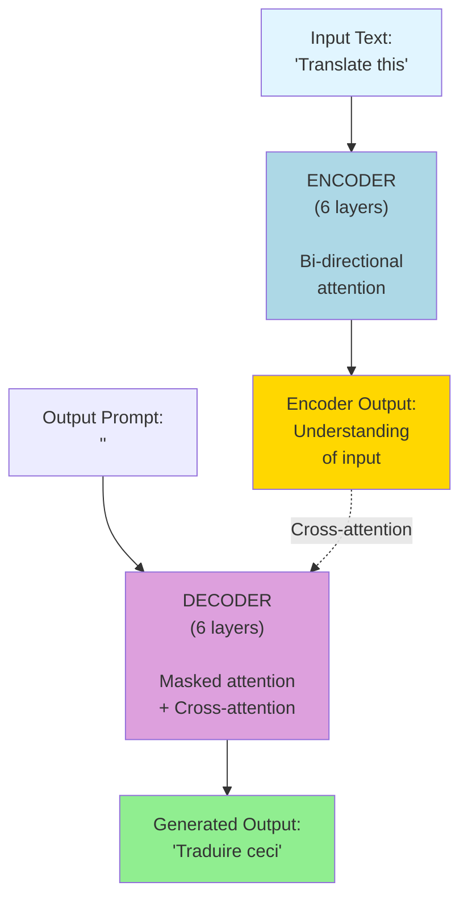

**Decoder-Only (GPT-style):**

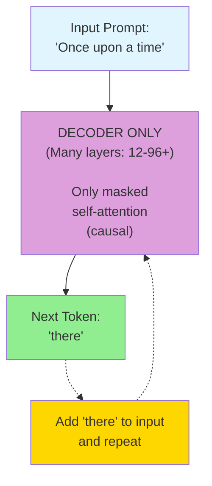

**The key differences:**

1. **No encoder** - Just stack decoder layers
2. **No cross-attention** - Only self-attention with causal masking
3. **Simpler architecture** - Fewer moving parts
4. **One input stream** - Everything is treated as a sequence to continue
5. **Auto-regressive generation** - Always predicting the next token

### Why This Works So Well

You might think: "Wait, if we removed half the architecture, won't it be less powerful?"

Surprisingly, **no!** Here's why:

**1. The task is simpler**

The original transformer was designed for translation: understand French → generate English. That requires two separate processes.

But for language modeling, there's only one task: **given some text, predict what comes next**. You don't need separate "understanding" and "generation" components.

**2. You can train on everything**

With encoder-decoder models, you need paired data (e.g., French sentences with English translations).

With decoder-only models, **any text is training data!** You just:
- Take any text: "The cat sat on the"
- Hide the next word: "mat"
- Train the model to predict "mat"

This means you can train on the **entire internet**—billions of books, websites, articles, code, conversations. More data = smarter model!

**3. It scales beautifully**

The simpler architecture makes it easier to scale to:
- Millions/billions of parameters
- Longer context windows
- Larger training datasets
- Distributed training across thousands of GPUs

**Advanced Explanation:** Decoder-only models can be viewed as implementing a conditional language model P(x_t | x_1, ..., x_{t-1}). By removing the encoder and cross-attention, we eliminate architecture complexity and reduce the number of learned parameters for the same model size, allowing those parameters to be allocated to deeper or wider layers. The causal masking in self-attention provides the same functionality as the decoder's masked self-attention in encoder-decoder models. Empirically, decoder-only models have shown superior scaling properties, following predictable power laws relating compute, data, and performance.

---

## The Core Architecture

Let's look at what's inside a decoder-only transformer, piece by piece.

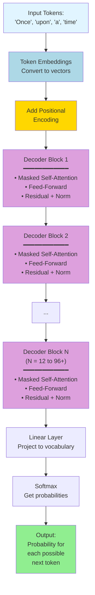

Each component serves a specific purpose. Let's explore them!

### Input: Tokens and Embeddings

Just like the original transformer, decoder-only models start by converting text into numbers.

**Tokenization:** Break text into pieces (tokens)

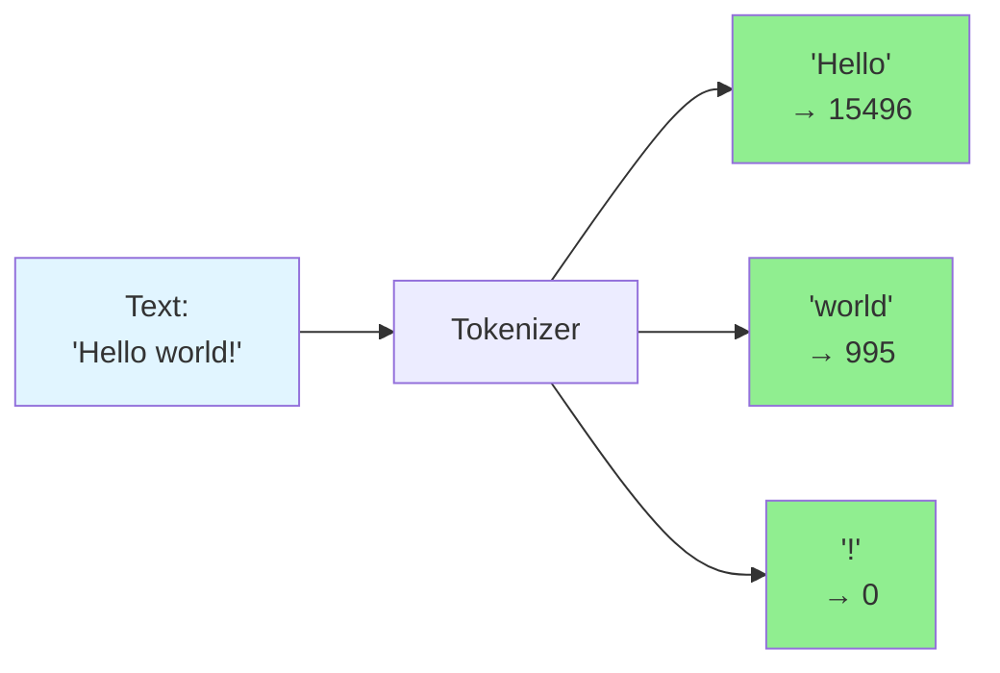

**Embedding:** Convert token IDs to vectors

Each token ID gets mapped to a learned vector (e.g., 768, 1024, or 4096 dimensions depending on the model).

#### How Token Embeddings Are Calculated

The embedding layer is actually a **learned lookup table** (a large matrix). Here's exactly how it works:

**Step 1: The Embedding Matrix**

Imagine we have a vocabulary of 50,000 tokens and want 768-dimensional embeddings:

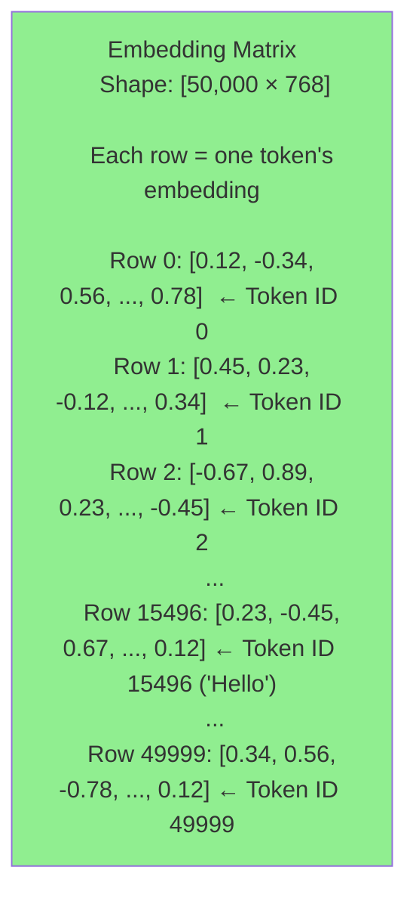

**Step 2: Lookup Process**

For each token ID, we simply **fetch the corresponding row** from the embedding matrix:

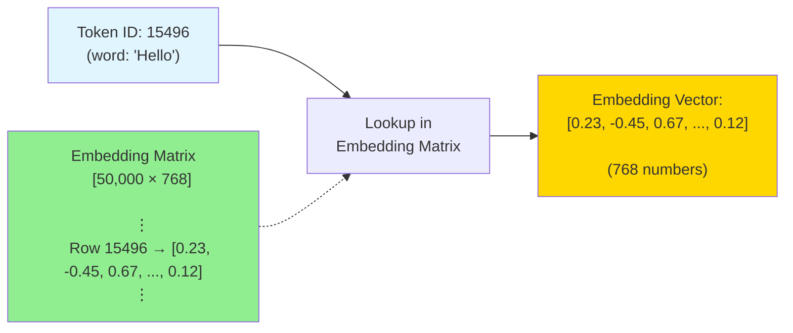

**Step 3: Mathematical View**

This lookup is mathematically equivalent to **matrix multiplication with a one-hot vector**:

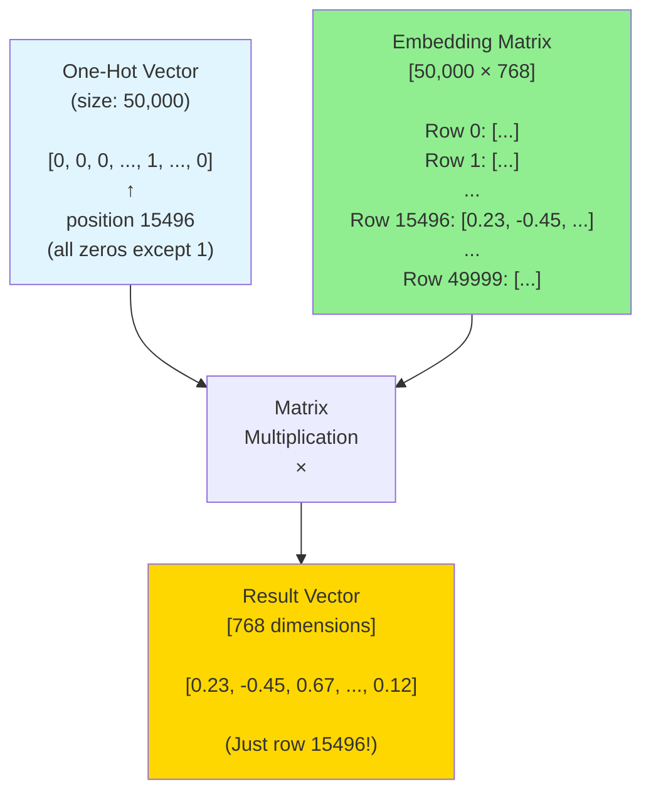

**In practice:** We don't actually create the one-hot vector and multiply. We just directly index into the matrix (much faster!):

```
embedding_vector = embedding_matrix[token_id]
```

**Step 4: Complete Example with Multiple Tokens**

Let's see how "Hi how are" gets embedded:

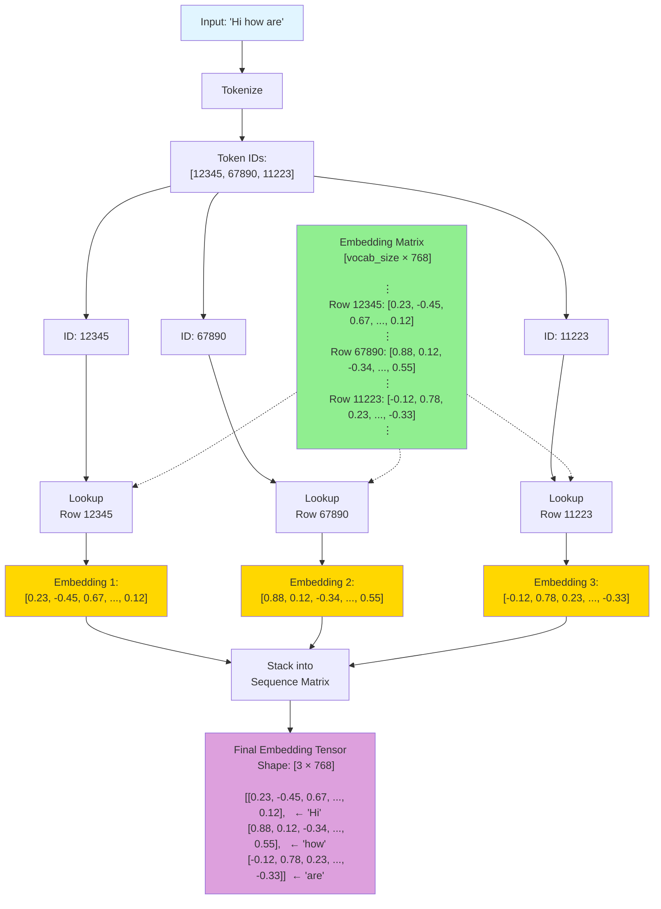

**Key Points:**

1. **The embedding matrix is learned during training** - it starts with random values and gets updated via backpropagation
2. **Each row represents one token** - similar tokens end up with similar embeddings
3. **The lookup is just array indexing** - very fast operation
4. **Same matrix used for all positions** - token "the" always gets the same embedding regardless of position

**Advanced Explanation:** Modern LLMs use subword tokenization (BPE, WordPiece, or SentencePiece) that balances vocabulary size with representation efficiency. The embedding layer is a learned matrix of shape [vocab_size × d_model], where each row is a token's embedding. This same matrix is often weight-tied (shared) with the final output projection layer to reduce parameters. Embeddings are typically initialized randomly and learned end-to-end during training. The gradients flow back through this lookup operation just like any other layer - when the model makes a prediction, it adjusts the embedding vectors to make better predictions in the future.

#### How the Embedding Matrix is Generated and Learned

The embedding matrix isn't hand-crafted—it's **learned automatically during training**! Here's the complete process:

**Phase 1: Initialization (Before Training)**

When you first create a model, the embedding matrix starts with **random numbers**:

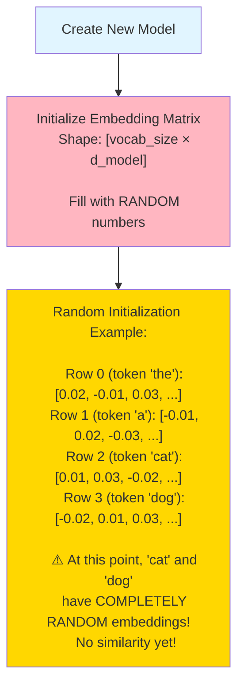

**Typical initialization:** Random values from a normal distribution with small variance (e.g., mean=0, std=0.02)

**Phase 2: Learning Through Training**

The magic happens during training through **backpropagation**. Let me show you step by step:

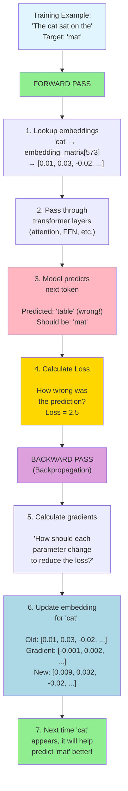

**Phase 3: Why Similar Words Get Similar Embeddings**

Through millions of training examples, words that appear in similar contexts naturally get similar embeddings!

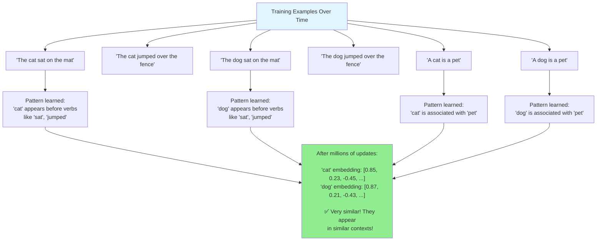

**The Learning Process in Detail:**

Let's trace one complete training step:

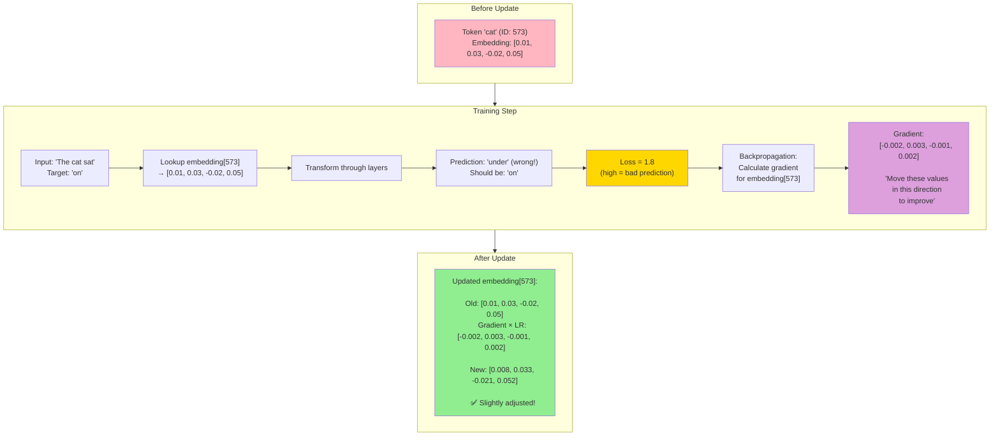

**Phase 4: After Training (Millions of Updates)**

After seeing billions of tokens during training, the embedding matrix becomes **highly meaningful**:

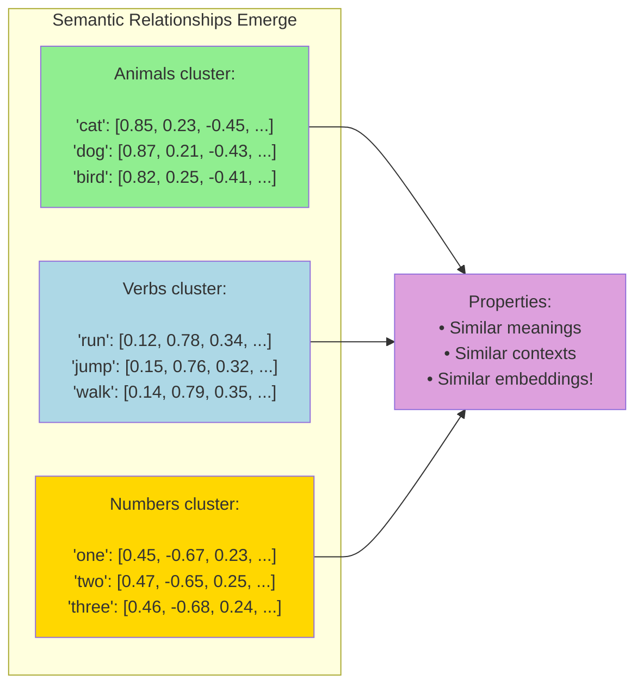

**Why This Works:**

1. **Distributional Hypothesis:** "Words that appear in similar contexts have similar meanings"

2. **Gradient Descent:** Small adjustments accumulate over billions of examples

3. **Context Pressure:** The model learns that certain embeddings help predict what comes next

4. **Natural Clustering:** Without being told, similar words naturally cluster together

**Complete Training Timeline:**

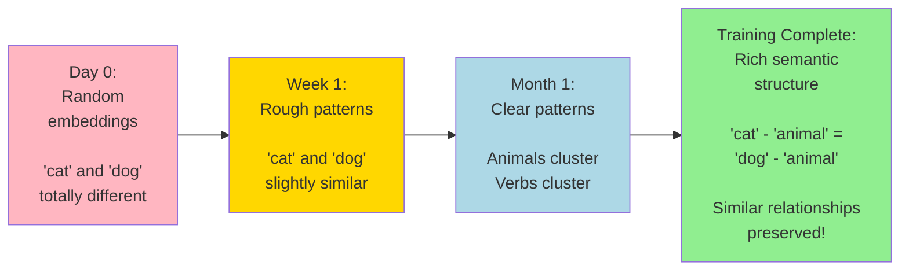

**Key Insights:**

1. **Start Random:** The embedding matrix begins with completely random values

2. **Learn from Context:** Through predicting next tokens, the model learns which embeddings work well together

3. **Gradual Refinement:** Each training example makes tiny adjustments (learning rate × gradient)

4. **Emergent Structure:** After billions of updates, meaningful semantic relationships emerge naturally

5. **Never Stop Learning:** Even in a "trained" model, the embeddings reflect patterns from all the training data

**Fun Fact:** You can even do math with learned embeddings:
```
king - man + woman ≈ queen
Paris - France + Italy ≈ Rome
```

These relationships emerge naturally from training, not from programming them in!

**Advanced Explanation:** The embedding matrix is trained via stochastic gradient descent (SGD) or Adam optimizer. During backpropagation, gradients flow from the loss through all layers back to the embeddings. For a given training example, only the embeddings of tokens that appear in that example receive gradient updates—the rest remain unchanged (sparse gradient updates). This is why training on diverse text is crucial: each embedding needs to appear in many contexts to learn a good representation. The learning rate determines the step size of updates. Typical values: lr=1e-4 to 1e-3. The embeddings learn to encode both semantic (meaning) and syntactic (grammar) information because both help predict the next token. Modern pre-trained models have embeddings that have already seen trillions of tokens, which is why they capture such rich linguistic structure.

### Positional Encoding

Since the model processes all tokens in parallel, we need to tell it the order of words!

**Original approach (sinusoidal):** Used fixed sine/cosine patterns

**Modern approach (learned):** Most modern LLMs use **learned positional embeddings** or **RoPE** (Rotary Position Embeddings)

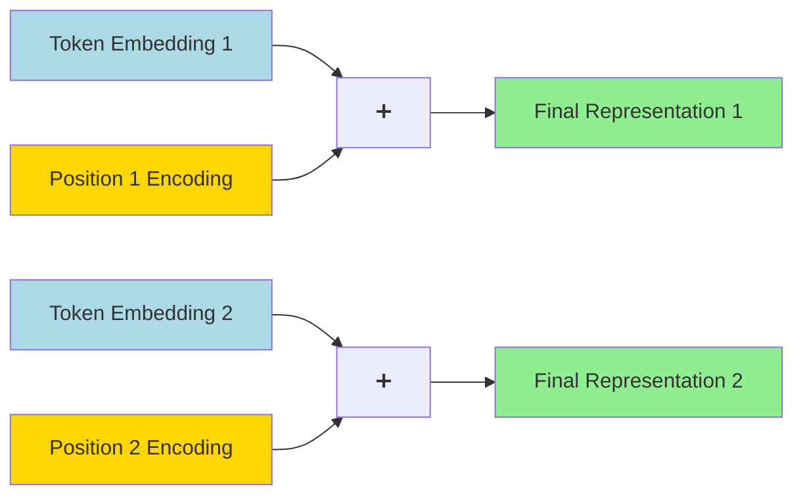

**Advanced Explanation:** RoPE (Rotary Position Embeddings) has become the dominant approach in modern LLMs (LLaMA, GPT-NeoX, etc.). Instead of adding positional information, RoPE rotates the key and query vectors in the attention mechanism by an angle proportional to the position. This provides several advantages: better length extrapolation, relative position encoding, and no additional parameters. The rotation is applied in the complex plane for pairs of dimensions: (q_2i, q_{2i+1}) gets rotated by θ_i × position, where θ_i = 10000^(-2i/d).

### The Decoder Blocks

Each decoder block is identical in structure (though they have different learned weights). A typical block contains:

1. **Masked Multi-Head Self-Attention**
2. **Feed-Forward Network**
3. **Residual Connections and Normalization**

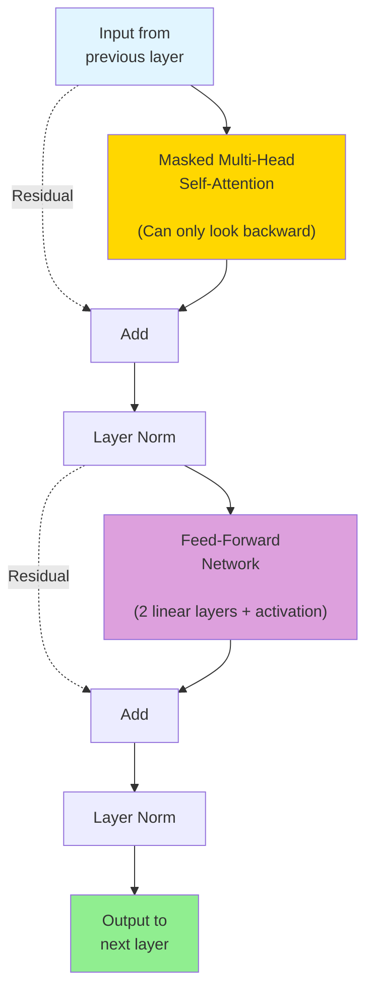

Modern models often use **Pre-LayerNorm** (normalize before, not after) and **different normalizations** like RMSNorm.

---

## Causal Self-Attention: The Key Mechanism

The most important part of decoder-only transformers is **causal self-attention** (also called **masked self-attention**).

### What is Causal Attention?

**Causal** means "one thing causes another." In our case, past tokens can influence future tokens, but **future tokens can NEVER influence past tokens**.

Think of it like writing a story:
- When you write word 5, you can look back at words 1, 2, 3, and 4
- But you **cannot** look ahead to word 6 (you haven't written it yet!)

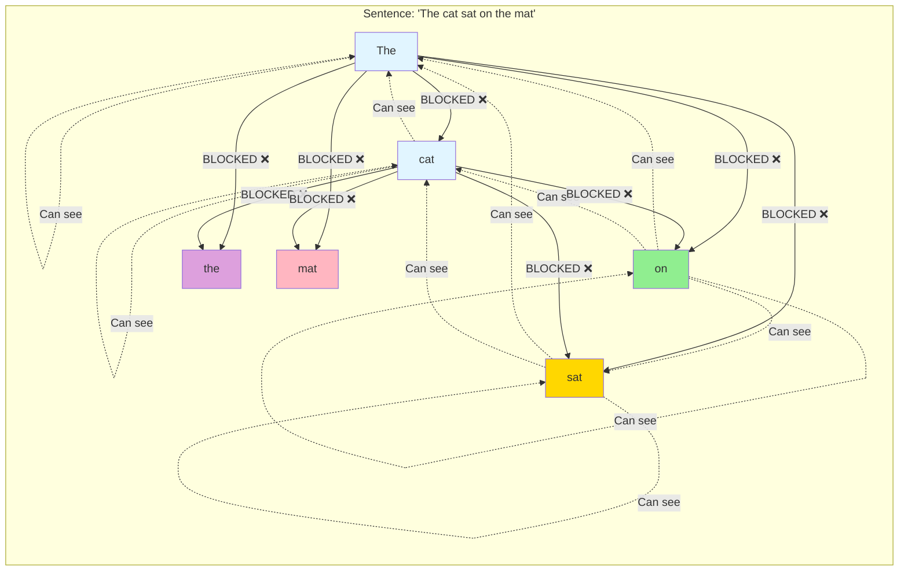

**In this diagram:**
- Each word can attend to itself and all previous words
- Future words are blocked (masked out)
- This creates a **causal** or **autoregressive** model

### Why Masking Matters

Without masking, the model could "cheat" during training:

**Without masking (❌ BAD):**
```
Training example: "The cat sat on the mat"
Task: Predict "sat"

If the model can see the full sentence including "sat", 
it just copies the answer! No learning happens.
```

**With masking (✅ GOOD):**
```
Training example: "The cat sat on the mat"
Task: Predict "sat"

The model can only see: "The cat"
Now it must LEARN what word likely comes next!
```

This forces the model to learn:
- Grammar rules
- Common patterns  
- World knowledge
- Reasoning abilities
- Everything needed to predict the next word

### Advanced Explanation: Implementing Causal Masking

Causal masking is implemented by setting attention scores for future positions to negative infinity before the softmax operation:

```
Attention scores matrix (before masking):
           The   cat   sat   on
    The  [ 0.8   0.3   0.5   0.2 ]
    cat  [ 0.4   0.9   0.6   0.3 ]
    sat  [ 0.2   0.5   0.7   0.4 ]
    on   [ 0.3   0.4   0.3   0.8 ]

Apply causal mask (lower triangular):
           The   cat   sat   on
    The  [ 0.8  -inf  -inf  -inf ]
    cat  [ 0.4   0.9  -inf  -inf ]
    sat  [ 0.2   0.5   0.7  -inf ]
    on   [ 0.3   0.4   0.3   0.8 ]

After softmax, -inf becomes 0:
           The   cat   sat   on
    The  [ 1.0   0.0   0.0   0.0 ]
    cat  [ 0.4   0.6   0.0   0.0 ]
    sat  [ 0.2   0.3   0.5   0.0 ]
    on   [ 0.2   0.3   0.2   0.3 ]
```

The mask is typically implemented as a binary matrix of 1s and 0s (or True/False) that's added to the attention scores before softmax. This mask can be precomputed and reused for all attention heads and layers since it depends only on sequence length, not content.

---

## How Decoder-Only Models Generate Text

Now let's see how these models actually generate text, one token at a time.

### Step-by-Step Generation Process

Let's walk through generating "Once upon a time there was" step by step.

**Step 1: Start with a prompt**

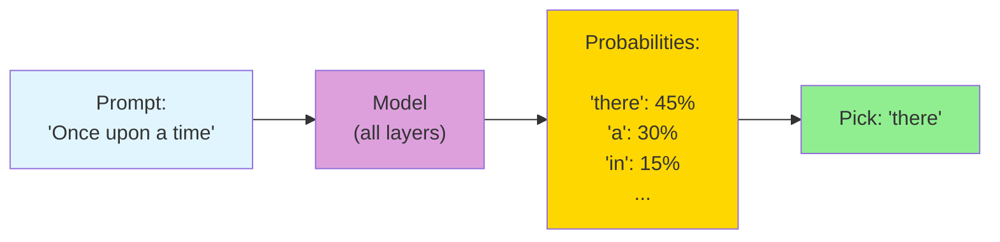

**Step 2: Add the generated token and repeat**

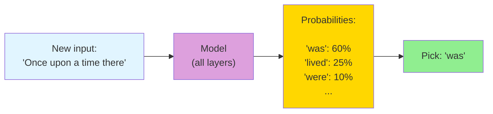

**Step 3: Continue until done**

Keep repeating until:
- You hit a stopping token (like `<|endoftext|>`)
- You reach a maximum length
- You manually stop generation

### The Auto-Regressive Loop

This process is called **auto-regressive** because each output becomes part of the next input.

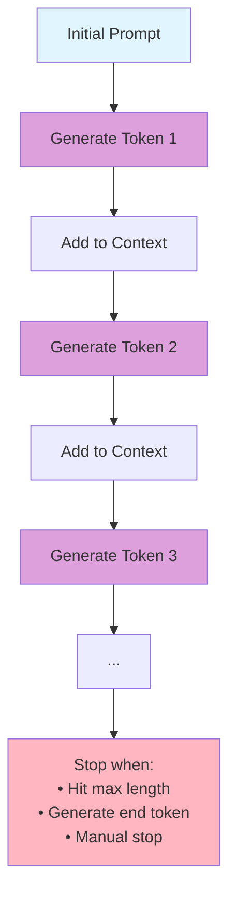

**Key insight:** The model runs the full computation for every single token! If you generate 100 tokens, the model does 100 forward passes. This is why generation can be slow for long sequences.

**Optimization - KV Cache:** Modern implementations cache the Key and Value vectors from previous tokens, so they don't need to be recomputed. This dramatically speeds up generation.

**Advanced Explanation:** The auto-regressive property means P(x_1, ..., x_T) = ∏_{t=1}^T P(x_t | x_{<t}). During generation, we sample from P(x_t | x_{<t}) using various decoding strategies (greedy, beam search, top-k, top-p, temperature sampling). The KV cache optimization exploits the fact that in self-attention, the Keys and Values for positions 1 to t-1 don't change when computing position t. By caching them, we reduce the attention computation from O(T²) to O(T) per token. This cache grows with sequence length and can become a memory bottleneck for very long contexts.

---

## Training: Next-Token Prediction

The beauty of decoder-only models is the incredibly simple training objective.

### The Training Objective

**One simple task: Predict the next token.**

That's it! No complex loss functions, no paired data, just:

1. Take any text
2. Feed in tokens 1 through N-1
3. Ask the model to predict token N
4. Calculate how wrong it was (cross-entropy loss)
5. Update weights to improve

```mermaid
graph TD
    Text["Training Text:
    'The cat sat on the mat'"] --> Split["Split into input/target pairs"]
    
    Split --> Ex1["Input: 'The'
    Target: 'cat'"]
    
    Split --> Ex2["Input: 'The cat'
    Target: 'sat'"]
    
    Split --> Ex3["Input: 'The cat sat'
    Target: 'on'"]
    
    Split --> Ex4["Input: 'The cat sat on'
    Target: 'the'"]
    
    Split --> Ex5["Input: 'The cat sat on the'
    Target: 'mat'"]
    
    Ex1 --> Loss["Calculate loss
    for all predictions"]
    Ex2 --> Loss
    Ex3 --> Loss
    Ex4 --> Loss
    Ex5 --> Loss
    
    Loss --> Update["Update model
    weights via
    backpropagation"]
    
    style Text fill:#e1f5ff
    style Ex1 fill:#ADD8E6
    style Ex2 fill:#ADD8E6
    style Ex3 fill:#ADD8E6
    style Ex4 fill:#ADD8E6
    style Ex5 fill:#ADD8E6
    style Loss fill:#FFB6C1
    style Update fill:#90EE90
```

**The magic:** From a single sentence, we get **multiple training examples**! One sentence of 6 tokens gives us 5 prediction tasks.

### Why This Training Strategy is Powerful

**1. It works with any text**

You don't need labeled data, translations, or annotations. Any text in any language works:
- Books
- Wikipedia
- Websites
- Code
- Conversations
- Scientific papers

**2. It teaches everything implicitly**

To predict the next word well, the model must learn:
- **Grammar:** "The cat **is**" (not "are")
- **Facts:** "The capital of France is **Paris**"
- **Reasoning:** "2 + 2 = **4**"
- **Context:** "She was happy because **she** won" (who is "she"?)

**3. It scales infinitely**

As long as there's more text on the internet, you can keep training!

**Real example from GPT-3:**
- Trained on 300 billion tokens
- From books, websites, papers, code, etc.
- Cost: ~$4-5 million in compute
- Resulted in 175 billion parameters

### Advanced Explanation: Training Details

**Loss function:** Cross-entropy loss between predicted distribution and true next token:
```
L = -log P(x_t | x_{<t})
```

**Teacher forcing:** During training, we always use the true previous tokens as input, never the model's own predictions. This is more stable than "scheduled sampling" or feeding model outputs back.

**Parallel training:** While generation is sequential, training is highly parallel. We can process an entire batch of sequences and compute loss for all positions simultaneously using causal masking. A single forward pass computes predictions for all sequence positions at once.

**Gradient accumulation:** For very large models, the batch size that fits in memory might be too small for stable training. Gradient accumulation allows accumulating gradients over multiple micro-batches before updating weights, effectively simulating larger batch sizes.

**Mixed precision training:** FP16 or BF16 (bfloat16) mixed precision training reduces memory usage and speeds up computation while maintaining model quality through careful loss scaling.

**Distributed training:** Large models use model parallelism (splitting model across GPUs), data parallelism (splitting data across GPUs), or pipeline parallelism (splitting layers across GPUs). ZeRO optimization (by DeepSpeed) efficiently shards optimizer states and gradients across devices.

---

## Key Differences from Original Transformers

Let's summarize the main differences between encoder-decoder transformers (like the original) and decoder-only transformers (like GPT).

| Aspect | Original Transformer | Decoder-Only (GPT) |
|--------|---------------------|-------------------|
| **Architecture** | Encoder + Decoder | Decoder only |
| **Attention Types** | Bi-directional (encoder)<br>Masked (decoder)<br>Cross-attention | Causal (masked) only |
| **Input** | Source & target sequences | Single sequence |
| **Training Data** | Paired examples<br>(e.g., translations) | Any text<br>(unsupervised) |
| **Training Objective** | Cross-entropy on target | Next-token prediction |
| **Use Case** | Translation, summarization | General language modeling |
| **Typical Size** | 6 layers each side | 12-96+ layers |
| **Parameters** | ~100M (original) | 1B - 1T+ |
| **Context Window** | 512-1024 tokens | 2K - 128K+ tokens |

**Visualization of the difference:**

```mermaid
graph TB
    subgraph Original["Original Transformer"]
        I1["Input"] --> E["Encoder
        (bidirectional)"]
        E --> Cross["Cross-attention"]
        T["Target"] --> D1["Decoder
        (masked)"]
        Cross --> D1
        D1 --> O1["Output"]
    end
    
    subgraph DecoderOnly["Decoder-Only"]
        I2["Input/Target
        (same sequence)"] --> D2["Decoder Stack
        (causal masking)"]
        D2 --> O2["Output"]
    end
    
    style E fill:#ADD8E6
    style D1 fill:#DDA0DD
    style D2 fill:#DDA0DD
    style Cross fill:#FFD700
```

---

## Modern Improvements and Variants

Since GPT-2 (2019), many improvements have been made to decoder-only transformers. Here are the most important ones:

### 1. Grouped-Query Attention (GQA)

**Problem:** Multi-head attention uses a lot of memory because each head has its own Key and Value matrices.

**Solution:** Share Keys and Values across groups of Query heads!

```mermaid
graph TD
    Input["Input"] --> Queries["8 Query Heads
    (separate)"]
    
    Input --> KV["2 Key-Value Heads
    (shared)"]
    
    Queries --> Group1["Heads 1-4
    share KV head 1"]
    Queries --> Group2["Heads 5-8
    share KV head 2"]
    
    KV --> Group1
    KV --> Group2
    
    Group1 --> Combine["Combine"]
    Group2 --> Combine
    
    Combine --> Output["Output"]
    
    style Input fill:#e1f5ff
    style Queries fill:#FFD700
    style KV fill:#DDA0DD
    style Output fill:#90EE90
```

**Used in:** LLaMA 2, Mistral

**Advanced Explanation:** GQA reduces the KV cache size by a factor of heads_per_group, enabling longer contexts and faster inference. It's a middle ground between Multi-Head Attention (MHA, each head has its own K,V) and Multi-Query Attention (MQA, all heads share one K,V). GQA provides most of MQA's efficiency benefits while maintaining better quality than pure MQA.

### 2. Rotary Position Embeddings (RoPE)

**Problem:** Learned positional embeddings don't extrapolate well to longer sequences than seen during training.

**Solution:** Encode position by rotating the attention vectors!

**Benefits:**
- Better length extrapolation
- Relative position information
- No extra parameters

**Used in:** GPT-NeoX, LLaMA, Mistral, most modern models

**Advanced Explanation:** RoPE applies a rotation to Q and K vectors based on their absolute position, but the dot product depends only on relative position difference. For a position m, we rotate query and key vectors by multiplying them with a rotation matrix R_m that depends on m. The attention score between positions m and n becomes: q_m^T k_n = (R_m q)^T (R_n k) = q^T R_{m-n} k, which depends only on the relative distance m-n.

### 3. SwiGLU Activation

**Problem:** ReLU activation in feed-forward networks is simple but not optimal.

**Solution:** Use SwiGLU (Swish-Gated Linear Unit)

```
SwiGLU(x) = Swish(xW) ⊗ (xV)
where Swish(x) = x · sigmoid(x)
```

**Benefits:**
- Better model quality
- More expressive transformations

**Used in:** LLaMA, PaLM

**Advanced Explanation:** SwiGLU is a gated activation where one linear projection is multiplied element-wise with a non-linear transformation of another projection. It's been shown empirically to improve performance, especially in large models. The feed-forward layer becomes: FFN(x) = (Swish(xW) ⊗ (xV))W_2, where ⊗ is element-wise multiplication. This replaces the traditional FFN(x) = σ(xW_1)W_2 where σ is ReLU or GeLU.

### 4. RMSNorm Instead of LayerNorm

**Problem:** LayerNorm computes both mean and variance, which can be slow.

**Solution:** RMSNorm (Root Mean Square Normalization) only uses RMS, not mean.

```
RMSNorm(x) = x / RMS(x) · γ
where RMS(x) = sqrt(mean(x²))
```

**Benefits:**
- Faster computation
- Similar performance to LayerNorm

**Used in:** LLaMA, many recent models

**Advanced Explanation:** RMSNorm normalizes using only the root mean square, eliminating the mean subtraction in LayerNorm. This reduces computation and improves training stability in practice. The normalization becomes: y = (x / √(mean(x²) + ε)) · γ, where γ is a learned gain parameter and ε is a small constant for numerical stability.

### 5. Larger Context Windows

Modern models support much longer contexts:

| Model | Context Window |
|-------|---------------|
| GPT-2 | 1,024 tokens |
| GPT-3 | 2,048 tokens |
| GPT-3.5-turbo | 4,096 tokens |
| GPT-4 | 8K / 32K / 128K tokens |
| Claude 2 | 100K tokens |
| Claude 3 | 200K tokens |
| GPT-4 Turbo | 128K tokens |
| Gemini 1.5 Pro | 1M tokens! |

**Techniques for longer contexts:**
- Sparse attention patterns
- Flash Attention (optimized attention computation)
- ALiBi (Attention with Linear Biases)
- Context compression

---

## Scaling Laws: Bigger is Better (Usually)

One of the most important discoveries in recent years is that model performance follows **predictable scaling laws**.

```mermaid
graph LR
    subgraph Inputs["What You Scale"]
        Compute["Compute
        (GPU hours)"]
        Data["Data
        (tokens)"]
        Params["Parameters
        (model size)"]
    end
    
    subgraph Output["Result"]
        Performance["Better Performance
        (lower loss)"]
    end
    
    Compute --> Performance
    Data --> Performance
    Params --> Performance
    
    style Compute fill:#ADD8E6
    style Data fill:#DDA0DD
    style Params fill:#FFD700
    style Performance fill:#90EE90
```

**The key insights:**

1. **More parameters = better performance** (given enough data and compute)
2. **More training data = better performance** (given a large enough model)
3. **More compute = better performance** (efficiently allocated)
4. The improvements are **predictable** and follow power laws

**Example progression:**
- GPT-1 (2018): 117M parameters
- GPT-2 (2019): 1.5B parameters
- GPT-3 (2020): 175B parameters
- GPT-4 (2023): ~1.7T parameters (rumored)

**But there are limits:**
- **Compute cost** scales quadratically with context length
- **Memory** requirements grow with model size
- **Diminishing returns** - each doubling costs more and helps less
- **Environmental impact** - training huge models uses massive energy

**Advanced Explanation:** The scaling laws discovered by Kaplan et al. (2020) show that test loss scales as a power law with model size (N), dataset size (D), and compute (C): L(N) ≈ (N_c/N)^α_N. The optimal allocation follows: N ∝ C^0.73, D ∝ C^0.27. This means you should scale parameters faster than data. However, Hoffmann et al. (2022) showed that prior work underestimated optimal data size, leading to the "Chinchilla scaling laws": for compute-optimal training, model size and training tokens should scale equally. A 70B parameter model should be trained on ~1.4T tokens for optimal performance per compute.

---

## From Pre-Training to Chat Models

Most LLMs go through multiple training stages to become the helpful assistants we interact with.

### Stage 1: Pre-Training (Base Model)

**Objective:** Learn language by predicting next tokens

**Data:** Massive amounts of text from the internet
- Books, articles, websites
- Code repositories
- Academic papers
- Social media (filtered)

**Result:** A "base model" that can:
- Complete text
- Answer questions (sometimes)
- Write code (sometimes)
- But... not very helpful or safe

```mermaid
graph LR
    Internet["Internet Text
    (trillions of tokens)"] --> PreTrain["Pre-Training
    
    Next-token
    prediction"]
    
    PreTrain --> Base["Base Model
    
    Can complete text
    but not aligned
    to be helpful"]
    
    style Internet fill:#e1f5ff
    style PreTrain fill:#DDA0DD
    style Base fill:#FFD700
```

**Example:**
- **Prompt:** "How do I bake a cake?"
- **Base model:** "How do I bake a cake? I've been trying to find a recipe for a cake that I can make at home. I've tried a few different recipes, but I can't seem to get it right..." (just continues text, doesn't answer)

### Stage 2: Instruction Tuning

**Objective:** Teach the model to follow instructions

**Data:** High-quality instruction-response pairs
- Questions with answers
- Tasks with completions
- Demonstrations of helpful behavior

**Result:** A model that can follow instructions!

```mermaid
graph LR
    Base["Base Model"] --> SFT["Supervised
    Fine-Tuning
    
    (Instruction
    tuning)"]
    
    Instructions["Instruction
    Dataset
    
    Q: How do I...?
    A: Here's how..."] --> SFT
    
    SFT --> Instruct["Instruction Model
    
    Follows instructions
    and helps users"]
    
    style Base fill:#FFD700
    style SFT fill:#DDA0DD
    style Instructions fill:#e1f5ff
    style Instruct fill:#90EE90
```

**Example:**
- **Prompt:** "How do I bake a cake?"
- **Instruction-tuned model:** "Here's how to bake a basic cake: 1. Preheat oven to 350°F... 2. Mix flour, sugar, eggs... 3. Bake for 30 minutes..."

### Stage 3: RLHF (Reinforcement Learning from Human Feedback)

**Objective:** Align the model with human preferences

**Process:**
1. Generate multiple responses
2. Humans rank them (which is best?)
3. Train a reward model to predict human preferences
4. Use reinforcement learning (PPO) to optimize for higher rewards

**Result:** A model that's:
- More helpful
- More harmless
- More honest
- Better aligned with human values

```mermaid
graph TD
    Instruct["Instruction Model"] --> Generate["Generate
    Multiple Responses"]
    
    Generate --> Human["Humans Rank
    Responses"]
    
    Human --> Reward["Train Reward
    Model"]
    
    Reward --> RL["Reinforcement
    Learning (PPO)"]
    
    Instruct --> RL
    
    RL --> Final["Final Model
    
    Aligned with
    human preferences"]
    
    style Instruct fill:#90EE90
    style Human fill:#FFD700
    style Reward fill:#DDA0DD
    style Final fill:#90EE90
```

**Example:**
- **Prompt:** "How do I bake a cake?"
- **RLHF model:** "I'd be happy to help you bake a cake! Here's a simple recipe for beginners... [Gives clear, structured, helpful answer]"

**Advanced Explanation:** RLHF uses Proximal Policy Optimization (PPO) to fine-tune the model. The reward function is learned from human preference comparisons using a Bradley-Terry model. The PPO objective includes a penalty term (KL divergence from the SFT model) to prevent the model from diverging too far and generating nonsense that happens to score high on the reward model. The final objective is: maximize E[r(x,y) - β·log(π(y|x)/π_SFT(y|x))], where r is the reward model, π is the current policy, π_SFT is the supervised fine-tuned model, and β controls the KL penalty.

---

## Popular Decoder-Only Model Families

Let's look at the most important decoder-only model families and their characteristics.

### GPT Family (OpenAI)

**GPT-2 (2019)**
- 1.5B parameters
- 1,024 token context
- Trained on WebText
- First to show "emergent abilities"

**GPT-3 (2020)**
- 175B parameters
- 2,048 token context
- Trained on 300B tokens
- Few-shot learning abilities

**GPT-3.5 (ChatGPT, 2022)**
- ~175B parameters
- 4,096 token context
- Instruction tuned + RLHF
- Breakthrough in usability

**GPT-4 (2023)**
- ~1.7T parameters (rumored, mixture of experts)
- 8K / 32K / 128K context
- Multimodal (text + images)
- Significantly more capable

### LLaMA Family (Meta)

**LLaMA 1 (2023)**
- Open weights
- 7B, 13B, 33B, 65B variants
- Trained on 1T-1.4T tokens
- Very efficient for size

**LLaMA 2 (2023)**
- 7B, 13B, 70B variants
- Trained on 2T tokens
- Includes chat-tuned versions
- Free for commercial use

**LLaMA 3 (2024)**
- 8B, 70B variants
- Trained on 15T tokens
- Significantly improved performance
- Better multilingual support

**Key innovations:**
- RoPE positional embeddings
- SwiGLU activation
- RMSNorm
- Grouped-Query Attention (LLaMA 2+)

### Mistral Family

**Mistral 7B (2023)**
- 7B parameters
- 8K context (32K with sliding window)
- Sliding Window Attention
- Outperforms much larger models

**Mixtral 8x7B (2024)**
- Mixture of Experts (8 experts)
- 47B total params, 13B active per token
- Extremely efficient
- Strong performance

**Innovation:** Sparse Mixture of Experts allows higher capacity without proportional compute cost.

### Gemini Family (Google)

**Gemini Nano, Pro, Ultra (2024)**
- Multimodal from the ground up
- Extremely long contexts (up to 1M tokens in 1.5 Pro)
- Strong reasoning capabilities

### Claude Family (Anthropic)

**Claude 1, 2, 3 (2023-2024)**
- Very long contexts (100K-200K tokens)
- Strong focus on safety
- Constitutional AI training
- Excellent at analysis and reasoning

---

## Why Decoder-Only Won

Why has the decoder-only architecture become dominant? Let's summarize:

**1. Simplicity**
- Fewer architectural components
- Easier to implement and debug
- Fewer hyperparameters to tune

**2. Scalability**
- Scales cleanly to billions of parameters
- Parallelizes well across GPUs
- Predictable computational requirements

**3. Data Efficiency**
- Can train on any text (no need for paired data)
- The entire internet is training data
- Self-supervised learning works incredibly well

**4. Versatility**
- One architecture for everything:
  - Text generation
  - Question answering
  - Translation
  - Summarization
  - Code generation
  - Reasoning

**5. Emergent Abilities**
- Larger models develop unexpected capabilities
- Few-shot learning
- Chain-of-thought reasoning
- Tool use

**6. Strong Performance**
- Empirically outperforms encoder-decoder on most tasks
- Scales better with compute and data

---

## Limitations and Challenges

Despite their success, decoder-only transformers have limitations:

**1. Computational Cost**
- Generation is slow (sequential, one token at a time)
- Long contexts are expensive (quadratic attention)
- Large models need expensive hardware

**2. Memory Requirements**
- KV cache grows with sequence length
- Billions of parameters need lots of RAM/VRAM

**3. Context Window Limits**
- Even 128K tokens isn't enough for some tasks
- Books, large codebases, complex research

**4. Lack of True Understanding**
- Can still produce "hallucinations" (plausible but false info)
- No grounding in reality
- Can't verify factual claims

**5. Training Data Challenges**
- Trained on internet data (includes biases, errors)
- Can reproduce or amplify problematic content
- Difficult to fully control behavior

**6. Alignment Challenges**
- Hard to specify exactly what we want
- Goodhart's Law: when a measure becomes a target, it ceases to be a good measure
- Adversarial attacks can manipulate behavior

---

## The Future of Decoder-Only Models

Where are decoder-only transformers heading?

**1. Even Longer Contexts**
- Multi-million token contexts
- Full books, codebases, conversations
- Techniques: sparse attention, compression

**2. Multimodality**
- Native image, audio, video understanding
- Unified models across modalities
- Examples: GPT-4V, Gemini

**3. More Efficient Architectures**
- Sparse models (Mixture of Experts)
- Retrieval-augmented generation
- Speculative decoding for faster generation

**4. Better Alignment**
- More sophisticated RLHF
- Constitutional AI
- Process supervision

**5. Smaller, More Capable Models**
- Better training techniques
- Knowledge distillation
- Synthetic data

**6. Specialized Models**
- Domain-specific LLMs (medical, legal, scientific)
- Multilingual models
- Code-specialized models

---

## Key Takeaways

1. **Decoder-only transformers use only the decoder part** of the original transformer architecture, with causal masking

2. **They're trained with next-token prediction** - a simple, powerful, and scalable objective

3. **Causal self-attention** is the key mechanism - each token can only attend to previous tokens

4. **Modern improvements** like RoPE, GQA, and SwiGLU make them more efficient and capable

5. **They scale predictably** - bigger models with more data and compute consistently perform better

6. **Training happens in stages** - pre-training, instruction tuning, and RLHF alignment

7. **They power all major LLMs** - GPT, LLaMA, Claude, Gemini, Mistral, etc.

8. **Auto-regressive generation** produces text one token at a time, feeding output back as input

9. **Despite limitations**, they're remarkably capable at a wide range of language tasks

10. **The future is bright** - longer contexts, multimodality, efficiency improvements, and better alignment

---

## Further Reading

### Foundational Papers
- [Language Models are Unsupervised Multitask Learners (GPT-2)](https://cdn.openai.com/better-language-models/language_models_are_unsupervised_multitask_learners.pdf) - OpenAI, 2019
- [Language Models are Few-Shot Learners (GPT-3)](https://arxiv.org/abs/2005.14165) - Brown et al., 2020
- [LLaMA: Open and Efficient Foundation Language Models](https://arxiv.org/abs/2302.13971) - Touvron et al., 2023
- [LLaMA 2: Open Foundation and Fine-Tuned Chat Models](https://arxiv.org/abs/2307.09288) - Touvron et al., 2023

### Scaling and Training
- [Scaling Laws for Neural Language Models](https://arxiv.org/abs/2001.08361) - Kaplan et al., 2020
- [Training Compute-Optimal Large Language Models (Chinchilla)](https://arxiv.org/abs/2203.15556) - Hoffmann et al., 2022
- [Scaling Laws for Autoregressive Generative Modeling](https://arxiv.org/abs/2010.14701) - Henighan et al., 2020

### Alignment and RLHF
- [Training Language Models to Follow Instructions (InstructGPT)](https://arxiv.org/abs/2203.02155) - Ouyang et al., 2022
- [Constitutional AI: Harmlessness from AI Feedback](https://arxiv.org/abs/2212.08073) - Bai et al., 2022

### Architecture Improvements
- [RoFormer: Enhanced Transformer with Rotary Position Embedding](https://arxiv.org/abs/2104.09864) - Su et al., 2021
- [GQA: Training Generalized Multi-Query Transformer](https://arxiv.org/abs/2305.13245) - Ainslie et al., 2023
- [GLU Variants Improve Transformer](https://arxiv.org/abs/2002.05202) - Shazeer, 2020
- [Flash Attention: Fast and Memory-Efficient Exact Attention](https://arxiv.org/abs/2205.14135) - Dao et al., 2022

### Blog Posts and Tutorials
- [The Illustrated GPT-2](https://jalammar.github.io/illustrated-gpt2/) - Jay Alammar
- [The Annotated Transformer](http://nlp.seas.harvard.edu/annotated-transformer/) - Harvard NLP
- [Understanding LLaMA](https://lightning.ai/pages/community/article/understanding-llama/) - Lightning AI

### Interactive Resources
- [GPT-2 Playground](https://transformer.huggingface.co/doc/gpt2-large) - Hugging Face
- [LLM Visualization](https://bbycroft.net/llm) - Interactive 3D visualization

---

**Remember:** Decoder-only transformers are powerful but still tools. Understanding how they work helps you use them more effectively, understand their limitations, and think critically about their outputs. The field is evolving rapidly, and new improvements emerge constantly! 🚀

---

*This document was created to demystify decoder-only transformers for everyone, from curious beginners to practicing engineers. For questions or clarifications, refer to the resources above or explore the growing community of LLM practitioners and researchers.*

