# Intelligent Agentic Workflow Designer - Temporal.ai + Crew AI Architecture

## Executive Summary

This document outlines the architecture for an intelligent agentic workflow designer platform using **Temporal.ai** for durable workflow orchestration and **Crew AI** for agent-based task execution. The system is designed to compete with n8n while providing advanced AI agent capabilities, with scale and performance as primary design goals.

---

## Table of Contents

1. [System Overview](#system-overview)
2. [Architecture Principles](#architecture-principles)
3. [System Architecture](#system-architecture)
4. [Component Details](#component-details)
5. [Data Flow](#data-flow)
6. [Scalability Strategy](#scalability-strategy)
7. [Performance Optimizations](#performance-optimizations)
8. [Security Architecture](#security-architecture)
9. [Deployment Architecture](#deployment-architecture)
10. [Technology Stack](#technology-stack)

---

## System Overview

The platform enables users to design, deploy, and monitor AI-powered workflows through a visual interface. It combines the reliability of Temporal.ai's workflow engine with Crew AI's opinionated agent framework.

### Key Features

- Visual workflow designer with drag-and-drop interface
- AI agents with roles, goals, and tools
- Durable execution with automatic retries and fault tolerance
- Real-time workflow monitoring and debugging
- Multi-tenancy support
- Horizontal scalability
- Event-driven architecture

---

## Architecture Principles

1. **Separation of Concerns**: Clear boundaries between workflow orchestration, agent execution, and UI
2. **Scalability First**: Designed for horizontal scaling from day one
3. **Fault Tolerance**: Leveraging Temporal's durability guarantees
4. **Performance**: Sub-second UI response times, efficient resource utilization
5. **Extensibility**: Plugin architecture for custom agents and integrations
6. **Observability**: Comprehensive monitoring, logging, and tracing

---

## System Architecture

### High-Level Architecture

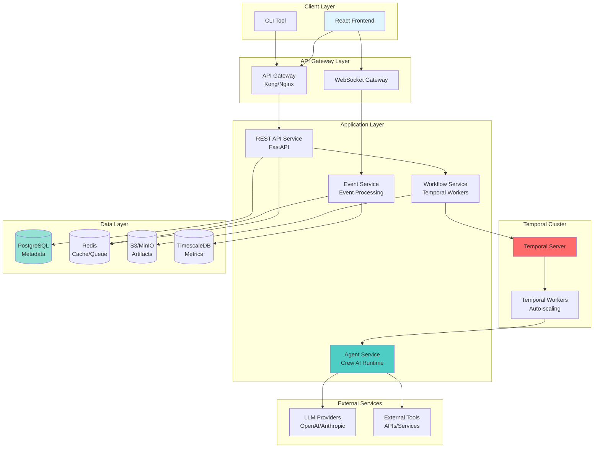
```mermaid
graph TB
    subgraph "Client Layer"
        UI[React Frontend]
        CLI[CLI Tool]
    end
    
    subgraph "API Gateway Layer"
        AG[API Gateway<br/>Kong/Nginx]
        WS[WebSocket Gateway]
    end
    
    subgraph "Application Layer"
        API[REST API Service<br/>FastAPI]
        WF[Workflow Service<br/>Temporal Workers]
        AG_SERVICE[Agent Service<br/>Crew AI Runtime]
        EVENT[Event Service<br/>Event Processing]
    end
    
    subgraph "Temporal Cluster"
        TC[Temporal Server]
        TW[Temporal Workers<br/>Auto-scaling]
    end
    
    subgraph "Data Layer"
        POSTGRES[(PostgreSQL<br/>Metadata)]
        REDIS[(Redis<br/>Cache/Queue)]
        S3[(S3/MinIO<br/>Artifacts)]
        TSDB[(TimescaleDB<br/>Metrics)]
    end
    
    subgraph "External Services"
        LLM[LLM Providers<br/>OpenAI/Anthropic]
        TOOLS[External Tools<br/>APIs/Services]
    end
    
    UI --> AG
    CLI --> AG
    AG --> API
    UI --> WS
    WS --> EVENT
    API --> WF
    WF --> TC
    TC --> TW
    TW --> AG_SERVICE
    AG_SERVICE --> LLM
    AG_SERVICE --> TOOLS
    API --> POSTGRES
    API --> REDIS
    WF --> S3
    EVENT --> REDIS
    EVENT --> TSDB
    
    style UI fill:#e1f5ff
    style TC fill:#ff6b6b
    style AG_SERVICE fill:#4ecdc4
    style POSTGRES fill:#95e1d3
```

### Layered Architecture

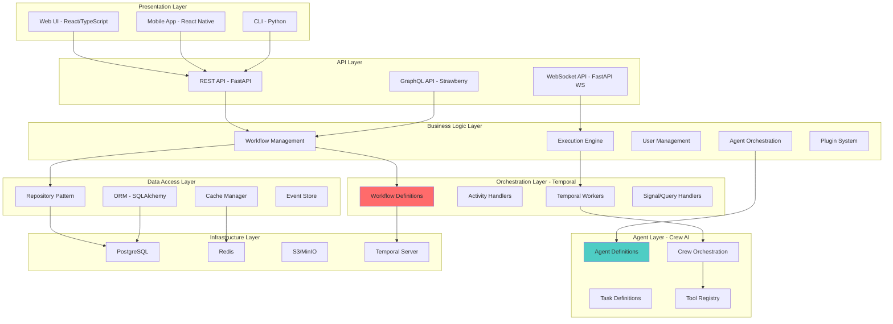
```mermaid
graph TB
    subgraph "Presentation Layer"
        A1[Web UI - React/TypeScript]
        A2[Mobile App - React Native]
        A3[CLI - Python]
    end
    
    subgraph "API Layer"
        B1[REST API - FastAPI]
        B2[GraphQL API - Strawberry]
        B3[WebSocket API - FastAPI WS]
    end
    
    subgraph "Business Logic Layer"
        C1[Workflow Management]
        C2[Agent Orchestration]
        C3[User Management]
        C4[Execution Engine]
        C5[Plugin System]
    end
    
    subgraph "Orchestration Layer - Temporal"
        D1[Workflow Definitions]
        D2[Activity Handlers]
        D3[Temporal Workers]
        D4[Signal/Query Handlers]
    end
    
    subgraph "Agent Layer - Crew AI"
        E1[Agent Definitions]
        E2[Task Definitions]
        E3[Crew Orchestration]
        E4[Tool Registry]
    end
    
    subgraph "Data Access Layer"
        F1[Repository Pattern]
        F2[ORM - SQLAlchemy]
        F3[Cache Manager]
        F4[Event Store]
    end
    
    subgraph "Infrastructure Layer"
        G1[PostgreSQL]
        G2[Redis]
        G3[S3/MinIO]
        G4[Temporal Server]
    end
    
    A1 --> B1
    A2 --> B1
    A3 --> B1
    B1 --> C1
    B2 --> C1
    B3 --> C4
    C1 --> D1
    C2 --> E1
    C4 --> D3
    D3 --> E3
    E3 --> E4
    C1 --> F1
    F1 --> G1
    F2 --> G1
    F3 --> G2
    D1 --> G4
    
    style D1 fill:#ff6b6b
    style E1 fill:#4ecdc4
```

---

## Component Details

### 1. Frontend Application

#### Architecture

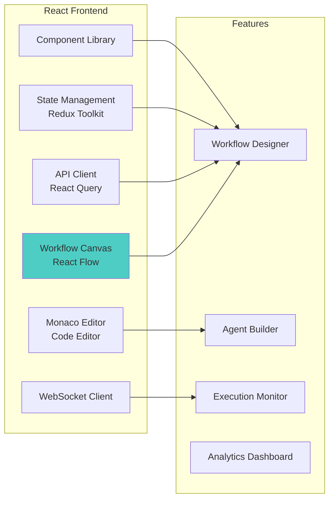
```mermaid
graph LR
    subgraph "React Frontend"
        A[Component Library]
        B[State Management<br/>Redux Toolkit]
        C[API Client<br/>React Query]
        D[WebSocket Client]
        E[Workflow Canvas<br/>React Flow]
        F[Monaco Editor<br/>Code Editor]
    end
    
    subgraph "Features"
        G[Workflow Designer]
        H[Agent Builder]
        I[Execution Monitor]
        J[Analytics Dashboard]
    end
    
    A --> G
    B --> G
    C --> G
    D --> I
    E --> G
    F --> H
    
    style E fill:#4ecdc4
```

**Key Technologies:**
- **React 18+** with TypeScript for type safety and modern development
- **React Flow** for visual workflow designer with drag-and-drop capabilities
- **Redux Toolkit** for centralized state management across the application
- **React Query** for efficient API caching, synchronization, and background updates
- **Tailwind CSS** + **shadcn/ui** for modern, responsive UI components
- **Monaco Editor** for in-browser code and prompt editing
- **WebSocket** for real-time execution updates and monitoring

**Performance Optimizations:**
- **Code splitting and lazy loading**: Only load components when needed to reduce initial bundle size
- **Virtual scrolling**: Efficiently render large lists of workflows without performance degradation
- **Debounced auto-save**: Prevent excessive API calls while users are editing
- **Optimistic UI updates**: Immediately reflect user actions in the UI before server confirmation
- **Service Worker**: Enable offline support and faster subsequent page loads

---

### 2. API Service (FastAPI)

```mermaid
graph TB
    subgraph "API Service"
        A[Router Layer]
        B[Authentication<br/>JWT + OAuth2]
        C[Authorization<br/>RBAC]
        D[Validation<br/>Pydantic]
        E[Business Logic]
        F[Error Handling]
    end
    
    subgraph "Endpoints"
        G[/workflows]
        H[/agents]
        I[/executions]
        J[/users]
        K[/plugins]
    end
    
    subgraph "Services"
        L[Workflow Service]
        M[Agent Service]
        N[Execution Service]
        O[User Service]
    end
    
    A --> B
    B --> C
    C --> D
    D --> E
    E --> F
    
    A --> G
    A --> H
    A --> I
    A --> J
    A --> K
    
    G --> L
    H --> M
    I --> N
    J --> O
    
    style E fill:#4ecdc4
```

**Responsibilities:**
- **Workflow CRUD operations**: Create, read, update, and delete workflow definitions
- **Agent configuration management**: Store and manage agent roles, goals, and tool assignments
- **Execution triggering and monitoring**: Start workflows and query their status
- **User authentication and authorization**: JWT-based auth with role-based access control
- **Plugin management**: Register and manage custom tools and integrations
- **Metrics collection**: Gather usage statistics and performance metrics

**Performance Features:**
- **Async request handling**: Non-blocking I/O for high concurrency
- **Connection pooling**: Reuse database connections to reduce overhead
- **Request caching**: Store frequently accessed data in Redis for fast retrieval
- **Rate limiting**: Prevent abuse and ensure fair resource distribution
- **Response compression**: Reduce bandwidth usage with gzip/brotli
- **Database query optimization**: Use indexes and query planning for fast responses

---

### 3. Temporal Workflow Layer

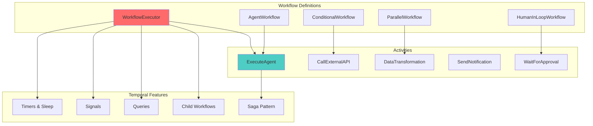
```mermaid
graph TB
    subgraph "Workflow Definitions"
        A[WorkflowExecutor]
        B[AgentWorkflow]
        C[ConditionalWorkflow]
        D[ParallelWorkflow]
        E[HumanInLoopWorkflow]
    end
    
    subgraph "Activities"
        F[ExecuteAgent]
        G[CallExternalAPI]
        H[DataTransformation]
        I[SendNotification]
        J[WaitForApproval]
    end
    
    subgraph "Temporal Features"
        K[Timers & Sleep]
        L[Signals]
        M[Queries]
        N[Child Workflows]
        O[Saga Pattern]
    end
    
    A --> F
    B --> F
    C --> G
    D --> H
    E --> J
    
    A --> K
    A --> L
    A --> M
    A --> N
    
    F --> O
    
    style A fill:#ff6b6b
    style F fill:#4ecdc4
```

**Workflow Patterns:**

**1. Sequential Agent Execution**
- Executes agent tasks one after another in a defined order
- Each task receives the output from the previous task as context
- Automatic retry logic with exponential backoff on failures
- Configurable timeout and retry policies per task
- State is maintained throughout the execution chain

**2. Parallel Agent Execution**
- Runs multiple agent tasks simultaneously for faster execution
- Useful when tasks are independent and don't depend on each other
- Aggregates results from all parallel tasks
- Waits for all tasks to complete before proceeding
- Handles partial failures with configurable strategies

**3. Human-in-the-Loop**
- Pauses workflow execution to wait for human input or approval
- Uses Temporal signals to receive external input
- Supports timeout configurations for approval deadlines
- Can proceed with default actions if approval timeout is exceeded
- Maintains full workflow state during the waiting period

**4. Conditional Routing**
- Evaluates conditions to determine next workflow step
- Supports complex business logic for decision making
- Can branch to different agent tasks based on previous results
- Enables dynamic workflow paths

**5. Saga Pattern for Compensation**
- Implements distributed transactions across multiple services
- Automatically handles rollback on failures
- Executes compensation activities to undo partial work
- Ensures data consistency across the system

---

### 4. Crew AI Agent Layer

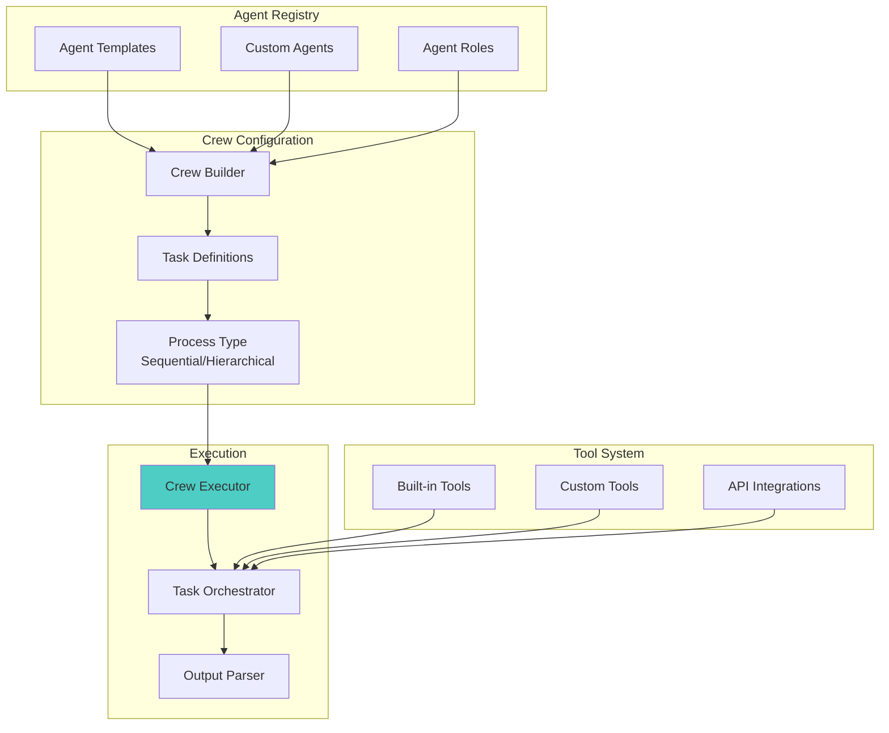
```mermaid
graph TB
    subgraph "Agent Registry"
        A[Agent Templates]
        B[Custom Agents]
        C[Agent Roles]
    end
    
    subgraph "Crew Configuration"
        D[Crew Builder]
        E[Task Definitions]
        F[Process Type<br/>Sequential/Hierarchical]
    end
    
    subgraph "Tool System"
        G[Built-in Tools]
        H[Custom Tools]
        I[API Integrations]
    end
    
    subgraph "Execution"
        J[Crew Executor]
        K[Task Orchestrator]
        L[Output Parser]
    end
    
    A --> D
    B --> D
    C --> D
    D --> E
    E --> F
    F --> J
    J --> K
    G --> K
    H --> K
    I --> K
    K --> L
    
    style J fill:#4ecdc4
```

**Agent Configuration Model:**

**Agent Structure:**
- **Role**: Defines the agent's function (e.g., "Research Analyst", "Content Writer")
- **Goal**: Specific objective the agent should achieve
- **Backstory**: Context that guides the agent's behavior and decision-making
- **Tools**: Set of capabilities the agent can use (web search, API calls, calculations)
- **LLM Configuration**: Provider and model selection (GPT-4, Claude, etc.)
- **Parameters**: Temperature, max iterations, memory settings

**Task Structure:**
- **Description**: Clear explanation of what needs to be done
- **Expected Output**: Specification of the desired result format
- **Agent Assignment**: Which agent should execute this task
- **Context Dependencies**: Links to outputs from previous tasks
- **Async Execution**: Whether this task can run in parallel

**Crew Configuration:**
- **Process Type**: Sequential (one after another) or Hierarchical (with a manager agent)
- **Agent Collection**: Set of agents working together
- **Task Pipeline**: Ordered list of tasks to execute
- **Manager LLM**: For hierarchical crews, the LLM that coordinates agents
- **Rate Limiting**: Maximum requests per minute to prevent API throttling

**Crew Executor Implementation:**

The Crew Executor is responsible for:
1. **Building Agents**: Creating agent instances from configuration with assigned tools and LLMs
2. **Building Tasks**: Converting task definitions into executable units with proper dependencies
3. **Building Crew**: Assembling agents and tasks into a cohesive execution unit
4. **Loading Tools**: Dynamically importing and instantiating tools based on configuration
5. **LLM Configuration**: Setting up appropriate LLM connections per agent
6. **Execution**: Running the crew and collecting outputs
7. **Metrics Tracking**: Recording token usage, costs, and execution times

---

## Data Flow

### Workflow Execution Flow

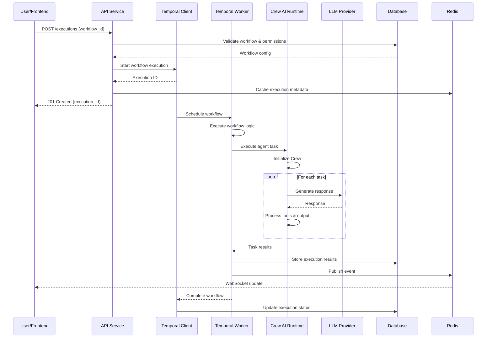
```mermaid
sequenceDiagram
    participant U as User/Frontend
    participant API as API Service
    participant TC as Temporal Client
    participant TW as Temporal Worker
    participant CA as Crew AI Runtime
    participant LLM as LLM Provider
    participant DB as Database
    participant R as Redis
    
    U->>API: POST /executions (workflow_id)
    API->>DB: Validate workflow & permissions
    DB-->>API: Workflow config
    API->>TC: Start workflow execution
    TC-->>API: Execution ID
    API->>R: Cache execution metadata
    API-->>U: 201 Created (execution_id)
    
    TC->>TW: Schedule workflow
    TW->>TW: Execute workflow logic
    TW->>CA: Execute agent task
    CA->>CA: Initialize Crew
    
    loop For each task
        CA->>LLM: Generate response
        LLM-->>CA: Response
        CA->>CA: Process tools & output
    end
    
    CA-->>TW: Task results
    TW->>DB: Store execution results
    TW->>R: Publish event
    R-->>U: WebSocket update
    TW-->>TC: Complete workflow
    TC->>DB: Update execution status
```

**Flow Explanation:**

1. **Workflow Initiation**: User submits a workflow execution request through the frontend
2. **Validation**: API service validates workflow definition and user permissions
3. **Temporal Workflow Start**: Temporal client creates a new workflow execution instance
4. **Execution Metadata Caching**: Store execution details in Redis for fast access
5. **Response to User**: Return execution ID immediately to user for tracking
6. **Worker Scheduling**: Temporal schedules the workflow on available workers
7. **Crew Initialization**: Worker creates Crew AI instance with configured agents
8. **Task Execution Loop**: Each agent task is executed sequentially or in parallel
9. **LLM Interaction**: Agents make calls to configured LLM providers
10. **Result Processing**: Crew AI processes tool outputs and agent responses
11. **Result Storage**: Final results stored in database
12. **Real-time Updates**: Events published to Redis for WebSocket delivery to frontend
13. **Workflow Completion**: Temporal marks workflow as complete and records final state

### Real-time Monitoring Flow

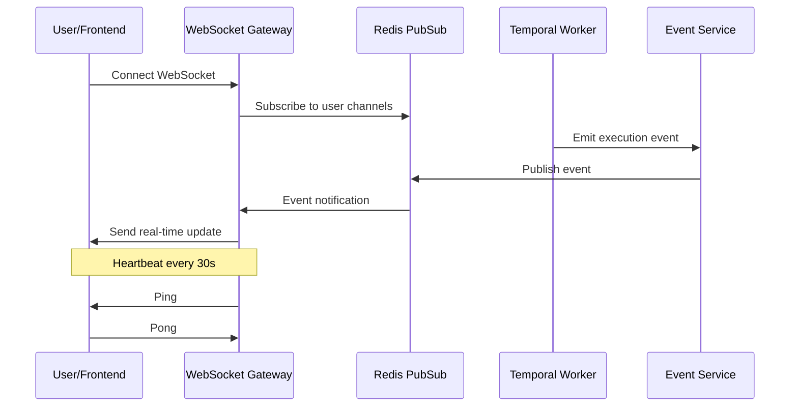
```mermaid
sequenceDiagram
    participant U as User/Frontend
    participant WS as WebSocket Gateway
    participant R as Redis PubSub
    participant TW as Temporal Worker
    participant E as Event Service
    
    U->>WS: Connect WebSocket
    WS->>R: Subscribe to user channels
    
    TW->>E: Emit execution event
    E->>R: Publish event
    R->>WS: Event notification
    WS->>U: Send real-time update
    
    Note over U,WS: Heartbeat every 30s
    WS->>U: Ping
    U->>WS: Pong
```

**Monitoring Flow Explanation:**

1. **WebSocket Connection**: Frontend establishes persistent connection to WebSocket gateway
2. **Channel Subscription**: Gateway subscribes to user-specific Redis channels
3. **Event Emission**: Temporal workers emit events during workflow execution
4. **Event Publishing**: Events are published to Redis Pub/Sub channels
5. **Event Notification**: Redis notifies WebSocket gateway of new events
6. **Real-time Delivery**: WebSocket gateway pushes updates to connected frontend
7. **Connection Health**: Periodic ping/pong to maintain connection and detect disconnects

---

## Scalability Strategy

### Horizontal Scaling Architecture

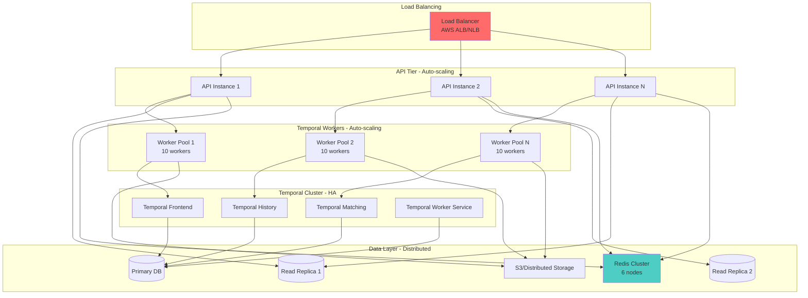
```mermaid
graph TB
    subgraph "Load Balancing"
        LB[Load Balancer<br/>AWS ALB/NLB]
    end
    
    subgraph "API Tier - Auto-scaling"
        API1[API Instance 1]
        API2[API Instance 2]
        API3[API Instance N]
    end
    
    subgraph "Temporal Workers - Auto-scaling"
        W1[Worker Pool 1<br/>10 workers]
        W2[Worker Pool 2<br/>10 workers]
        W3[Worker Pool N<br/>10 workers]
    end
    
    subgraph "Temporal Cluster - HA"
        T1[Temporal Frontend]
        T2[Temporal History]
        T3[Temporal Matching]
        T4[Temporal Worker Service]
    end
    
    subgraph "Data Layer - Distributed"
        DB1[(Primary DB)]
        DB2[(Read Replica 1)]
        DB3[(Read Replica 2)]
        RC[Redis Cluster<br/>6 nodes]
        S3[S3/Distributed Storage]
    end
    
    LB --> API1
    LB --> API2
    LB --> API3
    
    API1 --> W1
    API2 --> W2
    API3 --> W3
    
    W1 --> T1
    W2 --> T2
    W3 --> T3
    
    T1 --> DB1
    T2 --> DB1
    T3 --> DB1
    T4 --> DB1
    
    API1 --> DB2
    API2 --> DB3
    API3 --> DB2
    
    API1 --> RC
    API2 --> RC
    API3 --> RC
    
    W1 --> S3
    W2 --> S3
    W3 --> S3
    
    style LB fill:#ff6b6b
    style RC fill:#4ecdc4
```

### Scaling Dimensions

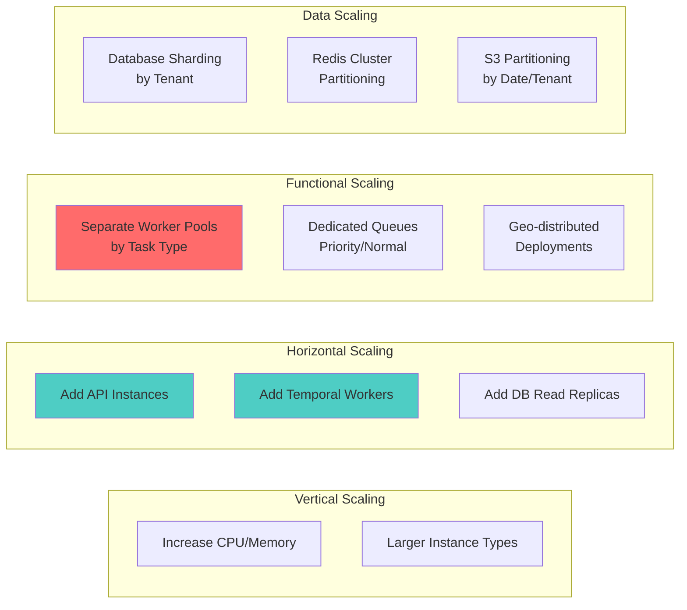
```mermaid
graph LR
    subgraph "Vertical Scaling"
        A[Increase CPU/Memory]
        B[Larger Instance Types]
    end
    
    subgraph "Horizontal Scaling"
        C[Add API Instances]
        D[Add Temporal Workers]
        E[Add DB Read Replicas]
    end
    
    subgraph "Functional Scaling"
        F[Separate Worker Pools<br/>by Task Type]
        G[Dedicated Queues<br/>Priority/Normal]
        H[Geo-distributed<br/>Deployments]
    end
    
    subgraph "Data Scaling"
        I[Database Sharding<br/>by Tenant]
        J[Redis Cluster<br/>Partitioning]
        K[S3 Partitioning<br/>by Date/Tenant]
    end
    
    style C fill:#4ecdc4
    style D fill:#4ecdc4
    style F fill:#ff6b6b
```

### Auto-scaling Configuration

**API Service Auto-scaling Strategy:**
- **Trigger Metrics**: 
  - CPU utilization > 70%
  - Memory utilization > 80%
  - Request queue depth > 100 requests
  - Response time > 500ms (p95)
- **Scale Up Policy**: Add 2 instances when threshold exceeded
- **Scale Down Policy**: Remove 1 instance after 10 minutes below threshold
- **Limits**: Minimum 3 instances, Maximum 20 instances
- **Cool Down Period**: 5 minutes between scaling actions

**Temporal Workers Auto-scaling Strategy:**
- **Trigger Metrics**:
  - Pending activities > 50 per worker
  - CPU utilization > 80%
  - Workflow backlog > 100
  - Average task execution time increasing
- **Scale Up Policy**: Add 1 worker pool (10 workers)
- **Scale Down Policy**: Remove pool if idle > 15 minutes
- **Limits**: Minimum 2 pools (20 workers), Maximum 10 pools (100 workers)
- **Task Type Segregation**: Separate pools for heavy vs. light tasks

**Database Scaling Strategy:**
- **Read Replicas**: 2-5 replicas based on read load patterns
- **Connection Pooling**: 20-50 connections per service instance
- **Query Timeout**: 30 seconds for complex queries
- **Failover**: Automatic promotion of replica to primary on failure
- **Backup**: Continuous backups with point-in-time recovery

---

## Performance Optimizations

### Caching Strategy

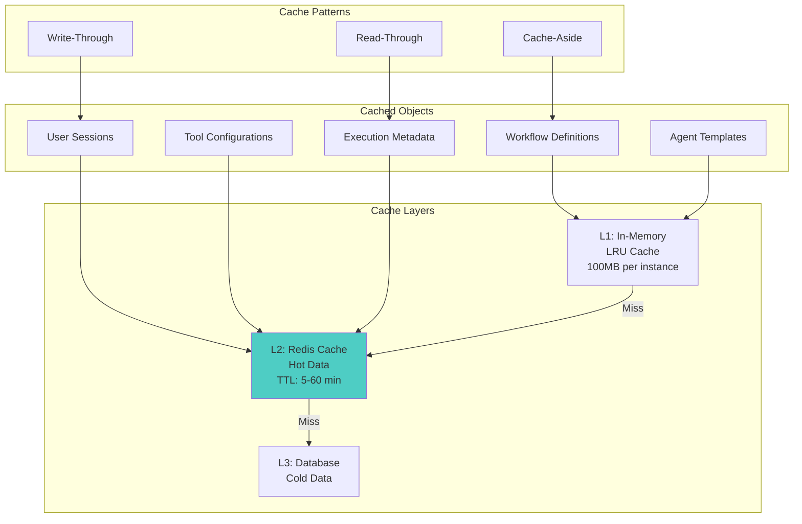
```mermaid
graph TB
    subgraph "Cache Layers"
        L1[L1: In-Memory<br/>LRU Cache<br/>100MB per instance]
        L2[L2: Redis Cache<br/>Hot Data<br/>TTL: 5-60 min]
        L3[L3: Database<br/>Cold Data]
    end
    
    subgraph "Cached Objects"
        A[Workflow Definitions]
        B[Agent Templates]
        C[User Sessions]
        D[Tool Configurations]
        E[Execution Metadata]
    end
    
    subgraph "Cache Patterns"
        F[Cache-Aside]
        G[Write-Through]
        H[Read-Through]
    end
    
    A --> L1
    B --> L1
    C --> L2
    D --> L2
    E --> L2
    
    L1 -->|Miss| L2
    L2 -->|Miss| L3
    
    F --> A
    G --> C
    H --> E
    
    style L2 fill:#4ecdc4
```

**Caching Strategy Details:**

**L1 Cache (In-Memory):**
- **Purpose**: Ultra-fast access to frequently used data within each service instance
- **Technology**: LRU (Least Recently Used) cache with 100MB limit
- **Stored Data**: Workflow definitions, agent templates, configuration
- **TTL**: 5 minutes
- **Invalidation**: Immediate on updates via cache keys

**L2 Cache (Redis):**
- **Purpose**: Shared cache across all service instances
- **Technology**: Redis Cluster with 6 nodes for high availability
- **Stored Data**: User sessions, execution metadata, tool configs
- **TTL**: 5-60 minutes based on data type
- **Patterns**: 
  - Cache-aside for workflow definitions
  - Write-through for user sessions
  - Read-through for execution metadata

**L3 Cache (Database):**
- **Purpose**: Persistent storage for all data
- **Technology**: PostgreSQL with optimized indexes
- **Access Pattern**: Only accessed on L1/L2 cache misses

### Database Optimization

**Index Strategy:**
- **Workflow Table**:
  - Composite index on (user_id, created_at DESC) for user's workflow list
  - Partial index on status where status = 'active' for active workflows
  - Full-text search index on name and description
  
- **Executions Table**:
  - Composite index on (workflow_id, created_at DESC) for workflow execution history
  - Composite index on (status, created_at DESC) for filtering by status
  - Index on user_id for user's execution list
  - Partitioned by month for faster queries and easier archival

- **Partitioning Strategy**:
  - Monthly partitions for executions table
  - Automatic partition creation for upcoming months
  - Partition pruning for queries with date filters
  - Archived partitions moved to cold storage after 90 days

**Query Optimization Techniques:**
- **Connection Pooling**: Reuse database connections with async SQLAlchemy
- **Prepared Statements**: Pre-compile frequently used queries
- **Batch Operations**: Insert/update multiple records in single transaction
- **Lazy Loading**: Only fetch related data when needed
- **Select Optimization**: Fetch only required columns, not entire rows
- **Query Planning**: Use EXPLAIN ANALYZE to optimize slow queries

### LLM Request Optimization

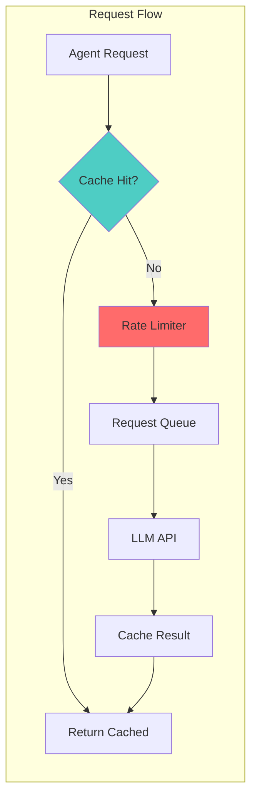
```mermaid
graph LR
    subgraph "Request Flow"
        A[Agent Request]
        B{Cache Hit?}
        C[Return Cached]
        D[Rate Limiter]
        E[Request Queue]
        F[LLM API]
        G[Cache Result]
    end
    
    A --> B
    B -->|Yes| C
    B -->|No| D
    D --> E
    E --> F
    F --> G
    G --> C
    
    style B fill:#4ecdc4
    style D fill:#ff6b6b
```

**LLM Optimization Techniques:**

**1. Semantic Caching**:
- Cache similar prompts using embedding similarity
- Reduce redundant LLM calls by 30-40%
- Use vector database for efficient similarity search
- Configure similarity threshold (typically 0.95)

**2. Request Batching**:
- Combine multiple independent requests into single API call where supported
- Reduce network overhead and latency
- Particularly effective for classification tasks

**3. Streaming Responses**:
- Stream LLM outputs token-by-token for better user experience
- Display partial results while generation continues
- Reduce perceived latency

**4. Token Usage Optimization**:
- Truncate unnecessary context from prompts
- Use smaller models for simple tasks
- Implement prompt compression techniques

**5. Parallel Requests**:
- Execute independent LLM calls concurrently
- Respect rate limits with queue management
- Aggregate results efficiently

**6. Circuit Breaker Pattern**:
- Detect LLM API failures early
- Fall back to alternative providers or cached responses
- Prevent cascading failures
- Auto-recovery after cool-down period

---

## Security Architecture

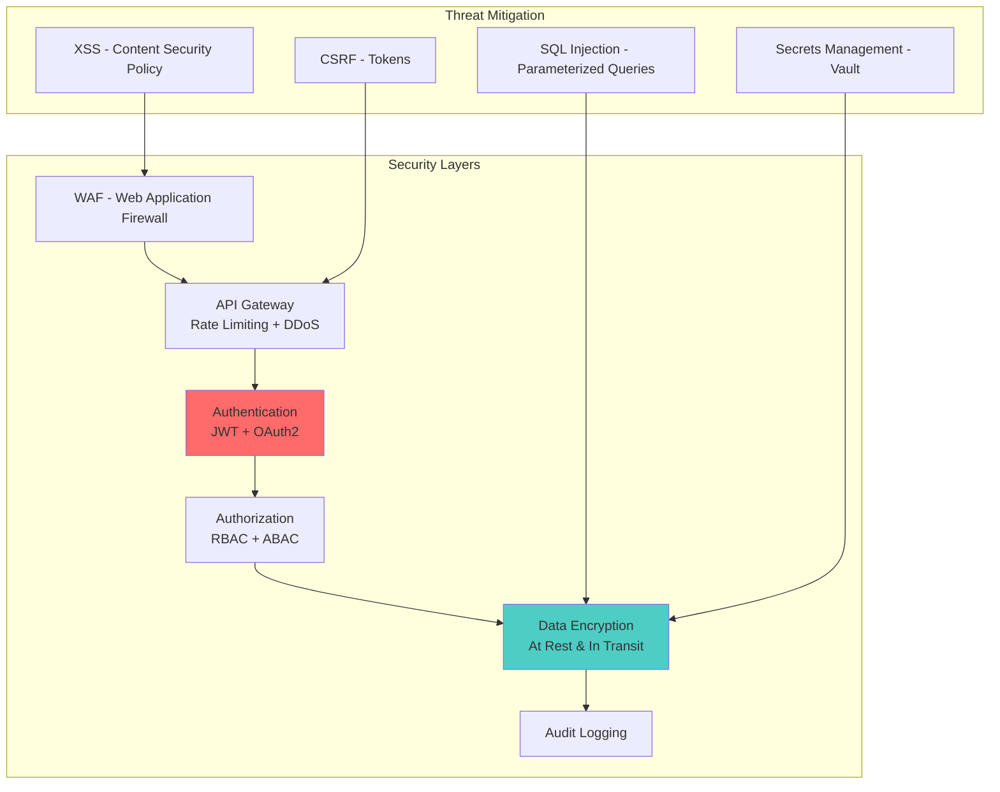
```mermaid
graph TB
    subgraph "Security Layers"
        A[WAF - Web Application Firewall]
        B[API Gateway<br/>Rate Limiting + DDoS]
        C[Authentication<br/>JWT + OAuth2]
        D[Authorization<br/>RBAC + ABAC]
        E[Data Encryption<br/>At Rest & In Transit]
        F[Audit Logging]
    end
    
    subgraph "Threat Mitigation"
        G[SQL Injection - Parameterized Queries]
        H[XSS - Content Security Policy]
        I[CSRF - Tokens]
        J[Secrets Management - Vault]
    end
    
    A --> B
    B --> C
    C --> D
    D --> E
    E --> F
    
    G --> E
    H --> A
    I --> B
    J --> E
    
    style C fill:#ff6b6b
    style E fill:#4ecdc4
```

### Security Features

**Authentication & Authorization:**
- **JWT Tokens**: Short-lived access tokens (15 minutes) for API authentication
- **Refresh Tokens**: Long-lived tokens (7 days) for obtaining new access tokens
- **OAuth2 Integration**: Support for Google, GitHub, Microsoft authentication
- **Multi-Factor Authentication**: Optional MFA for enhanced security
- **Role-Based Access Control (RBAC)**: Assign permissions based on user roles
- **Row-Level Security**: Database-level security ensuring users only access their data

**Data Protection:**
- **TLS 1.3 Encryption**: All communications encrypted in transit
- **AES-256 Encryption**: Data encrypted at rest in database and storage
- **HashiCorp Vault**: Secure secrets management for API keys and credentials
- **PII Encryption**: Additional encryption layer for personally identifiable information
- **Automatic Secret Rotation**: Regular rotation of credentials and API keys

**Threat Mitigation:**
- **SQL Injection Prevention**: Parameterized queries and ORM usage
- **XSS Protection**: Content Security Policy headers and input sanitization
- **CSRF Protection**: Token-based validation for state-changing operations
- **Rate Limiting**: Prevent brute force and DoS attacks
- **Input Validation**: Strict validation of all user inputs using Pydantic schemas

**Compliance:**
- **GDPR Compliance**: Data portability, right to deletion, consent management
- **SOC 2 Type II**: Security, availability, and confidentiality controls
- **Audit Logs**: Comprehensive logging retained for 1 year
- **Data Residency**: Options for data storage in specific geographic regions

---

## Deployment Architecture

### Kubernetes Deployment

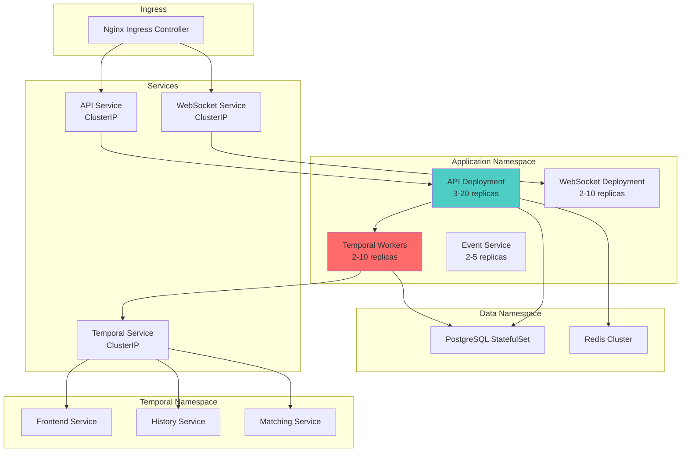
```mermaid
graph TB
    subgraph "Ingress"
        ING[Nginx Ingress Controller]
    end
    
    subgraph "Application Namespace"
        API[API Deployment<br/>3-20 replicas]
        WS[WebSocket Deployment<br/>2-10 replicas]
        WORKER[Temporal Workers<br/>2-10 replicas]
        EVENT[Event Service<br/>2-5 replicas]
    end
    
    subgraph "Temporal Namespace"
        TFE[Frontend Service]
        THIST[History Service]
        TMATCH[Matching Service]
    end
    
    subgraph "Data Namespace"
        PG[PostgreSQL StatefulSet]
        RD[Redis Cluster]
    end
    
    subgraph "Services"
        SVC_API[API Service<br/>ClusterIP]
        SVC_WS[WebSocket Service<br/>ClusterIP]
        SVC_T[Temporal Service<br/>ClusterIP]
    end
    
    ING --> SVC_API
    ING --> SVC_WS
    SVC_API --> API
    SVC_WS --> WS
    API --> WORKER
    WORKER --> SVC_T
    SVC_T --> TFE
    SVC_T --> THIST
    SVC_T --> TMATCH
    
    API --> PG
    API --> RD
    WORKER --> PG
    
    style API fill:#4ecdc4
    style WORKER fill:#ff6b6b
```

### Infrastructure as Code

**Deployment Strategy:**

**Cloud Infrastructure (Terraform):**
- **EKS Cluster Configuration**:
  - Kubernetes 1.28+ for container orchestration
  - Two node groups: API nodes (t3.xlarge, SPOT) and Worker nodes (c5.2xlarge, ON_DEMAND)
  - API nodes: 3-20 instances with auto-scaling
  - Worker nodes: 2-10 instances for intensive agent workloads
  - VPC with private subnets for security

- **RDS PostgreSQL Setup**:
  - PostgreSQL 15.3 in multi-AZ configuration for high availability
  - Instance class: db.r6g.2xlarge (memory-optimized)
  - Storage: 500GB with auto-scaling up to 2TB
  - Automated backups with 7-day retention
  - Encryption at rest enabled

- **ElastiCache Redis Configuration**:
  - Redis 7.0 cluster mode with 6 nodes
  - Instance type: cache.r6g.xlarge
  - Automatic failover enabled
  - Multi-AZ deployment for resilience
  - Encryption in transit and at rest

**Kubernetes Resources:**
- **Deployments**: Define desired state for API, Workers, and Event services
- **StatefulSets**: For PostgreSQL and Redis requiring persistent storage
- **Services**: ClusterIP for internal communication, LoadBalancer for external access
- **ConfigMaps**: Environment-specific configuration
- **Secrets**: Sensitive data like API keys and database credentials
- **HorizontalPodAutoscalers**: Auto-scaling based on CPU, memory, and custom metrics
- **PersistentVolumeClaims**: Storage for databases and logs

---

## Technology Stack

### Backend

| Component | Technology | Version |
|-----------|-----------|---------|
| Runtime | Python | 3.11+ |
| API Framework | FastAPI | 0.104+ |
| Workflow Engine | Temporal.io | 1.22+ |
| Agent Framework | Crew AI | 0.20+ |
| Database | PostgreSQL | 15+ |
| Cache | Redis | 7.0+ |
| Message Queue | Redis Streams | 7.0+ |
| Object Storage | MinIO/S3 | Latest |
| Metrics DB | TimescaleDB | 2.13+ |

### Frontend

| Component | Technology | Version |
|-----------|-----------|---------|
| Framework | React | 18+ |
| Language | TypeScript | 5.0+ |
| State Management | Redux Toolkit | 2.0+ |
| Data Fetching | React Query | 5.0+ |
| UI Library | shadcn/ui | Latest |
| Styling | Tailwind CSS | 3.4+ |
| Workflow Canvas | React Flow | 11+ |
| Code Editor | Monaco Editor | 0.44+ |

### Infrastructure

| Component | Technology |
|-----------|-----------|
| Container Runtime | Docker |
| Orchestration | Kubernetes (EKS) |
| IaC | Terraform |
| CI/CD | GitHub Actions |
| Monitoring | Prometheus + Grafana |
| Logging | ELK Stack |
| Tracing | Jaeger |
| Service Mesh | Istio (Optional) |

---

## Performance Benchmarks

### Target Metrics

| Metric | Target | Measurement |
|--------|--------|-------------|
| API Response Time (p95) | < 200ms | Single workflow fetch |
| API Response Time (p99) | < 500ms | Complex queries |
| Workflow Start Latency | < 1s | From API call to execution |
| UI Initial Load | < 2s | Time to interactive |
| WebSocket Latency | < 100ms | Event delivery |
| Concurrent Workflows | 10,000+ | Simultaneous executions |
| Workflow Throughput | 1,000/sec | New workflow starts |
| Database Queries | < 50ms (p95) | Indexed queries |
| LLM Request Queue Time | < 5s | During normal load |

### Scalability Targets

- **Users**: 100,000+ concurrent users
- **Workflows**: 10M+ workflow definitions
- **Executions**: 100M+ executions/month
- **Data Volume**: 10TB+ total storage
- **API Requests**: 100,000 req/sec peak

---

## Monitoring & Observability

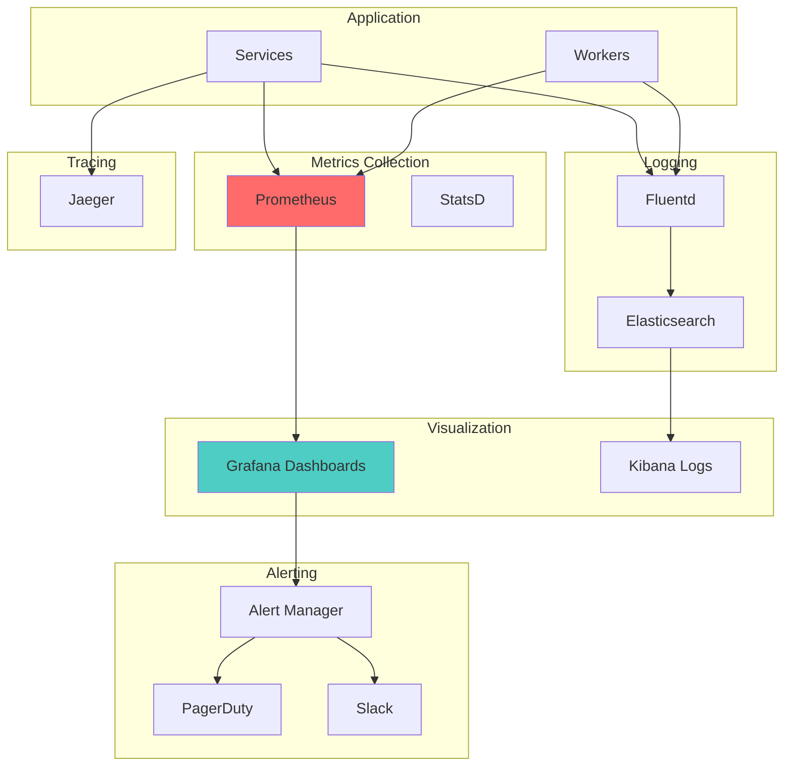
```mermaid
graph TB
    subgraph "Application"
        APP[Services]
        WORKER[Workers]
    end
    
    subgraph "Metrics Collection"
        PROM[Prometheus]
        STATSD[StatsD]
    end
    
    subgraph "Logging"
        FLUENT[Fluentd]
        ES[Elasticsearch]
    end
    
    subgraph "Tracing"
        JAEGER[Jaeger]
    end
    
    subgraph "Visualization"
        GRAFANA[Grafana Dashboards]
        KIBANA[Kibana Logs]
    end
    
    subgraph "Alerting"
        AM[Alert Manager]
        PD[PagerDuty]
        SLACK[Slack]
    end
    
    APP --> PROM
    APP --> FLUENT
    APP --> JAEGER
    WORKER --> PROM
    WORKER --> FLUENT
    
    PROM --> GRAFANA
    FLUENT --> ES
    ES --> KIBANA
    
    GRAFANA --> AM
    AM --> PD
    AM --> SLACK
    
    style GRAFANA fill:#4ecdc4
    style PROM fill:#ff6b6b
```

**Observability Stack:**

**Metrics (Prometheus + Grafana):**
- System metrics: CPU, memory, disk, network
- Application metrics: Request rates, latencies, error rates
- Business metrics: Workflows created, executions, agent usage
- LLM metrics: Token usage, costs, response times
- Custom dashboards for operations and business teams

**Logging (ELK Stack):**
- Centralized log aggregation from all services
- Structured logging in JSON format
- Log correlation with trace IDs
- Full-text search capabilities
- Log retention and archival policies

**Tracing (Jaeger):**
- Distributed tracing across microservices
- Request flow visualization
- Performance bottleneck identification
- Service dependency mapping
- Latency analysis

**Alerting:**
- Threshold-based alerts on metrics
- Multi-channel notifications (PagerDuty, Slack, Email)
- Escalation policies for critical issues
- Alert grouping and deduplication
- Runbook links for quick resolution

---

## Customer-Facing Token Observability & Transparency

### Overview

Providing full transparency on token usage and costs is critical for customer trust and platform adoption. This section outlines the comprehensive token tracking, metering, and reporting architecture.

### Token Tracking Architecture

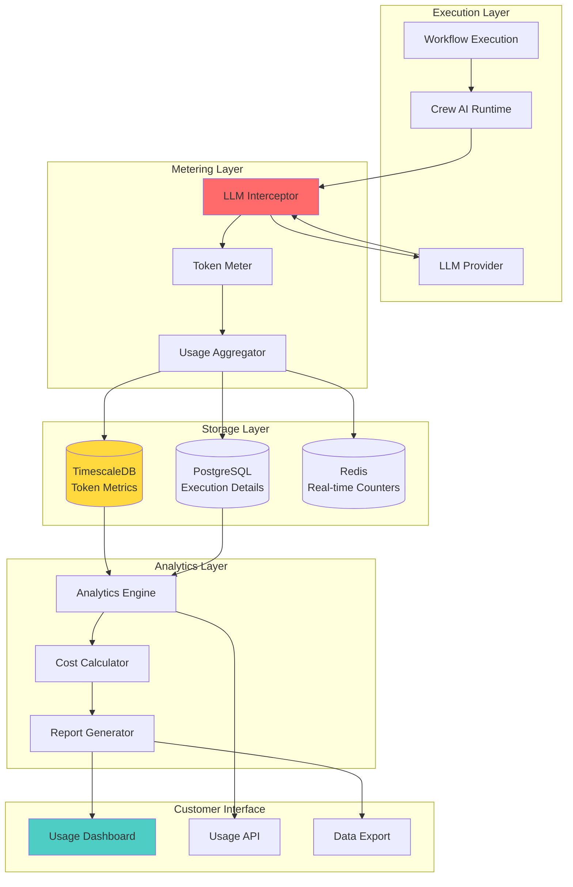
```mermaid
graph TB
    subgraph "Execution Layer"
        WF[Workflow Execution]
        CREW[Crew AI Runtime]
        LLM[LLM Provider]
    end
    
    subgraph "Metering Layer"
        INTERCEPTOR[LLM Interceptor]
        METER[Token Meter]
        AGGREGATOR[Usage Aggregator]
    end
    
    subgraph "Storage Layer"
        TSDB[(TimescaleDB<br/>Token Metrics)]
        POSTGRES[(PostgreSQL<br/>Execution Details)]
        REDIS[(Redis<br/>Real-time Counters)]
    end
    
    subgraph "Analytics Layer"
        ANALYTICS[Analytics Engine]
        COST_CALC[Cost Calculator]
        REPORT_GEN[Report Generator]
    end
    
    subgraph "Customer Interface"
        DASHBOARD[Usage Dashboard]
        API_USAGE[Usage API]
        EXPORT[Data Export]
    end
    
    WF --> CREW
    CREW --> INTERCEPTOR
    INTERCEPTOR --> LLM
    LLM --> INTERCEPTOR
    
    INTERCEPTOR --> METER
    METER --> AGGREGATOR
    
    AGGREGATOR --> TSDB
    AGGREGATOR --> POSTGRES
    AGGREGATOR --> REDIS
    
    TSDB --> ANALYTICS
    POSTGRES --> ANALYTICS
    ANALYTICS --> COST_CALC
    COST_CALC --> REPORT_GEN
    
    REPORT_GEN --> DASHBOARD
    ANALYTICS --> API_USAGE
    REPORT_GEN --> EXPORT
    
    style INTERCEPTOR fill:#ff6b6b
    style DASHBOARD fill:#4ecdc4
    style TSDB fill:#ffd93d
```

### Token Metering Data Model

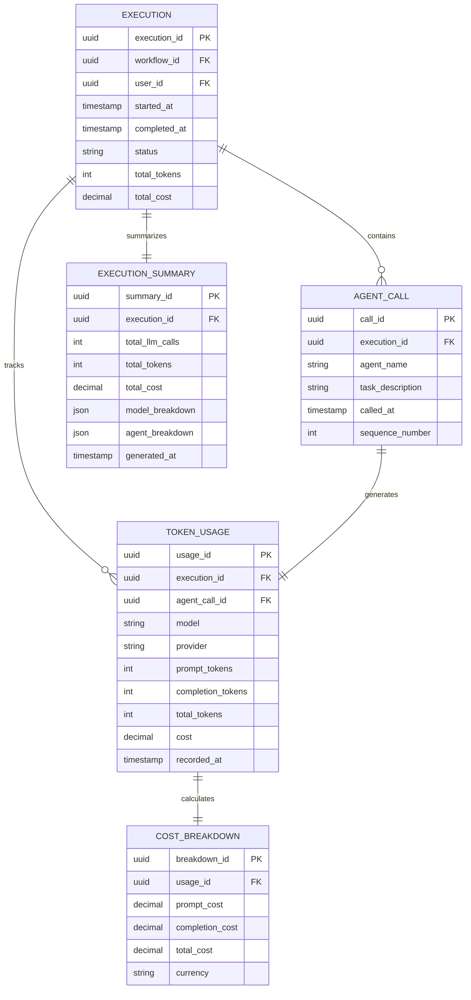
```mermaid
erDiagram
    EXECUTION ||--o{ TOKEN_USAGE : tracks
    EXECUTION ||--o{ AGENT_CALL : contains
    AGENT_CALL ||--|| TOKEN_USAGE : generates
    TOKEN_USAGE ||--|| COST_BREAKDOWN : calculates
    EXECUTION ||--|| EXECUTION_SUMMARY : summarizes
    
    EXECUTION {
        uuid execution_id PK
        uuid workflow_id FK
        uuid user_id FK
        timestamp started_at
        timestamp completed_at
        string status
        int total_tokens
        decimal total_cost
    }
    
    AGENT_CALL {
        uuid call_id PK
        uuid execution_id FK
        string agent_name
        string task_description
        timestamp called_at
        int sequence_number
    }
    
    TOKEN_USAGE {
        uuid usage_id PK
        uuid execution_id FK
        uuid agent_call_id FK
        string model
        string provider
        int prompt_tokens
        int completion_tokens
        int total_tokens
        decimal cost
        timestamp recorded_at
    }
    
    COST_BREAKDOWN {
        uuid breakdown_id PK
        uuid usage_id FK
        decimal prompt_cost
        decimal completion_cost
        decimal total_cost
        string currency
    }
    
    EXECUTION_SUMMARY {
        uuid summary_id PK
        uuid execution_id FK
        int total_llm_calls
        int total_tokens
        decimal total_cost
        json model_breakdown
        json agent_breakdown
        timestamp generated_at
    }
```

### Real-time Token Tracking Flow

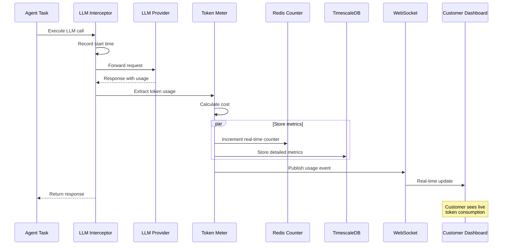
```mermaid
sequenceDiagram
    participant A as Agent Task
    participant I as LLM Interceptor
    participant L as LLM Provider
    participant M as Token Meter
    participant R as Redis Counter
    participant DB as TimescaleDB
    participant WS as WebSocket
    participant C as Customer Dashboard
    
    A->>I: Execute LLM call
    I->>I: Record start time
    I->>L: Forward request
    L-->>I: Response with usage
    
    I->>M: Extract token usage
    M->>M: Calculate cost
    
    par Store metrics
        M->>R: Increment real-time counter
        M->>DB: Store detailed metrics
    end
    
    M->>WS: Publish usage event
    WS->>C: Real-time update
    
    I-->>A: Return response
    
    Note over C: Customer sees live<br/>token consumption
```

### Customer Dashboard Components

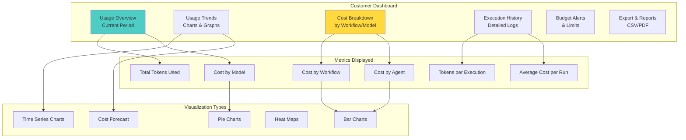
```mermaid
graph TB
    subgraph "Customer Dashboard"
        OVERVIEW[Usage Overview<br/>Current Period]
        TRENDS[Usage Trends<br/>Charts & Graphs]
        BREAKDOWN[Cost Breakdown<br/>by Workflow/Model]
        HISTORY[Execution History<br/>Detailed Logs]
        BUDGET[Budget Alerts<br/>& Limits]
        EXPORT[Export & Reports<br/>CSV/PDF]
    end
    
    subgraph "Metrics Displayed"
        M1[Total Tokens Used]
        M2[Cost by Model]
        M3[Cost by Workflow]
        M4[Cost by Agent]
        M5[Tokens per Execution]
        M6[Average Cost per Run]
    end
    
    subgraph "Visualization Types"
        V1[Time Series Charts]
        V2[Pie Charts]
        V3[Bar Charts]
        V4[Heat Maps]
        V5[Cost Forecast]
    end
    
    OVERVIEW --> M1
    OVERVIEW --> M2
    TRENDS --> V1
    TRENDS --> V5
    BREAKDOWN --> M3
    BREAKDOWN --> M4
    HISTORY --> M5
    HISTORY --> M6
    
    M2 --> V2
    M3 --> V3
    M4 --> V3
    
    style OVERVIEW fill:#4ecdc4
    style BREAKDOWN fill:#ffd93d
```

### Token Usage Granularity Levels

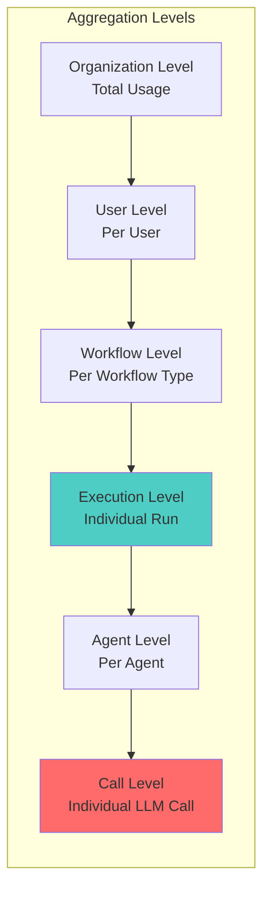
```mermaid
graph LR
    subgraph "Aggregation Levels"
        L1[Organization Level<br/>Total Usage]
        L2[User Level<br/>Per User]
        L3[Workflow Level<br/>Per Workflow Type]
        L4[Execution Level<br/>Individual Run]
        L5[Agent Level<br/>Per Agent]
        L6[Call Level<br/>Individual LLM Call]
    end
    
    L1 --> L2
    L2 --> L3
    L3 --> L4
    L4 --> L5
    L5 --> L6
    
    style L4 fill:#4ecdc4
    style L6 fill:#ff6b6b
```

### Token Tracking Implementation Details

**Per-Execution Tracking:**
- **Execution Start**: Initialize token counter and cost accumulator
- **Per Agent Call**: Record tokens for each LLM interaction
- **Model Identification**: Track which model was used (GPT-4, Claude, etc.)
- **Token Breakdown**: Separate prompt tokens vs completion tokens
- **Cost Calculation**: Apply provider-specific pricing per model
- **Execution End**: Aggregate all metrics and store final summary

**Real-time Updates:**
- **Live Counter**: WebSocket updates showing current token usage during execution
- **Progress Bar**: Visual indicator of estimated cost vs budget
- **Alert Threshold**: Notify when execution exceeds expected token usage
- **Pause Capability**: Allow users to pause/stop high-cost executions

**Historical Analytics:**
- **Time-based Aggregation**: Daily, weekly, monthly usage summaries
- **Trend Analysis**: Identify usage patterns and anomalies
- **Comparison**: Compare current vs previous periods
- **Forecasting**: Predict future usage based on historical data

### Cost Transparency Features

```mermaid
graph TB
    subgraph "Cost Breakdown View"
        A[Execution Details]
        B[Model Costs]
        C[Agent Costs]
        D[Time-based Costs]
    end
    
    subgraph "Price Components"
        E[Prompt Tokens Cost<br/>Input pricing]
        F[Completion Tokens Cost<br/>Output pricing]
        G[Model Multiplier<br/>GPT-4 vs GPT-3.5]
        H[Provider Fees<br/>OpenAI/Anthropic]
    end
    
    subgraph "Transparency Info"
        I[Token Count<br/>Exact numbers]
        J[Unit Price<br/>$/1K tokens]
        K[Calculation Formula<br/>How cost is computed]
        L[Timestamp<br/>When charged]
    end
    
    A --> E
    A --> F
    B --> G
    B --> H
    
    E --> I
    F --> I
    G --> J
    H --> J
    
    I --> K
    J --> K
    K --> L
    
    style I fill:#4ecdc4
    style K fill:#ffd93d
```

### Budget Management & Alerts

```mermaid
graph TB
    subgraph "Budget Configuration"
        B1[Set Budget Limits<br/>Per workflow/user/org]
        B2[Alert Thresholds<br/>50%, 75%, 90%, 100%]
        B3[Action on Limit<br/>Warn/Pause/Stop]
    end
    
    subgraph "Monitoring"
        M1[Real-time Tracking]
        M2[Threshold Checking]
        M3[Alert Generation]
    end
    
    subgraph "Notifications"
        N1[Email Alerts]
        N2[Dashboard Warnings]
        N3[WebSocket Notifications]
        N4[Slack/Teams Integration]
    end
    
    subgraph "Actions"
        A1[Continue Execution]
        A2[Pause for Approval]
        A3[Stop Execution]
        A4[Notify Admin]
    end
    
    B1 --> M1
    B2 --> M2
    B3 --> M3
    
    M1 --> M2
    M2 --> M3
    
    M3 --> N1
    M3 --> N2
    M3 --> N3
    M3 --> N4
    
    M2 --> A1
    M2 --> A2
    M2 --> A3
    M2 --> A4
    
    style M2 fill:#ff6b6b
    style N2 fill:#4ecdc4
```

### Usage API Endpoints

**API for Programmatic Access:**

**Get Execution Token Usage:**
- Endpoint: `GET /api/v1/executions/{execution_id}/usage`
- Returns: Complete token breakdown for single execution
- Includes: Prompt tokens, completion tokens, cost, model used, timestamps

**Get Workflow Usage Summary:**
- Endpoint: `GET /api/v1/workflows/{workflow_id}/usage?period=30d`
- Returns: Aggregated usage across all executions
- Includes: Total tokens, average per execution, cost trends, most expensive runs

**Get User Usage:**
- Endpoint: `GET /api/v1/users/{user_id}/usage?from=2024-01-01&to=2024-01-31`
- Returns: User's total usage for time period
- Includes: Breakdown by workflow, model, daily usage

**Export Usage Data:**
- Endpoint: `GET /api/v1/usage/export?format=csv&period=monthly`
- Returns: Complete usage data in CSV/JSON format
- Includes: All metrics for billing and analysis

### Dashboard Visualizations

**1. Real-time Execution Monitor:**
- Live token counter during workflow execution
- Current cost accumulation
- Estimated total cost based on progress
- Model-by-model breakdown
- Agent-by-agent contribution

**2. Cost Trends Chart:**
- Time series visualization of daily/weekly/monthly costs
- Comparison with previous periods
- Trend lines and forecasts
- Anomaly highlighting

**3. Model Distribution:**
- Pie chart showing usage by model (GPT-4, Claude, etc.)
- Cost comparison per model
- Recommendations for cost optimization

**4. Workflow Efficiency:**
- Average tokens per workflow type
- Most efficient vs most expensive workflows
- Optimization suggestions

**5. Budget Progress:**
- Visual progress bar for budget consumption
- Days remaining in billing period
- Projected overage warnings

### Data Export & Reporting

```mermaid
graph LR
    subgraph "Export Formats"
        E1[CSV<br/>Spreadsheet]
        E2[JSON<br/>API Integration]
        E3[PDF<br/>Reports]
        E4[Excel<br/>Analysis]
    end
    
    subgraph "Report Types"
        R1[Daily Summary]
        R2[Weekly Report]
        R3[Monthly Invoice]
        R4[Custom Period]
    end
    
    subgraph "Included Data"
        D1[Token Usage Details]
        D2[Cost Breakdown]
        D3[Execution Logs]
        D4[Model Statistics]
    end
    
    R1 --> E1
    R2 --> E3
    R3 --> E3
    R4 --> E2
    
    E1 --> D1
    E2 --> D1
    E3 --> D2
    E4 --> D3
    
    style E3 fill:#4ecdc4
    style R3 fill:#ffd93d
```

### Performance Considerations

**Efficient Token Tracking:**
- **Async Recording**: Don't block execution to record metrics
- **Batch Writes**: Aggregate metrics before writing to database
- **Hot Path Optimization**: Use Redis for real-time counters
- **Cold Storage**: Archive detailed logs after 90 days
- **Aggregated Views**: Pre-compute common queries (daily/monthly totals)

**Data Retention Policy:**
- **Detailed Logs**: 90 days in hot storage (TimescaleDB)
- **Aggregated Data**: 2 years in warm storage
- **Summary Data**: Indefinite retention
- **Raw Logs**: Archived to S3 after 90 days
- **On-demand Retrieval**: Restore from archive if needed

### Privacy & Security

**Data Protection:**
- **Prompt Content**: Not stored in usage metrics (only token counts)
- **User Isolation**: Row-level security ensures users only see their data
- **Audit Trail**: All access to usage data is logged
- **GDPR Compliance**: Full data export and deletion capabilities
- **Encryption**: Usage data encrypted at rest and in transit

### Cost Optimization Recommendations

**Automated Insights:**
- Identify workflows using expensive models unnecessarily
- Suggest cheaper model alternatives for simple tasks
- Highlight inefficient prompts consuming excessive tokens
- Recommend caching opportunities
- Alert on unusual usage spikes

```mermaid
graph TB
    subgraph "Analysis Engine"
        A1[Usage Pattern Analysis]
        A2[Model Efficiency Check]
        A3[Anomaly Detection]
    end
    
    subgraph "Recommendations"
        R1[Use GPT-3.5 instead of GPT-4<br/>Save 90% on cost]
        R2[Enable prompt caching<br/>Reduce redundant calls]
        R3[Optimize prompt length<br/>Trim unnecessary context]
        R4[Batch similar requests<br/>Reduce API calls]
    end
    
    subgraph "Impact Projection"
        I1[Estimated Savings<br/>Monthly $XXX]
        I2[Quality Impact<br/>Minimal/None]
        I3[Implementation Effort<br/>Low/Medium/High]
    end
    
    A1 --> R1
    A2 --> R2
    A3 --> R3
    A1 --> R4
    
    R1 --> I1
    R2 --> I1
    R3 --> I1
    R4 --> I1
    
    R1 --> I2
    R2 --> I2
    
    R1 --> I3
    
    style R1 fill:#4ecdc4
    style I1 fill:#ffd93d
```

### Customer Benefits

**Full Transparency:**
- ✅ Exact token count for every execution
- ✅ Real-time cost tracking during execution
- ✅ Detailed breakdown by model, agent, and task
- ✅ Historical usage trends and patterns
- ✅ Exportable data for accounting and analysis

**Cost Control:**
- ✅ Budget limits with automatic enforcement
- ✅ Multi-level alerts before limit breach
- ✅ Ability to pause or stop expensive executions
- ✅ Optimization recommendations
- ✅ Forecast future costs

**Trust Building:**
- ✅ No hidden costs or surprise charges
- ✅ Calculation formula transparency
- ✅ Model pricing clearly displayed
- ✅ Independent verification possible
- ✅ Audit trail for compliance

---

## Conclusion

This architecture provides a robust, scalable foundation for an intelligent agentic workflow platform using Temporal.ai and Crew AI. Key strengths:

✅ **Scalability**: Horizontal scaling at every layer
✅ **Reliability**: Temporal's durability guarantees
✅ **Performance**: Sub-second response times with caching
✅ **Developer Experience**: Crew AI's opinionated patterns
✅ **Observability**: Comprehensive monitoring and tracing

**Trade-offs:**
- Less flexibility than LangGraph for custom agent logic
- Crew AI lock-in for agent patterns
- LLM provider switching requires Crew AI configuration changes

**Best For:**
- Teams wanting faster development with opinionated frameworks
- Use cases fitting Crew AI's sequential/hierarchical patterns
- Organizations prioritizing speed-to-market over flexibility
