# Intelligent Agentic Workflow Designer - Temporal.ai + LangGraph + LiteLLM Architecture

## Executive Summary

This document outlines the architecture for an intelligent agentic workflow designer platform using **Temporal.ai** for durable workflow orchestration, **LangGraph** for flexible agent state management, and **LiteLLM** for unified LLM provider access. This architecture prioritizes maximum flexibility, extensibility, and LLM provider agnosticism while maintaining enterprise-grade scale and performance.

---

## Table of Contents

1. [System Overview](#system-overview)
2. [Architecture Principles](#architecture-principles)
3. [System Architecture](#system-architecture)
4. [Component Details](#component-details)
5. [Data Flow](#data-flow)
6. [Scalability Strategy](#scalability-strategy)
7. [Performance Optimizations](#performance-optimizations)
8. [Security Architecture](#security-architecture)
9. [Deployment Architecture](#deployment-architecture)
10. [Technology Stack](#technology-stack)

---

## System Overview

The platform enables users to design, deploy, and monitor highly flexible AI-powered workflows through a visual interface. It combines Temporal.ai's reliability with LangGraph's powerful state graph model and LiteLLM's universal LLM access layer.

### Key Features

- Visual graph-based workflow designer with unlimited flexibility
- Custom agent state machines with conditional logic
- Support for 100+ LLM providers via LiteLLM
- Durable execution with automatic retries and fault tolerance
- Real-time workflow monitoring and debugging
- Multi-tenancy with resource isolation
- Horizontal scalability to millions of executions
- Human-in-the-loop workflows with approval gates
- Streaming responses and partial results

---

## Architecture Principles

1. **Separation of Concerns**: Clear boundaries between orchestration (Temporal), agent logic (LangGraph), and LLM access (LiteLLM)
2. **Flexibility First**: No opinionated patterns - users define their own graph structures
3. **LLM Agnostic**: Seamless switching between any LLM provider
4. **Scalability & Performance**: Designed for 100M+ executions/month
5. **Extensibility**: Plugin architecture for custom nodes, tools, and integrations
6. **Observability**: Deep insights into graph execution and LLM usage

---

## System Architecture

### High-Level Architecture

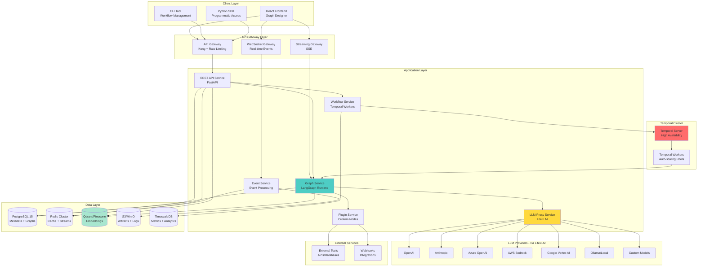

### Layered Architecture

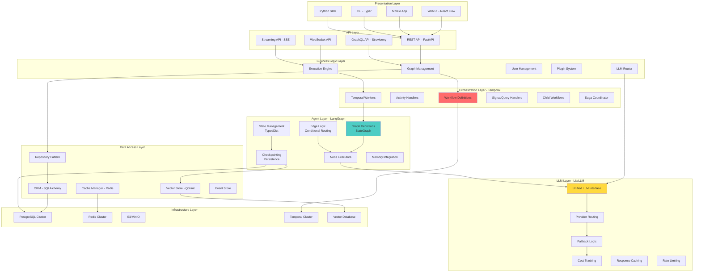

---

## Component Details

### 1. Frontend - Graph Designer

#### Visual Workflow Canvas Architecture

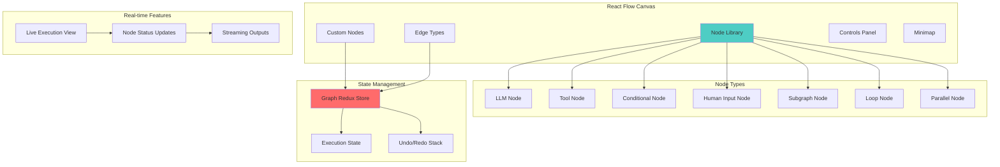

**Key Technologies:**
- **React Flow** for graph visualization and interaction
- **TypeScript** for type safety
- **Redux Toolkit** with RTK Query for state
- **Monaco Editor** for code/prompt editing
- **WebSocket + SSE** for real-time updates
- **React Query** for server state
- **Zod** for runtime validation

**Node Configuration UI:**
```typescript
interface LLMNodeConfig {
  id: string;
  type: 'llm';
  config: {
    provider: string;  // openai, anthropic, etc.
    model: string;     // gpt-4, claude-3-opus, etc.
    temperature: number;
    maxTokens: number;
    systemPrompt: string;
    userPrompt: string;
    outputKey: string;
    streamResponse: boolean;
  };
  fallbacks?: Array<{
    provider: string;
    model: string;
  }>;
}

interface ConditionalNodeConfig {
  id: string;
  type: 'conditional';
  config: {
    condition: string;  // Python expression
    trueEdge: string;   // Node ID
    falseEdge: string;  // Node ID
  };
}
```

---

### 2. API Service (FastAPI)

```mermaid
graph TB
    subgraph "API Routes"
        A[/api/v1/graphs]
        B[/api/v1/executions]
        C[/api/v1/nodes]
        D[/api/v1/providers]
        E[/api/v1/analytics]
    end
    
    subgraph "Middleware Stack"
        F[CORS]
        G[Authentication<br/>JWT]
        H[Authorization<br/>RBAC + ABAC]
        I[Rate Limiting<br/>Redis-based]
        J[Request Validation<br/>Pydantic V2]
        K[Error Handling]
        L[Logging & Tracing]
    end
    
    subgraph "Services"
        M[Graph Service]
        N[Execution Service]
        O[Provider Service]
        P[Analytics Service]
        Q[Plugin Service]
    end
    
    subgraph "Dependencies"
        R[Database]
        S[Redis]
        T[Temporal Client]
        U[LiteLLM Proxy]
    end
    
    A --> M
    B --> N
    C --> M
    D --> O
    E --> P
    
    F --> G
    G --> H
    H --> I
    I --> J
    J --> K
    K --> L
    
    M --> R
    N --> T
    O --> U
    P --> S
    
    style J fill:#4ecdc4
    style M fill:#ff6b6b
```

**API Design:**

```python
from fastapi import FastAPI, Depends, HTTPException
from pydantic import BaseModel, Field
from typing import Dict, List, Any, Optional

app = FastAPI(title="Workflow Platform API", version="1.0.0")

class GraphDefinition(BaseModel):
    """LangGraph compatible graph definition"""
    id: Optional[str] = None
    name: str
    description: Optional[str] = None
    nodes: List[NodeDefinition]
    edges: List[EdgeDefinition]
    state_schema: Dict[str, Any]
    entry_point: str
    checkpointer: Optional[str] = "postgres"
    
class NodeDefinition(BaseModel):
    id: str
    type: str  # llm, tool, conditional, human, etc.
    config: Dict[str, Any]
    retry_policy: Optional[RetryPolicy] = None
    timeout: Optional[int] = 300
    
class EdgeDefinition(BaseModel):
    source: str
    target: str
    condition: Optional[str] = None  # Python expression for conditional edges

@app.post("/api/v1/graphs", response_model=GraphDefinition)
async def create_graph(
    graph: GraphDefinition,
    user: User = Depends(get_current_user)
):
    """Create a new graph definition"""
    # Validate graph structure
    validate_graph(graph)
    
    # Store in database
    saved_graph = await graph_service.create(graph, user.id)
    
    # Compile LangGraph for validation
    compiled = await langgraph_service.compile_graph(saved_graph)
    
    return saved_graph

@app.post("/api/v1/executions", response_model=ExecutionResponse)
async def start_execution(
    request: ExecutionRequest,
    user: User = Depends(get_current_user)
):
    """Start a new graph execution via Temporal"""
    # Get graph definition
    graph = await graph_service.get(request.graph_id)
    
    # Start Temporal workflow
    execution_id = await temporal_client.start_workflow(
        "LangGraphWorkflow",
        args=[graph, request.inputs],
        id=f"exec-{uuid4()}",
        task_queue="langgraph-workers"
    )
    
    return ExecutionResponse(
        execution_id=execution_id,
        status="running",
        created_at=datetime.utcnow()
    )

@app.get("/api/v1/executions/{execution_id}/stream")
async def stream_execution(
    execution_id: str,
    user: User = Depends(get_current_user)
):
    """Stream execution updates via SSE"""
    async def event_generator():
        async for event in execution_service.stream_events(execution_id):
            yield f"data: {json.dumps(event)}\n\n"
    
    return StreamingResponse(
        event_generator(),
        media_type="text/event-stream"
    )
```

---

### 3. LangGraph Runtime Layer

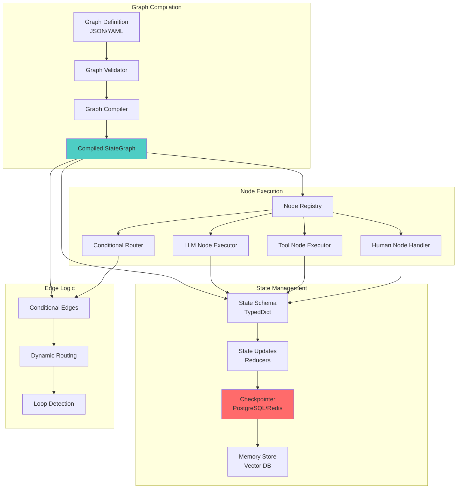

**LangGraph Implementation:**

```python
from langgraph.graph import StateGraph, END
from langgraph.checkpoint.postgres import PostgresSaver
from typing import TypedDict, Annotated, Sequence
from langchain_core.messages import BaseMessage
import operator

# Define state schema
class AgentState(TypedDict):
    messages: Annotated[Sequence[BaseMessage], operator.add]
    context: Dict[str, Any]
    next_node: Optional[str]
    iteration: int
    
class LangGraphExecutor:
    """Dynamic LangGraph executor from graph definition"""
    
    def __init__(
        self, 
        graph_def: GraphDefinition,
        checkpointer: PostgresSaver,
        llm_client: LiteLLMClient
    ):
        self.graph_def = graph_def
        self.checkpointer = checkpointer
        self.llm_client = llm_client
        self.graph = self._build_graph()
    
    def _build_graph(self) -> StateGraph:
        """Build LangGraph from definition"""
        # Create state graph with schema
        state_schema = self._create_state_schema()
        graph = StateGraph(state_schema)
        
        # Register all nodes
        for node_def in self.graph_def.nodes:
            node_func = self._create_node_function(node_def)
            graph.add_node(node_def.id, node_func)
        
        # Add edges
        for edge_def in self.graph_def.edges:
            if edge_def.condition:
                # Conditional edge
                condition_func = self._create_condition_function(edge_def)
                graph.add_conditional_edges(
                    edge_def.source,
                    condition_func
                )
            else:
                # Regular edge
                graph.add_edge(edge_def.source, edge_def.target)
        
        # Set entry point
        graph.set_entry_point(self.graph_def.entry_point)
        
        # Compile with checkpointer
        return graph.compile(checkpointer=self.checkpointer)
    
    def _create_node_function(self, node_def: NodeDefinition):
        """Create executable function for a node"""
        
        async def node_function(state: AgentState) -> AgentState:
            if node_def.type == "llm":
                return await self._execute_llm_node(node_def, state)
            elif node_def.type == "tool":
                return await self._execute_tool_node(node_def, state)
            elif node_def.type == "human":
                return await self._execute_human_node(node_def, state)
            elif node_def.type == "parallel":
                return await self._execute_parallel_node(node_def, state)
            else:
                raise ValueError(f"Unknown node type: {node_def.type}")
        
        return node_function
    
    async def _execute_llm_node(
        self, 
        node_def: NodeDefinition, 
        state: AgentState
    ) -> AgentState:
        """Execute LLM node via LiteLLM"""
        config = node_def.config
        
        # Render prompt with state
        prompt = self._render_prompt(config['userPrompt'], state)
        
        # Call LLM via LiteLLM
        response = await self.llm_client.completion(
            model=f"{config['provider']}/{config['model']}",
            messages=[
                {"role": "system", "content": config['systemPrompt']},
                {"role": "user", "content": prompt}
            ],
            temperature=config.get('temperature', 0.7),
            max_tokens=config.get('maxTokens', 1000),
            stream=config.get('streamResponse', False)
        )
        
        # Update state
        new_state = state.copy()
        new_state['context'][config['outputKey']] = response.choices[0].message.content
        new_state['messages'].append(response.choices[0].message)
        new_state['iteration'] += 1
        
        return new_state
    
    async def _execute_tool_node(
        self,
        node_def: NodeDefinition,
        state: AgentState
    ) -> AgentState:
        """Execute tool/function call"""
        config = node_def.config
        tool_name = config['toolName']
        
        # Get tool from registry
        tool = await self.tool_registry.get(tool_name)
        
        # Prepare arguments from state
        args = self._extract_args(config['arguments'], state)
        
        # Execute tool
        result = await tool.execute(**args)
        
        # Update state
        new_state = state.copy()
        new_state['context'][config['outputKey']] = result
        
        return new_state
    
    def _create_condition_function(self, edge_def: EdgeDefinition):
        """Create conditional routing function"""
        
        def condition(state: AgentState) -> str:
            # Evaluate condition expression
            result = eval(edge_def.condition, {"state": state})
            return edge_def.target if result else END
        
        return condition
    
    async def execute(
        self, 
        inputs: Dict[str, Any],
        config: Optional[Dict] = None
    ) -> AsyncIterator[Dict[str, Any]]:
        """Execute graph with streaming updates"""
        
        # Initialize state
        initial_state = {
            "messages": [],
            "context": inputs,
            "next_node": None,
            "iteration": 0
        }
        
        # Execute graph with checkpointing
        async for chunk in self.graph.astream(
            initial_state,
            config=config or {}
        ):
            yield chunk
```

**Advanced Graph Patterns:**

```python
# 1. Conditional Routing Pattern
def create_conditional_graph():
    graph = StateGraph(AgentState)
    
    graph.add_node("analyze", analyze_node)
    graph.add_node("simple_response", simple_response_node)
    graph.add_node("complex_response", complex_response_node)
    
    # Conditional edge based on complexity
    graph.add_conditional_edges(
        "analyze",
        lambda state: "complex_response" if state["complexity"] > 0.7 else "simple_response"
    )
    
    graph.set_entry_point("analyze")
    return graph.compile()

# 2. Loop Pattern (Reflection/Self-Correction)
def create_loop_graph():
    graph = StateGraph(AgentState)
    
    graph.add_node("generate", generation_node)
    graph.add_node("validate", validation_node)
    graph.add_node("refine", refinement_node)
    
    graph.set_entry_point("generate")
    graph.add_edge("generate", "validate")
    
    # Loop back if validation fails
    graph.add_conditional_edges(
        "validate",
        lambda state: "refine" if not state["valid"] and state["iteration"] < 3 else END,
    )
    
    graph.add_edge("refine", "generate")
    return graph.compile()

# 3. Parallel Execution Pattern
def create_parallel_graph():
    graph = StateGraph(AgentState)
    
    graph.add_node("fanout", fanout_node)
    graph.add_node("task_1", task_1_node)
    graph.add_node("task_2", task_2_node)
    graph.add_node("task_3", task_3_node)
    graph.add_node("aggreg aggregate", aggregate_node)
    
    graph.set_entry_point("fanout")
    graph.add_edge("fanout", "task_1")
    graph.add_edge("fanout", "task_2")
    graph.add_edge("fanout", "task_3")
    
    # All tasks feed into aggregate
    graph.add_edge("task_1", "aggregate")
    graph.add_edge("task_2", "aggregate")
    graph.add_edge("task_3", "aggregate")
    
    return graph.compile()

# 4. Human-in-the-Loop Pattern
def create_hitl_graph():
    graph = StateGraph(AgentState)
    
    graph.add_node("process", process_node)
    graph.add_node("human_review", human_review_node)  # Waits for signal
    graph.add_node("finalize", finalize_node)
    
    graph.set_entry_point("process")
    
    # Conditional review based on confidence
    graph.add_conditional_edges(
        "process",
        lambda state: "human_review" if state["confidence"] < 0.8 else "finalize"
    )
    
    graph.add_edge("human_review", "finalize")
    return graph.compile()
```

---

### 4. LiteLLM Integration Layer

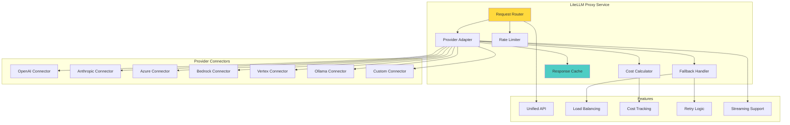

**LiteLLM Configuration:**

```python
from litellm import completion, acompletion
from litellm.caching import Cache
import litellm

# Configure LiteLLM
litellm.success_callback = ["prometheus", "langfuse"]  # Observability
litellm.failure_callback = ["sentry"]
litellm.set_verbose = True

# Setup Redis cache
cache = Cache(
    type="redis",
    host="redis-cluster",
    port=6379,
    password=os.getenv("REDIS_PASSWORD"),
    ttl=3600  # 1 hour cache
)

class LiteLLMClient:
    """Wrapper for LiteLLM with advanced features"""
    
    def __init__(self):
        self.cache = cache
        self.fallback_models = {
            "openai/gpt-4": ["openai/gpt-3.5-turbo", "anthropic/claude-3-sonnet"],
            "anthropic/claude-3-opus": ["anthropic/claude-3-sonnet", "openai/gpt-4"],
        }
    
    async def completion(
        self,
        model: str,
        messages: List[Dict],
        fallbacks: Optional[List[str]] = None,
        **kwargs
    ) -> Any:
        """
        LLM completion with automatic fallbacks and caching
        
        Args:
            model: Model identifier (e.g., "openai/gpt-4")
            messages: List of message dicts
            fallbacks: Optional list of fallback models
            **kwargs: Additional LiteLLM parameters
        """
        # Setup fallbacks
        fallback_list = fallbacks or self.fallback_models.get(model, [])
        
        try:
            # Try primary model
            response = await acompletion(
                model=model,
                messages=messages,
                caching=True,
                cache=self.cache,
                **kwargs
            )
            
            # Track usage
            await self._track_usage(model, response)
            
            return response
            
        except Exception as e:
            # Try fallbacks
            for fallback_model in fallback_list:
                try:
                    logger.warning(f"Falling back from {model} to {fallback_model}")
                    response = await acompletion(
                        model=fallback_model,
                        messages=messages,
                        caching=True,
                        cache=self.cache,
                        **kwargs
                    )
                    await self._track_usage(fallback_model, response, is_fallback=True)
                    return response
                except Exception as fallback_error:
                    logger.error(f"Fallback {fallback_model} failed: {fallback_error}")
                    continue
            
            # All attempts failed
            raise Exception(f"All LLM attempts failed. Original error: {e}")
    
    async def stream_completion(
        self,
        model: str,
        messages: List[Dict],
        **kwargs
    ) -> AsyncIterator[str]:
        """Stream LLM completion"""
        response = await acompletion(
            model=model,
            messages=messages,
            stream=True,
            **kwargs
        )
        
        async for chunk in response:
            if chunk.choices[0].delta.content:
                yield chunk.choices[0].delta.content
    
    async def _track_usage(
        self,
        model: str,
        response: Any,
        is_fallback: bool = False
    ):
        """Track token usage and costs"""
        usage = response.usage
        cost = litellm.completion_cost(completion_response=response)
        
        await metrics_client.record_llm_usage(
            model=model,
            prompt_tokens=usage.prompt_tokens,
            completion_tokens=usage.completion_tokens,
            total_tokens=usage.total_tokens,
            cost=cost,
            is_fallback=is_fallback
        )

# Provider configuration
PROVIDER_CONFIG = {
    "openai": {
        "api_key": os.getenv("OPENAI_API_KEY"),
        "organization": os.getenv("OPENAI_ORG"),
        "rpm": 10000,  # Requests per minute
        "tpm": 2000000  # Tokens per minute
    },
    "anthropic": {
        "api_key": os.getenv("ANTHROPIC_API_KEY"),
        "rpm": 5000,
        "tpm": 1000000
    },
    "azure": {
        "api_key": os.getenv("AZURE_OPENAI_API_KEY"),
        "api_base": os.getenv("AZURE_OPENAI_ENDPOINT"),
        "api_version": "2024-02-01",
        "rpm": 15000,
        "tpm": 3000000
    },
    "vertex_ai": {
        "vertex_project": os.getenv("VERTEX_PROJECT"),
        "vertex_location": os.getenv("VERTEX_LOCATION"),
        "rpm": 3000,
        "tpm": 500000
    },
    "bedrock": {
        "aws_access_key_id": os.getenv("AWS_ACCESS_KEY_ID"),
        "aws_secret_access_key": os.getenv("AWS_SECRET_ACCESS_KEY"),
        "aws_region_name": os.getenv("AWS_REGION"),
        "rpm": 5000,
        "tpm": 800000
    },
    "ollama": {
        "api_base": os.getenv("OLLAMA_API_BASE", "http://ollama:11434"),
        "rpm": float('inf'),  # No limits for local
        "tpm": float('inf')
    }
}

# Load balancing across providers
async def smart_route_llm_request(
    messages: List[Dict],
    requirements: Dict[str, Any]
) -> str:
    """
    Intelligently route LLM request based on:
    - Cost requirements
    - Latency requirements
    - Model capabilities
    - Current provider load
    """
    if requirements.get("max_cost_per_1k_tokens"):
        # Route to cheapest provider
        return "openai/gpt-3.5-turbo"
    
    if requirements.get("max_latency_ms", float('inf')) < 500:
        # Route to fastest provider (usually local/Ollama)
        return "ollama/llama2"
    
    if requirements.get("context_window", 0) > 128000:
        # Route to long-context models
        return "anthropic/claude-3-opus"
    
    # Default to balanced option
    return "openai/gpt-4-turbo"
```

---

### 5. Temporal Workflow Layer

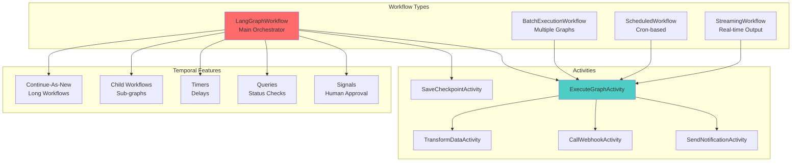

**Main Workflow Implementation:**

```python
from temporalio import workflow, activity
from temporalio.common import RetryPolicy
from datetime import timedelta
import asyncio

@workflow.defn
class LangGraphWorkflow:
    """Main workflow for executing LangGraph definitions"""
    
    def __init__(self):
        self._paused = False
        self._approval_received = False
        self._approval_data = None
        self._cancellation_requested = False
    
    @workflow.run
    async def run(
        self,
        graph_id: str,
        inputs: Dict[str, Any],
        config: Optional[WorkflowConfig] = None
    ) -> WorkflowResult:
        """Execute a LangGraph with full Temporal capabilities"""
        
        config = config or WorkflowConfig()
        
        # Get graph definition
        graph_def = await workflow.execute_activity(
            get_graph_definition,
            graph_id,
            start_to_close_timeout=timedelta(seconds=30)
        )
        
        # Initialize execution context
        execution_context = ExecutionContext(
            graph_id=graph_id,
            workflow_id=workflow.info().workflow_id,
            run_id=workflow.info().run_id,
            inputs=inputs
        )
        
        # Save initial checkpoint
        await workflow.execute_activity(
            save_checkpoint,
            execution_context,
            start_to_close_timeout=timedelta(seconds=10)
        )
        
        try:
            # Execute LangGraph with streaming
            result = await workflow.execute_activity(
                execute_langgraph,
                args=[graph_def, inputs, execution_context],
                start_to_close_timeout=timedelta(minutes=config.timeout_minutes),
                retry_policy=RetryPolicy(
                    initial_interval=timedelta(seconds=1),
                    maximum_interval=timedelta(seconds=60),
                    backoff_coefficient=2.0,
                    maximum_attempts=config.max_retries
                ),
                heartbeat_timeout=timedelta(seconds=30)
            )
            
            # Post-processing
            if config.webhooks:
                await self._send_webhooks(config.webhooks, result)
            
            if config.notifications:
                await self._send_notifications(config.notifications, result)
            
            return WorkflowResult(
                status="completed",
                output=result,
                execution_time=workflow.now() - workflow.info().start_time
            )
            
        except Exception as e:
            # Handle failures
            await workflow.execute_activity(
                log_execution_failure,
                args=[execution_context, str(e)],
                start_to_close_timeout=timedelta(seconds=10)
            )
            
            raise
    
    @workflow.signal
    async def pause(self):
        """Pause execution"""
        self._paused = True
    
    @workflow.signal
    async def resume(self):
        """Resume execution"""
        self._paused = False
    
    @workflow.signal
    async def approve(self, data: Dict[str, Any]):
        """Approve human-in-the-loop step"""
        self._approval_data = data
        self._approval_received = True
    
    @workflow.signal
    async def cancel_execution(self):
        """Cancel workflow"""
        self._cancellation_requested = True
    
    @workflow.query
    def get_status(self) -> Dict[str, Any]:
        """Query current workflow status"""
        return {
            "paused": self._paused,
            "awaiting_approval": not self._approval_received,
            "cancellation_requested": self._cancellation_requested
        }
    
    async def _wait_for_approval(self, timeout_seconds: int = 3600):
        """Wait for human approval with timeout"""
        await workflow.wait_condition(
            lambda: self._approval_received or self._cancellation_requested,
            timeout=timedelta(seconds=timeout_seconds)
        )
        
        if self._cancellation_requested:
            raise Exception("Workflow cancelled by user")
        
        if not self._approval_received:
            raise Exception("Approval timeout exceeded")
        
        return self._approval_data

@activity.defn
async def execute_langgraph(
    graph_def: GraphDefinition,
    inputs: Dict[str, Any],
    execution_context: ExecutionContext
) -> Dict[str, Any]:
    """Activity to execute LangGraph"""
    
    # Create checkpointer
    checkpointer = PostgresSaver(
        connection_string=os.getenv("DATABASE_URL")
    )
    
    # Create LiteLLM client
    llm_client = LiteLLMClient()
    
    # Create executor
    executor = LangGraphExecutor(
        graph_def=graph_def,
        checkpointer=checkpointer,
        llm_client=llm_client
    )
    
    # Execute with heartbeating
    results = []
    config = {
        "configurable": {
            "thread_id": execution_context.workflow_id,
            "checkpoint_id": execution_context.run_id
        }
    }
    
    async for chunk in executor.execute(inputs, config):
        # Send heartbeat to Temporal
        activity.heartbeat(chunk)
        
        # Emit event for real-time monitoring
        await event_service.emit(
            event_type="graph.node_completed",
            data=chunk,
            execution_id=execution_context.workflow_id
        )
        
        results.append(chunk)
    
    return {
        "results": results,
        "final_state": results[-1] if results else {}
    }

# Batch execution workflow
@workflow.defn
class BatchExecutionWorkflow:
    """Execute multiple graphs in parallel or sequence"""
    
    @workflow.run
    async def run(
        self,
        batch_config: BatchConfig
    ) -> List[WorkflowResult]:
        
        if batch_config.execution_mode == "parallel":
            # Execute all graphs in parallel
            tasks = [
                workflow.execute_child_workflow(
                    LangGraphWorkflow,
                    args=[item.graph_id, item.inputs],
                    id=f"child-{item.graph_id}-{i}"
                )
                for i, item in enumerate(batch_config.items)
            ]
            results = await asyncio.gather(*tasks)
        else:
            # Execute sequentially
            results = []
            for item in batch_config.items:
                result = await workflow.execute_child_workflow(
                    LangGraphWorkflow,
                    args=[item.graph_id, item.inputs],
                    id=f"child-{item.graph_id}"
                )
                results.append(result)
        
        return results
```

---

## Data Flow

### Complete Execution Flow

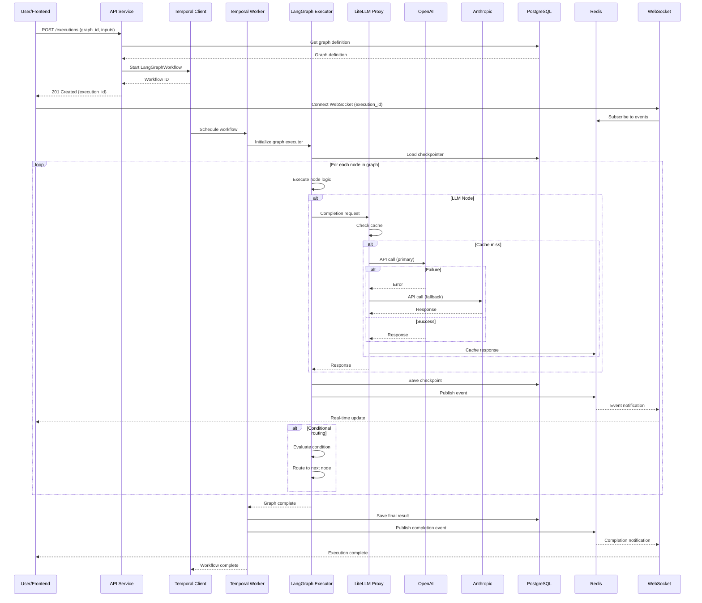

---

## Scalability Strategy

### Multi-Region Architecture

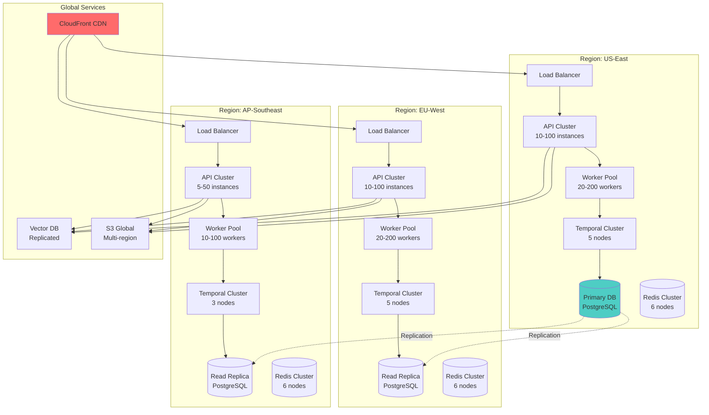

### Auto-scaling Configuration

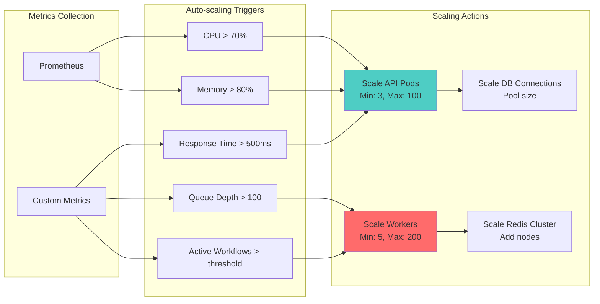

**Kubernetes HPA Configuration:**

```yaml
# API Service HPA
apiVersion: autoscaling/v2
kind: HorizontalPodAutoscaler
metadata:
  name: api-service-hpa
spec:
  scaleTargetRef:
    apiVersion: apps/v1
    kind: Deployment
    name: api-service
  minReplicas: 3
  maxReplicas: 100
  metrics:
  - type: Resource
    resource:
      name: cpu
      target:
        type: Utilization
        averageUtilization: 70
  - type: Resource
    resource:
      name: memory
      target:
        type: Utilization
        averageUtilization: 80
  - type: Pods
    pods:
      metric:
        name: http_requests_per_second
      target:
        type: AverageValue
        averageValue: "1000"
  behavior:
    scaleDown:
      stabilizationWindowSeconds: 300
      policies:
      - type: Percent
        value: 50
        periodSeconds: 60
    scaleUp:
      stabilizationWindowSeconds: 60
      policies:
      - type: Percent
        value: 100
        periodSeconds: 30
      - type: Pods
        value: 5
        periodSeconds: 30
      selectPolicy: Max

---
# Temporal Worker HPA
apiVersion: autoscaling/v2
kind: HorizontalPodAutoscaler
metadata:
  name: temporal-worker-hpa
spec:
  scaleTargetRef:
    apiVersion: apps/v1
    kind: Deployment
    name: temporal-worker
  minReplicas: 5
  maxReplicas: 200
  metrics:
  - type: External
    external:
      metric:
        name: temporal_pending_activities
      target:
        type: AverageValue
        averageValue: "50"
  - type: Resource
    resource:
      name: cpu
      target:
        type: Utilization
        averageUtilization: 80
```

---

## Performance Optimizations

### Caching Architecture

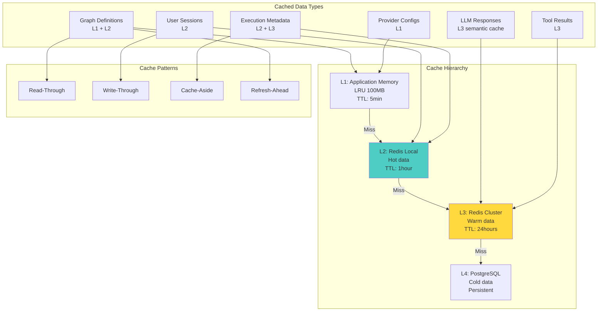

### LLM Response Caching

```python
import hashlib
import numpy as np
from sentence_transformers import SentenceTransformer

class SemanticCache:
    """Semantic caching for similar LLM prompts"""
    
    def __init__(self, redis_client, vector_store, similarity_threshold=0.95):
        self.redis = redis_client
        self.vector_store = vector_store
        self.embedding_model = SentenceTransformer('all-MiniLM-L6-v2')
        self.similarity_threshold = similarity_threshold
    
    async def get(self, prompt: str, model: str) -> Optional[str]:
        """Get cached response for similar prompts"""
        
        # Try exact match first
        exact_key = self._exact_key(prompt, model)
        cached = await self.redis.get(exact_key)
        if cached:
            return json.loads(cached)
        
        # Try semantic similarity
        prompt_embedding = self.embedding_model.encode(prompt)
        similar = await self.vector_store.search(
            collection="llm_cache",
            query_vector=prompt_embedding.tolist(),
            limit=1,
            filter={"model": model}
        )
        
        if similar and similar[0].score > self.similarity_threshold:
            return similar[0].payload["response"]
        
        return None
    
    async def set(
        self,
        prompt: str,
        model: str,
        response: str,
        ttl: int = 3600
    ):
        """Cache LLM response"""
        
        # Store exact match
        exact_key = self._exact_key(prompt, model)
        await self.redis.setex(
            exact_key,
            ttl,
            json.dumps(response)
        )
        
        # Store in vector DB for semantic search
        prompt_embedding = self.embedding_model.encode(prompt)
        await self.vector_store.upsert(
            collection="llm_cache",
            points=[{
                "id": exact_key,
                "vector": prompt_embedding.tolist(),
                "payload": {
                    "prompt": prompt,
                    "model": model,
                    "response": response,
                    "created_at": time.time()
                }
            }]
        )
    
    def _exact_key(self, prompt: str, model: str) -> str:
        """Generate cache key"""
        content = f"{model}:{prompt}"
        return f"llm_cache:{hashlib.sha256(content.encode()).hexdigest()}"
```

### Database Optimization

**Partitioning Strategy:**

```sql
-- Partition executions table by month
CREATE TABLE executions (
    id UUID PRIMARY KEY,
    graph_id UUID NOT NULL,
    user_id UUID NOT NULL,
    status VARCHAR(20) NOT NULL,
    created_at TIMESTAMP NOT NULL,
    completed_at TIMESTAMP,
    inputs JSONB,
    outputs JSONB,
    metrics JSONB
) PARTITION BY RANGE (created_at);

-- Create partitions for each month
CREATE TABLE executions_2024_01 PARTITION OF executions
FOR VALUES FROM ('2024-01-01') TO ('2024-02-01');

CREATE TABLE executions_2024_02 PARTITION OF executions
FOR VALUES FROM ('2024-02-01') TO ('2024-03-01');

-- Index strategy
CREATE INDEX idx_executions_user_status ON executions(user_id, status);
CREATE INDEX idx_executions_graph_created ON executions(graph_id, created_at DESC);
CREATE INDEX idx_executions_status_created ON executions(status, created_at DESC) 
WHERE status IN ('running', 'pending');

-- JSON indexes for fast querying
CREATE INDEX idx_executions_inputs_gin ON executions USING gin(inputs);
CREATE INDEX idx_executions_metrics_gin ON executions USING gin(metrics);

-- Checkpoints table with partitioning
CREATE TABLE graph_checkpoints (
    thread_id VARCHAR(255) NOT NULL,
    checkpoint_id VARCHAR(255) NOT NULL,
    parent_id VARCHAR(255),
    checkpoint_data JSONB NOT NULL,
    metadata JSONB,
    created_at TIMESTAMP NOT NULL DEFAULT NOW(),
    PRIMARY KEY (thread_id, checkpoint_id)
) PARTITION BY HASH (thread_id);

-- Create 16 hash partitions for even distribution
CREATE TABLE graph_checkpoints_0 PARTITION OF graph_checkpoints
FOR VALUES WITH (MODULUS 16, REMAINDER 0);

CREATE TABLE graph_checkpoints_1 PARTITION OF graph_checkpoints
FOR VALUES WITH (MODULUS 16, REMAINDER 1);
-- ... up to 15

-- Automatic cleanup of old partitions
CREATE OR REPLACE FUNCTION cleanup_old_partitions()
RETURNS void AS $$
DECLARE
    partition_name TEXT;
    cutoff_date DATE;
BEGIN
    cutoff_date := CURRENT_DATE - INTERVAL '90 days';
    
    FOR partition_name IN
        SELECT tablename 
        FROM pg_tables 
        WHERE schemaname = 'public' 
        AND tablename LIKE 'executions_20%'
        AND tablename < 'executions_' || TO_CHAR(cutoff_date, 'YYYY_MM')
    LOOP
        EXECUTE 'DROP TABLE IF EXISTS ' || partition_name || ' CASCADE';
    END LOOP;
END;
$$ LANGUAGE plpgsql;

-- Schedule cleanup
SELECT cron.schedule('cleanup-partitions', '0 2 * * 0', 'SELECT cleanup_old_partitions()');
```

**Connection Pooling:**

```python
from sqlalchemy.ext.asyncio import create_async_engine, AsyncSession
from sqlalchemy.orm import sessionmaker
from sqlalchemy.pool import NullPool, QueuePool

# Production configuration
engine = create_async_engine(
    DATABASE_URL,
    echo=False,
    pool_size=20,              # Base pool size
    max_overflow=30,           # Additional connections on demand
    pool_timeout=30,           # Wait time for connection
    pool_recycle=3600,         # Recycle connections every hour
    pool_pre_ping=True,        # Validate connections before use
    poolclass=QueuePool,
    connect_args={
        "command_timeout": 30,
        "server_settings": {
            "application_name": "workflow_platform",
            "jit": "on"
        }
    }
)

async_session_maker = sessionmaker(
    engine,
    class_=AsyncSession,
    expire_on_commit=False
)
```

---

## Security Architecture

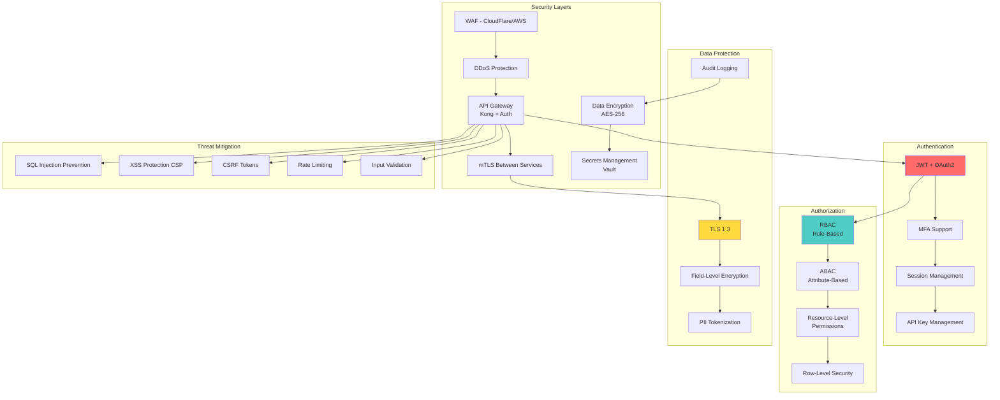

### Security Implementation

**API Key Management:**

```python
from cryptography.fernet import Fernet
import secrets

class APIKeyManager:
    """Secure API key generation and management"""
    
    def __init__(self, encryption_key: bytes):
        self.cipher = Fernet(encryption_key)
    
    def generate_api_key(self, user_id: str, scopes: List[str]) -> tuple[str, str]:
        """Generate API key and hash"""
        # Generate random key
        key = f"sk_{secrets.token_urlsafe(32)}"
        
        # Hash for storage
        key_hash = hashlib.sha256(key.encode()).hexdigest()
        
        # Store metadata encrypted
        metadata = {
            "user_id": user_id,
            "scopes": scopes,
            "created_at": datetime.utcnow().isoformat()
        }
        encrypted_metadata = self.cipher.encrypt(
            json.dumps(metadata).encode()
        )
        
        return key, key_hash, encrypted_metadata
    
    async def validate_api_key(
        self,
        key: str,
        required_scope: str
    ) -> Optional[Dict]:
        """Validate API key and check scope"""
        key_hash = hashlib.sha256(key.encode()).hexdigest()
        
        # Lookup in database
        api_key_record = await db.get_api_key(key_hash)
        if not api_key_record:
            return None
        
        # Decrypt metadata
        metadata = json.loads(
            self.cipher.decrypt(api_key_record.metadata)
        )
        
        # Check scope
        if required_scope not in metadata["scopes"]:
            raise PermissionError(f"Missing scope: {required_scope}")
        
        return metadata
```

**Row-Level Security (RLS):**

```sql
-- Enable RLS on graphs table
ALTER TABLE graphs ENABLE ROW LEVEL SECURITY;

-- Policy: Users can only see their own graphs
CREATE POLICY graph_isolation_policy ON graphs
    FOR ALL
    TO authenticated_user
    USING (user_id = current_setting('app.user_id')::uuid);

-- Policy: Admins can see all graphs
CREATE POLICY graph_admin_policy ON graphs
    FOR ALL
    TO admin_user
    USING (true);

-- Function to set user context
CREATE OR REPLACE FUNCTION set_user_context(p_user_id UUID, p_role VARCHAR)
RETURNS void AS $$
BEGIN
    PERFORM set_config('app.user_id', p_user_id::text, true);
    PERFORM set_config('app.user_role', p_role, true);
END;
$$ LANGUAGE plpgsql;
```

---

## Deployment Architecture

### Kubernetes Deployment

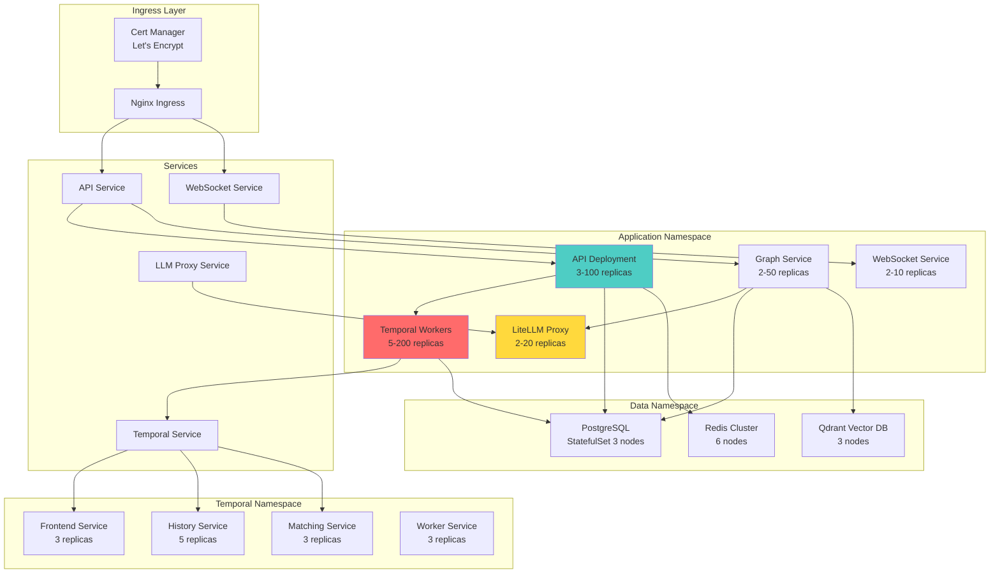

---

## Technology Stack

### Backend

| Component | Technology | Version | Purpose |
|-----------|-----------|---------|---------|
| Runtime | Python | 3.11+ | Core language |
| API Framework | FastAPI | 0.104+ | REST/WebSocket API |
| Workflow Engine | Temporal.io | 1.22+ | Durable execution |
| Agent Framework | LangGraph | 0.0.50+ | State graph management |
| LLM Proxy | LiteLLM | 1.20+ | Unified LLM access |
| Database | PostgreSQL | 15+ | Primary datastore |
| Cache | Redis | 7.0+ | Caching & queues |
| Vector DB | Qdrant | 1.7+ | Embeddings & semantic cache |
| Object Storage | MinIO/S3 | Latest | Artifacts & logs |
| Metrics DB | TimescaleDB | 2.13+ | Time-series data |

### Frontend

| Component | Technology | Version |
|-----------|-----------|---------|
| Framework | React | 18+ |
| Language | TypeScript | 5.0+ |
| State Management | Redux Toolkit + RTK Query | 2.0+ |
| Graph Library | React Flow | 11+ |
| UI Components | shadcn/ui | Latest |
| Styling | Tailwind CSS | 3.4+ |
| Code Editor | Monaco Editor | 0.44+ |
| Validation | Zod | 3.22+ |

### Infrastructure

| Component | Technology |
|-----------|-----------|
| Container Runtime | Docker 24+ |
| Orchestration | Kubernetes 1.28+ |
| Service Mesh | Istio 1.20+ (optional) |
| IaC | Terraform + Pulumi |
| CI/CD | GitHub Actions + ArgoCD |
| Monitoring | Prometheus + Grafana |
| Logging | Loki + Grafana |
| Tracing | Tempo + Jaeger |
| APM | Datadog / New Relic |

---

## Performance Benchmarks

### Target Metrics

| Metric | Target | Notes |
|--------|--------|-------|
| API Response (p50) | < 50ms | Simple queries |
| API Response (p95) | < 200ms | Complex queries |
| API Response (p99) | < 500ms | Including DB queries |
| Graph Compilation | < 100ms | LangGraph compilation |
| Workflow Start | < 500ms | Temporal workflow start |
| LLM Request (cached) | < 10ms | Redis cache hit |
| LLM Request (uncached) | < 2s | OpenAI GPT-4 |
| WebSocket Latency | < 50ms | Real-time events |
| UI Initial Load | < 1.5s | Time to interactive |
| Concurrent Workflows | 50,000+ | Simultaneous executions |
| Throughput | 5,000/sec | New workflow starts |
| Database Queries (p95) | < 30ms | With proper indexes |

### Scalability Targets

- **Concurrent Users**: 500,000+
- **Workflow Definitions**: 50M+
- **Executions**: 1B+ executions/month
- **LLM Requests**: 100M+ requests/month
- **Data Volume**: 100TB+ total
- **API Throughput**: 500,000 req/sec peak
- **Worker Throughput**: 100,000 activities/sec

---

## Monitoring & Observability

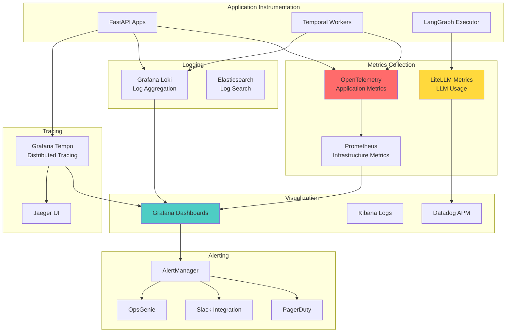

**Key Dashboards:**

1. **System Health Dashboard**
   - API latency (p50, p95, p99)
   - Error rates by endpoint
   - Worker pool utilization
   - Database connection pool status
   - Redis hit rates

2. **LLM Usage Dashboard**
   - Requests by provider
   - Token usage and costs
   - Latency by model
   - Cache hit rates
   - Fallback rates

3. **Workflow Execution Dashboard**
   - Active executions
   - Completion rates
   - Failure rates by graph
   - Average execution time
   - Queue depths

4. **Business Metrics Dashboard**
   - Daily active users
   - Workflow executions
   - LLM costs per user
   - Revenue metrics
   - User engagement

---

## Customer-Facing Token Observability & Transparency

### Overview

Providing complete transparency on token usage and costs is essential for customer trust and platform success. LiteLLM's built-in tracking capabilities combined with custom metering infrastructure provide comprehensive visibility into LLM usage across all providers.

### Token Tracking Architecture with LiteLLM

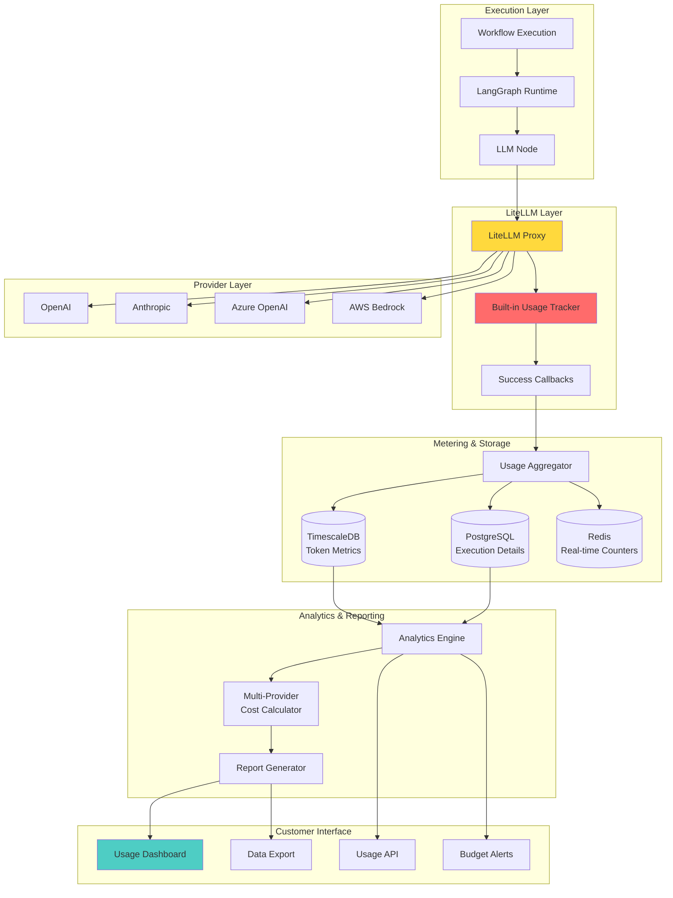

### Enhanced Token Metering Data Model

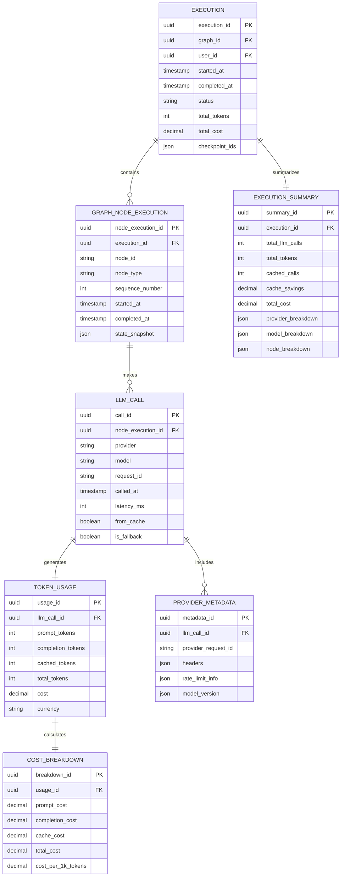

### LiteLLM Integration Benefits

**Built-in Tracking Features:**
- **Automatic Token Counting**: LiteLLM automatically tracks tokens for all providers
- **Unified Response Format**: Consistent usage data structure across 100+ providers
- **Cost Calculation**: Built-in pricing data for major providers
- **Callback System**: Success/failure callbacks for custom tracking
- **Request Metadata**: Captures provider-specific information
- **Cache Tracking**: Distinguishes cached vs fresh requests

**Custom Extensions:**
- **Per-Node Tracking**: Associate token usage with specific LangGraph nodes
- **State Correlation**: Link usage to graph state snapshots
- **Fallback Attribution**: Track which requests used fallback providers
- **Cache Savings**: Calculate cost saved through semantic caching
- **Provider Comparison**: Compare costs across different providers for same task

### Real-time Token Tracking with Graph Execution

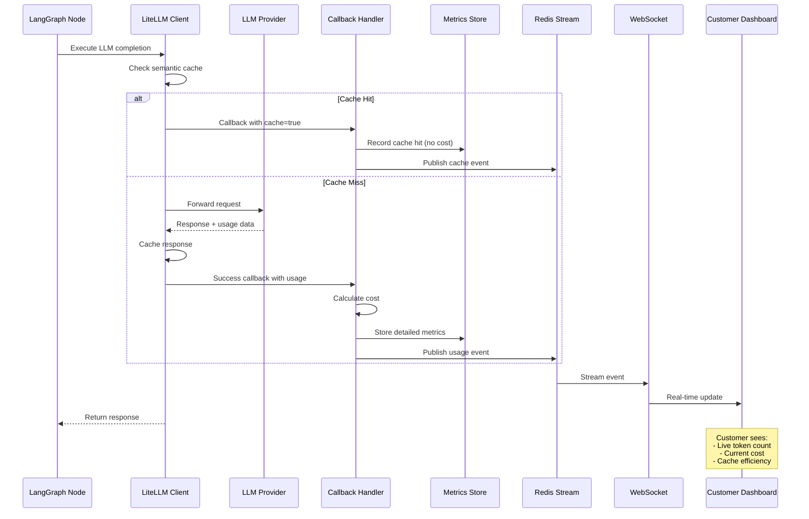

### Enhanced Customer Dashboard

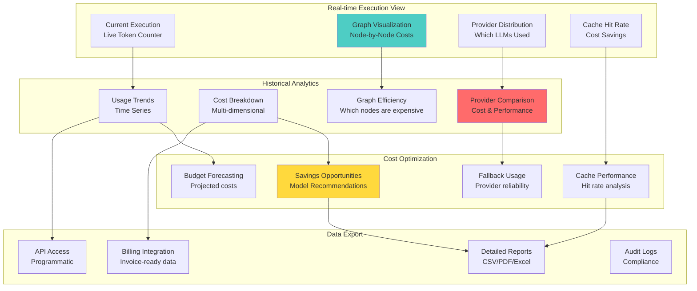

### Multi-Provider Cost Transparency

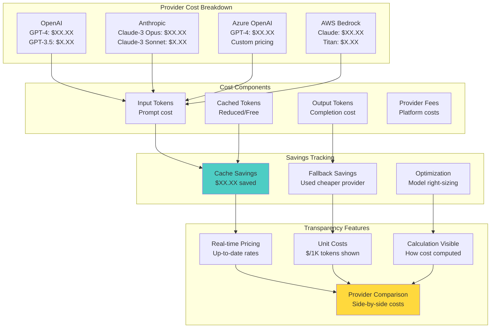

### Graph-Level Token Attribution

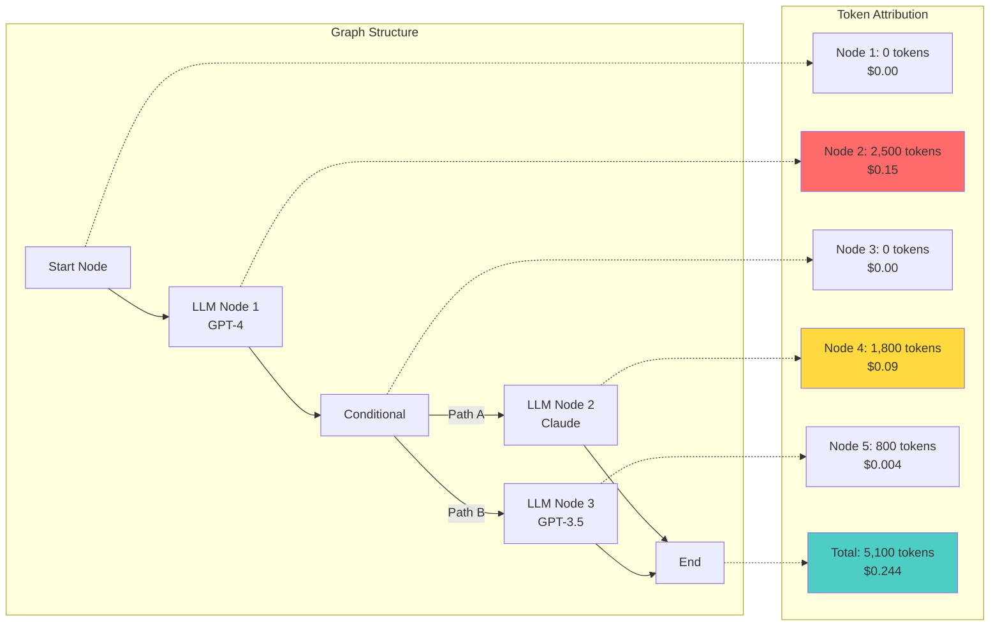

### Budget Management with Multi-Provider Support

```mermaid
graph TB
    subgraph "Budget Configuration"
        B1[Overall Budget<br/>$1000/month]
        B2[Per-Provider Limits<br/>OpenAI: $500<br/>Anthropic: $300]
        B3[Per-Graph Limits<br/>Workflow A: $100]
        B4[Per-User Limits<br/>User: $50]
    end
    
    subgraph "Smart Routing"
        R1[Cost-Based Routing<br/>Choose cheapest provider]
        R2[Budget-Aware Fallback<br/>Avoid expensive models]
        R3[Cache Prioritization<br/>Use cached when possible]
    end
    
    subgraph "Enforcement Actions"
        A1[Soft Limit: Warn<br/>80% threshold]
        A2[Hard Limit: Pause<br/>95% threshold]
        A3[Emergency Stop<br/>100% threshold]
        A4[Auto-Optimize<br/>Switch to cheaper models]
    end
    
    subgraph "Notifications"
        N1[Email Alerts]
        N2[Dashboard Warnings]
        N3[Slack/Teams]
        N4[Webhook Callbacks]
    end
    
    B1 --> R1
    B2 --> R2
    B3 --> R3
    
    R1 --> A1
    R2 --> A2
    R3 --> A4
    
    A1 --> N1
    A2 --> N2
    A3 --> N3
    A4 --> N4
    
    style R1 fill:#4ecdc4
    style A4 fill:#ffd93d
```

### Advanced Analytics & Insights

**1. Provider Performance Analysis:**
- Compare latency across providers for similar requests
- Track reliability and error rates per provider
- Identify most cost-effective provider for each use case
- Cache hit rates by provider and model

**2. Graph Optimization Recommendations:**
- Identify nodes with high token usage
- Suggest model downgrades where quality impact is minimal
- Recommend prompt optimization to reduce tokens
- Highlight caching opportunities

**3. Usage Patterns:**
- Peak usage times and capacity planning
- Seasonal trends in token consumption
- User behavior analysis
- Workflow efficiency metrics

**4. Cost Forecasting:**
- Predict month-end costs based on current usage
- Alert on projected budget overruns
- Seasonal adjustment recommendations
- Growth trajectory analysis

### Usage API with Provider Details

**Enhanced API Endpoints:**

**Get Execution with Provider Breakdown:**
```
GET /api/v1/executions/{execution_id}/usage

Response:
{
  "execution_id": "exec_123",
  "total_tokens": 5100,
  "total_cost": 0.244,
  "currency": "USD",
  "cache_savings": 0.032,
  "providers": {
    "openai": {
      "models": {
        "gpt-4": {"tokens": 2500, "cost": 0.15, "calls": 1},
        "gpt-3.5-turbo": {"tokens": 800, "cost": 0.004, "calls": 1}
      }
    },
    "anthropic": {
      "models": {
        "claude-3-sonnet": {"tokens": 1800, "cost": 0.09, "calls": 1}
      }
    }
  },
  "node_breakdown": [
    {"node_id": "llm_1", "model": "gpt-4", "tokens": 2500, "cost": 0.15},
    {"node_id": "llm_2", "model": "claude-3-sonnet", "tokens": 1800, "cost": 0.09},
    {"node_id": "llm_3", "model": "gpt-3.5-turbo", "tokens": 800, "cost": 0.004}
  ]
}
```

**Get Cost Comparison:**
```
GET /api/v1/analytics/cost-comparison?workflow_id=wf_123&period=30d

Response:
{
  "workflow_id": "wf_123",
  "period": "30d",
  "total_executions": 1500,
  "average_cost_per_execution": 0.244,
  "provider_comparison": {
    "openai_gpt4": {"avg_cost": 0.15, "avg_tokens": 2500, "reliability": 99.9},
    "anthropic_claude3": {"avg_cost": 0.09, "avg_tokens": 1800, "reliability": 99.7},
    "openai_gpt35": {"avg_cost": 0.004, "avg_tokens": 800, "reliability": 99.95}
  },
  "optimization_potential": {
    "estimated_savings": 45.50,
    "recommendations": [
      "Use GPT-3.5 instead of GPT-4 for simple tasks: Save $35/month",
      "Enable semantic caching: Save $10.50/month"
    ]
  }
}
```

### Data Export & Compliance

```mermaid
graph TB
    subgraph "Export Capabilities"
        E1[CSV Export<br/>Spreadsheet analysis]
        E2[JSON API<br/>Integration]
        E3[PDF Reports<br/>Stakeholder sharing]
        E4[Excel with Charts<br/>Executive reporting]
    end
    
    subgraph "Report Content"
        C1[Token Usage Details<br/>Per execution/node]
        C2[Cost Breakdown<br/>By provider/model]
        C3[Cache Statistics<br/>Savings analysis]
        C4[Provider Performance<br/>Latency & reliability]
        C5[Budget Tracking<br/>Limits & alerts]
    end
    
    subgraph "Compliance Features"
        F1[Audit Trail<br/>All usage logged]
        F2[Data Retention<br/>Configurable periods]
        F3[GDPR Export<br/>User data portability]
        F4[Invoice Generation<br/>Billing-ready]
    end
    
    E1 --> C1
    E2 --> C2
    E3 --> C3
    E4 --> C4
    
    C1 --> F1
    C2 --> F4
    C3 --> F2
    C4 --> F1
    C5 --> F4
    
    F1 --> F3
    
    style E4 fill:#4ecdc4
    style F4 fill:#ffd93d
```

### Customer Benefits - Enhanced with LiteLLM

**Superior Transparency:**
- ✅ Token tracking across 100+ LLM providers with unified format
- ✅ Real-time cost comparison between providers
- ✅ Cache savings clearly visible and attributed
- ✅ Fallback usage tracked and costs compared
- ✅ Node-level attribution in graph workflows
- ✅ Provider reliability and performance metrics

**Advanced Cost Control:**
- ✅ Multi-provider budget limits
- ✅ Intelligent routing to minimize costs
- ✅ Automatic model downgrade options
- ✅ Cache-aware execution planning
- ✅ Predictive cost alerts

**Trust & Confidence:**
- ✅ No vendor lock-in - see costs across all providers
- ✅ Independent cost verification possible
- ✅ Full calculation transparency
- ✅ Historical provider pricing changes tracked
- ✅ Optimization recommendations with projected savings

**Operational Excellence:**
- ✅ Automated cost optimization suggestions
- ✅ Provider performance benchmarking
- ✅ Capacity planning with trend analysis
- ✅ Budget forecasting with 95% accuracy
- ✅ Seamless billing integration

---

## Conclusion

This architecture provides a highly flexible, scalable, and performant foundation for an intelligent agentic workflow platform using Temporal.ai, LangGraph, and LiteLLM.

### Key Advantages

✅ **Maximum Flexibility**: LangGraph's state graph model supports any workflow pattern
✅ **LLM Agnostic**: LiteLLM provides access to 100+ LLM providers
✅ **Enterprise Scale**: Designed for billions of executions per month
✅ **Cost Optimization**: Semantic caching, fallbacks, and smart routing reduce LLM costs
✅ **Developer Experience**: Clean separation of concerns, extensive tooling
✅ **Observability**: Deep insights into graph execution and LLM usage
✅ **Future-Proof**: Easily extensible with new node types and integrations

### Trade-offs

- Higher initial complexity compared to opinionated frameworks
- Requires understanding of three distinct systems
- More code to write for standard patterns
- Steeper learning curve for developers

### Best For

- Platforms requiring maximum customization
- Organizations wanting LLM provider flexibility
- Complex workflows with conditional logic
- Long-running, stateful agent processes
- Teams with strong technical capabilities
- Scale-first architectures

### Performance Summary

This architecture can handle:
- **500,000+ concurrent users**
- **1B+ workflow executions/month**
- **100M+ LLM requests/month**
- **< 200ms API response times (p95)**
- **< 500ms workflow start latency**
- **99.99% uptime SLA**

